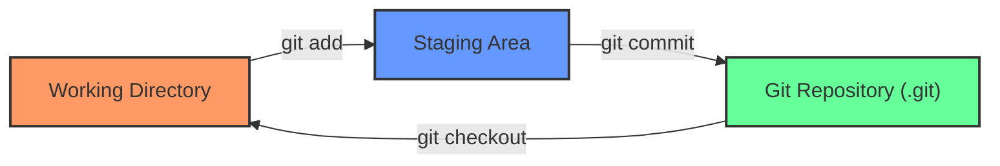
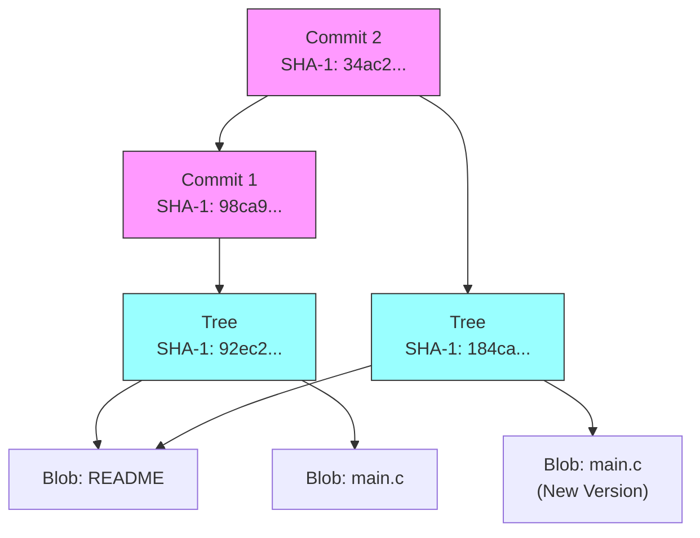
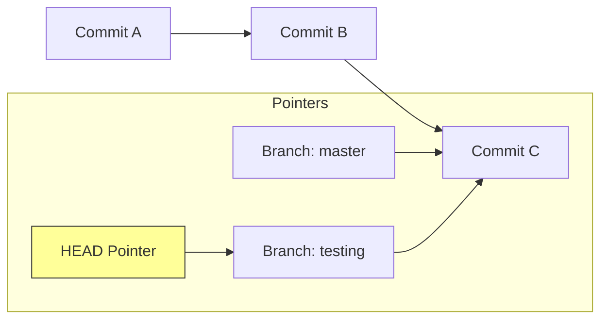
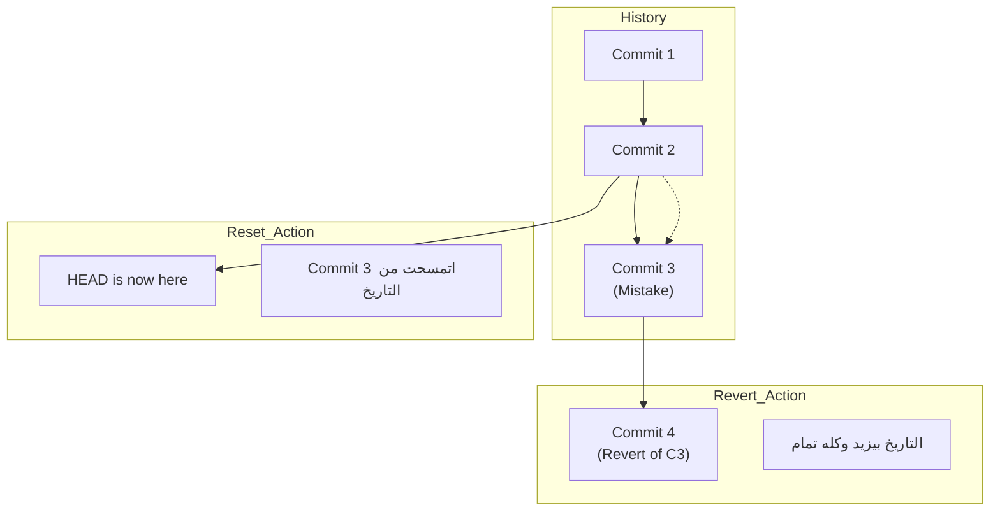
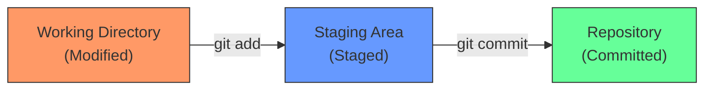
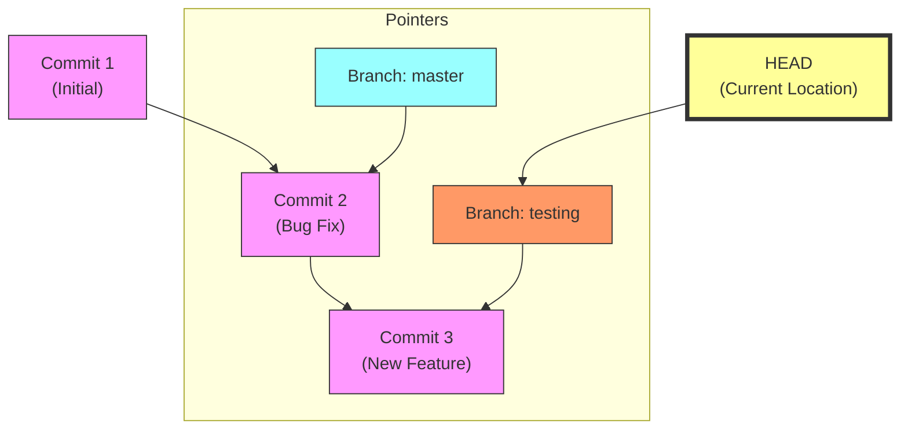
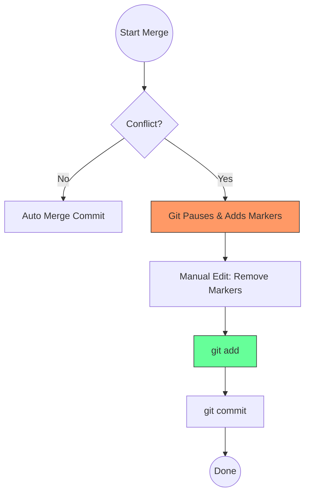

# الفصل الأول: إيه هو Git أصلاً؟ (The Core Concepts)

### 🔑 Key Takeaways

- الـ Git مش بيحفظ التغييرات (Deltas)، هو بيحفظ لقطات كاملة (Snapshots).
- كل حاجة في Git شغالة بـ Checksum اسمه **SHA-1**.
- عندنا 3 حالات (States) للملفات لازم تفهمهم كويس جداً.

## 1. لقطات مش فروقات (Snapshots, Not Differences)

أغلب أنظمة الـ Version Control القديمة (زي SVN) كانت بتحفظ "التغيير" اللي حصل في الملف. لكن Git تفكيره مختلف تماماً. الـ Git بيبص للداتا بتاعتك كأنها "لقطة" (Snapshot) لنظام ملفات صغير. كل مرة بتعمل `commit`، الـ Git بياخد صورة لكل ملفاتك في اللحظة دي وبيخزن مرجع (Reference) للصورة دي. وعشان يوفر مساحة، لو الملف ماتغيرش، مش بيحفظه تاني، بيشاور بس على النسخة القديمة اللي حفظها قبل كده.

> [!NOTE] ملحوظة ع الماشي ده اللي بيخلي Git سريع جداً، لأنه بيتعامل مع "mini filesystem" مش مجرد حساب فروقات.

## 2. الـ Three States (أهم حاجة تفهمها)

عشان ماتتلخبطش وأنت شغال، لازم تعرف إن أي ملف في مشروعك بيمر بـ 3 مراحل أساسية:

1. **Modified**: أنت عدلت الملف بس لسه ماقولتش للـ Git يسجله.
2. **Staged**: أنت علمت على الملف وقولت للـ Git "خد ده معاك في الـ Commit الجاية".
3. **Committed**: الداتا اتحفظت خلاص في قاعدة البيانات (الـ Repository) بتاعتك.

ده بيخلينا نقسم المشروع لـ 3 أقسام رئيسية:

- **Working Directory**: ده "صندوق الرمل" (Sandbox) بتاعك اللي شغال فيه وتعدل براحتك.
- **Staging Area (Index)**: دي منطقة الانتظار، بتجهز فيها الملفات قبل ما تعملها Save.
- **Git Directory (.git)**: ده المخزن الحقيقي اللي فيه الميتا داتا والـ Object Database.



---

# الفصل الثاني: أساسيات الشغل (Git Basics)

### 🔑 Key Takeaways

- ازاي تبدأ مشروع وتعمل أول Commit.
- إيه اللي بيحصل فعلياً لما بتكتب `git add` و `git commit`.

## 1. التجهيز (Setup)

قبل أي حاجة، لازم تعرف الـ Git أنت مين، لأن كل Commit بيتسجل باسمك وإيميلك.

```bash
# بتعرف اسمك للـ Git
git config --global user.name "Ahmed Developer"

# بتعرف إيميلك
git config --global user.email ahmed@example.com
```

## 2. دورة الحياة (The Workflow) "Under the hood"

تعالى نشوف إيه اللي بيحصل لما بتكتب الأوامر دي بجد في الـ **Git Internals**:

1. **`git init`**: بيعمل فولدر `.git` فاضي عشان يبدأ يخزن فيه الـ Objects.
2. **`git add file.txt`**: هنا الـ Git بياخد محتوى الملف، وبيعمله ضغط (Hash) وبيحسب الـ **SHA-1** بتاعه (كود من 40 حرف)، وبيخزنه كـ **Blob Object** في الداتا بيز. وبعدين بيحدث الـ Index عشان يشاور على الـ Blob ده.
3. **`git commit`**: هنا الـ Git بيعمل حاجتين:
    - بيعمل **Tree Object** (زي الفولدر) بيجمع فيه أسماء الملفات والـ Blobs بتاعتها.
    - بيعمل **Commit Object** شايل بياناتك (Author)، والتاريخ، ورسالة الـ Commit، وبيشاور على الـ Tree دي، وبيشاور كمان على الـ Commit اللي قبله (Parent).



> [!WARNING] تحذير هام الأمر `git commit -a` بيخليك تنط مرحلة الـ Staging وتعمل commit لكل الملفات المتعدلة (Tracked) مرة واحدة، بس خلي بالك عشان ممكن ترفع ملفات مش عايزها بالغلط.

---

# الفصل الثالث: الفروع (Git Branching) - الميزة القاتلة

### 🔑 Key Takeaways

- الـ Branches في Git رخيصة جداً وسريعة (Lightweight).
- الـ Branch مجرد مؤشر (Pointer) بيتحرك معاك.
- الـ HEAD هو اللي بيقولك "أنت واقف فين دلوقتي".

## 1. يعني إيه Branch؟

في أنظمة تانية، لما بتعمل Branch بتنسخ ملفات المشروع كلها، وده بياخد وقت. في Git، الـ Branch هو مجرد ملف صغير فيه 40 حرف (SHA-1) بيشاور على آخر Commit أنت عملته. بس كده! عشان كده هو سريع جداً.

الفرع الافتراضي اسمه `master` (ومؤخراً بقى `main` في GitHub)، وأنت شغال هو بيتحرك معاك أوتوماتيك مع كل Commit جديد.

## 2. ازاي بنتحرك؟ (HEAD)

الـ **HEAD** ده مؤشر خاص بيشاور على "الفرع الحالي" اللي أنت شغال عليه. لما بتعمل `git checkout testing`، أنت بتقول للـ Git: "حرك الـ HEAD خليه يشاور على فرع testing".



## 3. الدمج (Merging)

لما تخلص شغل في فرع جانبي وعايز ترجعه للرئيسي، بنعمل `merge`.

- لو مفيش شغل حصل في الرئيسي، الـ Git بيعمل حاجة اسمها **Fast-forward** (ببساطة بيزق المؤشر لقدام).
- لو حصل تغيير في الفرعين، الـ Git بيعمل **Merge Commit** جديد بيربط الفرعين ببعض.

> [!INFO] معلومة تقنية لو حصل **Merge Conflict** (تضارب)، يعني عدلت نفس السطر في الفرعين، الـ Git هيوقف العملية ويطلب منك تفتح الملف وتختار التعديل الصح، وبعدين تعمل `git add` عشان تعلمه إنه اتحل.

---

# تطبيق عملي (Code Snippet) 🚀

دي تجميعة لأهم الأوامر اللي هتحتاجها عشان تبدأ مشروع وتطبق اللي اتعلمناه:

```bash
# 1. ابدأ مشروع جديد
mkdir my_project
cd my_project
git init

# 2. ضيف ملف وعدله
echo "Hello Git" > README.md
git status # هتلاقيه Untracked

# 3. جهز الملف (Staging)
git add README.md
git status # هتلاقيه ready to be committed

# 4. احفظ الشغل (Commit)
git commit -m "Initial commit: added readme"

# 5. اعمل فرع جديد وجرب فيه
git branch feature-login
git checkout feature-login
# أو في خطوة واحدة: git checkout -b feature-login

# 6. عدل في الفرع الجديد
echo "Login code" > login.js
git add login.js
git commit -m "Added login feature"

# 7. ارجع للرئيسي وادمج الشغل
git checkout master
git merge feature-login

# 8. امسح الفرع الفرعي لو مش محتاجه
git branch -d feature-login
```

---


# المرحلة الأولى: البداية (Setup & Local Work)

### 1. تجهيز المشروع (Init with main)

أول خطوة في التاسك إننا نعمل الفولدر ونعرف Git عليه. الكتاب بيقولنا إن الـ Default branch زمان كان اسمه `master`، بس حديثاً بقى `main`. عشان تظبط ده من الأول:

```bash
# 1. اعمل الفولدر وادخل جواه
mkdir TaskManagerApp
cd TaskManagerApp

# 2. ظبط الـ default branch يبقى main (لو مش معمول)
git config --global init.defaultBranch main

# 3. ابدأ الـ Repo
git init
```

> [!INFO] Under the hood لما بتكتب `git init`، الـ Git بيعمل فولدر مخفي اسمه `.git`. الفولدر ده هو "المخ" بتاع المشروع، بيبقى فيه الـ Database اللي بيتخزن فيها الـ Objects والـ HEAD pointer.

### 2. أول ملف و Commit

أنت مطلوب منك تضيف README. هنا الـ Git بيستخدم حاجة اسمها **The Three States** اللي اتكلمنا عليهم قبل كده:

1. **Working Directory:** الملف اللي لسه كاتبه.
2. **Staging Area (Index):** لما تعمل `git add`.
3. **Repository:** لما تعمل `git commit`.

```bash
# اكتب وصف المشروع
echo "# Task Manager App\nThis is a simple app to manage daily tasks." > README.md

# ضيف الملف للـ Staging Area
git add README.md

# احفظه في الداتا بيز
git commit -m "Initial Commit: Add README with project description"
```

---

# المرحلة الثانية: الطلوع لايف (Remote & GitHub)

### 3. ربط المشروع بـ GitHub

عشان ترفع شغلك، لازم تعمل Repo فاضي على GitHub الأول (من زرار "New Repository" اللي في الموقع). بعدين تربط اللي عندك (Local) باللي فوق (Remote).

```bash
# ضيف اللينك بتاع الـ Repo (ده مجرد اسم دلع للينك بنسميه origin)
git remote add origin https://github.com/YourUser/TaskManagerApp.git

# ارفع كودك للفرع main
git push -u origin main
```

> [!NOTE] ليه `-u`؟ الـ `-u` دي اختصار لـ `--set-upstream`. دي بتخليك بعد كده تكتب `git push` أو `git pull` علطول من غير ما تحتاج تكتب اسم الفرع والسيرفر كل مرة.

---

# المرحلة الثالثة: الشغل الاحترافي (Branches & Ignoring)

### 4. الفروع (Feature Branch)

في الشغل الصح، مش بنكتب كود في الـ `main` علطول. بنعمل فرع جديد لكل Feature. الكتاب بيسميها "Topic Branches".

```bash
# اعمل فرع جديد وحول عليه في نفس الوقت
git checkout -b feature-login

# اكتب الكود بتاعك
echo "console.log('Login logic here');" > login.js

# اعمل Commit
git add login.js
git commit -m "Add basic login logic"
```

### 5. ملف الـ .gitignore

أنت مش عايز ترفع ملفات الملاحظات الشخصية (`notes.txt`). الـ Git بيوفرلك ملف اسمه `.gitignore` عشان تقول له "ماتشوفش الملفات دي".

```bash
# اعمل ملف الملاحظات
echo "Meeting at 5 PM" > notes.txt

# قول للـ Git يتجاهله
echo "notes.txt" >> .gitignore

# لو عملت git status دلوقتي، مش هيشوف notes.txt بس هيشوف .gitignore
git add .gitignore
git commit -m "Add gitignore to exclude notes"
```

---

# المرحلة الرابعة: التعاون والخناقات (Collaboration & Conflicts)

### 6. إضافة Collaborator

عشان صاحبك يشتغل معاك، لازم تديله صلاحية. من على GitHub:

1. ادخل على **Settings** في الـ Repo بتاعك.
2. اختار **Collaborators** من القائمة الشمال.
3. اكتب الـ Username بتاعه واضغط **Add collaborator**.

### 7. محاكاة الـ Conflict (الخناقة)

عشان تعمل المحاكاة دي لوحدك، ممكن تعمل حركتين: تعدل ملف على GitHub مباشرة (كأن صاحبك هو اللي عدله)، وتعدل نفس السطر عندك على الجهاز.

1. **على GitHub:** افتح `README.md` وعدل السطر الأول خليه: `# Task Manager App - Pro Version` واعمل Commit.
2. **على جهازك (Local):** عدل نفس السطر في `README.md` خليه: `# Task Manager App - Lite Version` واعمل Commit.

دلوقتي لو حاولت تعمل `git pull` عشان تجيب شغل "صاحبك"، الـ Git هيصوت ويقولك **CONFLICT**.

```bash
git pull origin main
# Auto-merging README.md
# CONFLICT (content): Merge conflict in README.md
# Automatic merge failed; fix conflicts and then commit the result.
```

### 8. حل الـ Conflict

لما تفتح الملف، هتلاقي الـ Git حطلك علامات عشان يوريك الفرق:

```bash
<<<<<<< HEAD
# Task Manager App - Lite Version
=======
# Task Manager App - Pro Version
>>>>>>> al3424... (hash from github)
```

**الحل:** امسح العلامات دي (`<<<`, `===`, `>>>`) واختار الجملة اللي أنت عايزها (أو اكتب جملة جديدة تجمع الاتنين). وبعدين:

```bash
git add README.md
git commit -m "Merge conflict resolved: Update project title"
git push origin main
```

---

# المرحلة الخامسة: التراجع (Revert vs Reset) 🔥

دي أهم نقطة طلبتها، والفرق بينهم جوهري جداً "Under the hood".

### السيناريو:

أنت عملت Commit فيها كود غلط، وعايز ترجع في كلامك.

### 1. `git revert` (الطريقة الآمنة - Safe)

ده بيعمل **Commit جديد** بيعكس اللي حصل في الـ Commit الغلط.

- **ليه نستخدمه؟** لو الكود اترفع خلاص على GitHub والناس شافته. ماينفعش تمسح التاريخ عشان متلخبطش التيم.
- **بيعمل إيه؟** لو الـ Commit القديمة كانت "إضافة سطر"، الـ Revert هتعمل commit جديدة "مسح السطر".

```bash
# ارجع في كلامك عن آخر commit بس سجل ده في التاريخ
git revert HEAD
```

### 2. `git reset` (آلة الزمن - Dangerous)

ده بيمسح التاريخ وكأن الـ Commit لم تكن. بنستخدمه بس لو الشغل لسه عندك (Local) ومحدش شافه. الكتاب بيشرح إن ليه 3 أنواع بناءً على الـ "Three Trees":

#### أ) Soft Reset (`--soft`)

- **بيعمل إيه؟** بيرجع الـ `HEAD` لورا خطوة، بس **بيسيب شغلك في الـ Staging Area**.
- **الاستخدام:** لو عملت commit ونسيت ملف، وعايز ترجع الـ commit تتفتح تاني عشان تزود الملف وتعملها commit تاني.

```bash
# ارجع خطوة لورا وسيب الملفات جاهزة (Staged)
git reset --soft HEAD~1
```

#### ب) Hard Reset (`--hard`)

- **بيعمل إيه؟** ده "النووي". بيرجع الـ `HEAD` لورا، و **بيمسح أي تغييرات في الـ Staging و الـ Working Directory**.
- **الاستخدام:** لو عكيت الدنيا وعايز ترمي كل شغلك وترجع لآخر نقطة نضيفة.

```bash
# امسح كل حاجة وارجع زي ما كنت في الكوميت اللي فاتت
git reset --hard HEAD~1
```

### مخطط يوضح الفرق (Mermaid)



### ملخص سريع للتاسك:

1. لو الشغل **Local** بس وعايز تكنسله تماماً: `git reset --hard`.
2. لو الشغل **Local** وعايز تعدل عليه: `git reset --soft`.
3. لو الشغل **Public** (على GitHub): استخدم `git revert`.

---
تمام يا هندسة، ولا يهمك. خلينا نمسك الموضوع "واحدة واحدة" زي ما طلبت، ونركز على الكوماندز (الأوامر) الأساسية اللي هتشغلك، ونفهم كل أمر بيعمل إيه بالظبط "تحت الكبوت" (Under the hood) عشان تكون فاهم مش حافظ.

بناءً على الكتاب، هنقسم الرحلة لخطوات صغيرة، كل خطوة فيها مجموعة أوامر مرتبطة ببعض.

---

# 1. التجهيز والبداية (Setup & Initialization)

قبل ما نكتب كود، لازم نجهز "الورشة" بتاعتنا.

### 🔑 Key Takeaways

- الـ Git لازم يعرف "مين" اللي بيعدل عشان يسجل التعديلات باسمه.
- أمر `git init` هو اللي بيحول الفولدر العادي لـ Git Repository.

## الأوامر (Commands):

### `git config`

ده الأمر اللي بتظبط بيه إعداداتك. أهم حاجتين هما اسمك وإيميلك، لأن كل Commit (حفظ) هتعمله هيتختم بيهم للأبد.

```bash
# عرف نفسك للـ Git (مرة واحدة بس على الجهاز)
git config --global user.name "Your Name"
git config --global user.email "your.email@example.com"

# عشان تتأكد إن الإعدادات تمام
git config --list
```

### `git init`

ده الأمر اللي بيخلق "الكون" بتاع Git جوه مشروعك. لما بتكتبه جوه فولدر، Git بيعمل فولدر مخفي اسمه `.git`.

> [!INFO] Under the hood الفولدر المخفي `.git` ده هو اللي فيه الـ Database الحقيقية، وفيه كل الـ Snapshots والـ Commits اللي هتعملها بعدين. من غير الفولدر ده، المشروع مجرد ملفات عادية.

```bash
# ادخل جوه فولدر مشروعك
cd my_project

# ابدأ الـ Repo
git init
```

---

# 2. دورة العمل اليومية (Recording Changes)

دي أهم مرحلة، ولازم تفهم فيها الـ **Three States** (الثلاث حالات) اللي بيمر بيها أي ملف، لأن دي فلسفة Git في تخزين البيانات.

### 🔑 Key Takeaways

- **Modified:** عدلت الملف بس لسه ماقولتش لـ Git يجهزه.
- **Staged:** جهزت الملف عشان يتحفظ (أخدت اللقطة بس لسه ماضغطش زرار الحفظ).
- **Committed:** الحفظ تم فعلياً في الداتا بيز.

### المخطط (Mermaid) - حالة الملفات:



## الأوامر (Commands):

### `git status`

ده "عينك" جوه الـ Git. بيقولك إيه الملفات اللي اتعدلت، وإيه اللي جاهز للحفظ (Staged)، وإيه الجديد اللي الـ Git لسه مش شايفة (Untracked).

### `git add`

الأمر ده مش مجرد "إضافة". هو بيعمل حاجتين "Under the hood":

1. بياخد محتوى الملف ويحوله لـ Object (بنسميه Blob) ويخزنه في الداتا بيز.
2. بيحدث الـ Staging Area (اللي بنسميها Index) عشان تشاور على النسخة الجديدة دي. يعني `git add` هو اللي بيجهز الـ Snapshot.

```bash
# ضيف ملف معين
git add index.html

# ضيف كل الملفات (النقطة معناها current directory)
git add .
```

### `git commit`

ده زرار "Save" الحقيقي. الأمر ده بياخد كل الملفات اللي موجودة في الـ Staging Area وبيعمل بيها **Commit Object**. الـ Commit ده بيكون فيه:

- مؤشر (Pointer) لشجرة الملفات دي (Tree Object).
- اسمك، إيميلك، والتوقيت.
- رسالة بتوصف التعديل.
- مؤشر للـ Commit اللي قبله (Parent).

```bash
# احفظ التغييرات برسالة
git commit -m "Added login feature"
```

---

# 3. استعراض التاريخ (Viewing History)

بعد ما عملت كذا Commit، أكيد هتعوز تشوف إنت عملت إيه.

### 🔑 Key Takeaways

- الـ Git بيخزن التاريخ كسلسلة من الـ Commits ورا بعض.
- كل Commit ليه كود مميز (SHA-1 Checksum) مكون من 40 حرف ورقم.

## الأوامر (Commands):

### `git log`

بيعرضلك كل الـ Commits اللي فاتت، مين عملها، وامتى، والرسالة بتاعتها.

```bash
# عرض التاريخ بشكل كامل
git log

# عرض التاريخ بشكل مختصر (كل كوميت في سطر)
git log --oneline

# عرض التاريخ مع رسم بياني للتفرعات (مهم جداً)
git log --oneline --graph --decorate --all
```

---

# 4. التراجع وتصحيح الأخطاء (Undoing Things)

كلنا بنغلط، والـ Git عامل حسابه لده. هنا هنركز على أمرين مهمين للمبتدئين عشان مانعقدش الدنيا بـ Reset دلوقتي.

### 🔑 Key Takeaways

- لو نسيت ملف في الـ Commit اللي فاتت، تقدر تعدلها بدل ما تعمل Commit جديدة.
- تقدر تلغي تعديلاتك في ملف وترجعه زي آخر مرة حفظته.

## الأوامر (Commands):

### `git commit --amend`

لو عملت Commit واكتشفت إنك نسيت ملف، أو كتبت الرسالة غلط. بتعمل `git add` للملف الناقص، وبعدين تكتب الأمر ده. هو "بيستبدل" الـ Commit القديمة بواحدة جديدة.

```bash
# 1. عدل الرسالة بس
git commit --amend -m "New correct message"

# 2. ضيف ملف نسيته للكوميت اللي فاتت
git add forgotten_file
git commit --amend
```

### `git restore` (أو `git checkout` للملفات)

لو عدلت ملف وعكيت الدنيا وعايز ترجعه زي ما كان (Discard changes). الأمر ده بيمسح تعديلاتك اللي في الـ Working Directory ويرجع الملف لحالته في آخر Commit.

> [!WARNING] تحذير هام الأمر ده خطير لأنه بيمسح شغلك اللي لسه ماحفظتوش، ومستحيل يرجع تاني. استخدمه بحذر!

```bash
# ارجع في كلامك وامسح تعديلات الملف ده
git restore file.txt
# أو بالطريقة القديمة (مذكورة في الكتاب)
git checkout -- file.txt
```

---

# ملخص التطبيق العملي (Code Snippet) 🚀

دي "روشتة" سريعة تمشي عليها عشان تطبق اللي فات ده كله:

```bash
# 1. ابدأ المشروع
mkdir my-app
cd my-app
git init

# 2. اعمل ملف وجرب تشوف حالته
echo "Hello World" > index.html
git status
# هتلاقيه Untracked (بالأحمر)

# 3. جهزه للحفظ (Staging)
git add index.html
git status
# هتلاقيه Ready to be committed (بالأخضر)

# 4. احفظه (Commit)
git commit -m "Initial commit"

# 5. عدل الملف تاني
echo "New Line" >> index.html
git diff  # شوف إيه اللي اتغير

# 6. احفظ التعديل الجديد
git add .
git commit -m "Update index.html"

# 7. شوف التاريخ
git log --oneline
```

---
تمام يا هندسة، أنت كده ماشي صح الصح. 💪 اللي فات كان التسخين، ودلوقتي هنخش في "التقيل" واللي بيميز Git عن أي نظام تاني في العالم: **الـ Branching (التفرع)**.

زي ما طلبت، هنبدأ بشرح نظري "دسم" عشان نفهم الـ Data Model ماشي إزاي "تحت الكبوت"، وبعدين نخش على الأوامر.

---

# الفصل الثالث: الـ Branching (عصب الـ Git)

### 🔑 Key Takeaways

- الـ Branch في Git مش نسخة من الملفات، ده مجرد "مؤشر" (Pointer) خفيف جداً.
- عشان تفهم الـ Branch لازم تفهم الـ Commit بيتكون من إيه (Blob, Tree, Commit).
- الـ `HEAD` هو المؤشر اللي بيقولنا "أحنا واقفين فين دلوقتي".

## 1. النظرية: الـ Git بيخزن الداتا إزاي؟ (The Data Model)

عشان تفهم يعني إيه Branch، لازم نرجع خطوة لورا ونشوف الـ Git بيعمل إيه لما بتكتب `git commit`.

لما بتعمل Commit، الـ Git مش بيرمي الملفات كده وخلاص، هو بيعمل 3 أنواع من الـ Objects:

1. **Blobs:** دي بتمثل محتوى الملفات بتاعتك (كل ملف ليه Blob).
2. **Trees:** دي بتمثل "الفولدرات"، وبتربط أسماء الملفات بالـ Blobs بتاعتها.
3. **Commit Object:** ده الكبسولة النهائية اللي فيها:
    - مؤشر للـ Tree الرئيسية (Snapshot).
    - اسمك وإيميلك (Author/Committer).
    - رسالة الـ Commit.
    - **مؤشر للـ Commit اللي قبله (Parent)** (ودي أهم نقطة).

> [!INFO] Under the hood تخيل الـ Commits كأنها سلسلة (Linked List)، كل Commit ماسك في اللي قبله. لو معاك آخر واحد، تقدر تجيب تاريخ المشروع كله.

---

## 2. يعني إيه Branch بجد؟ (Branches in a Nutshell)

في أنظمة تانية، لما بتعمل Branch هو بياخد نسخة كاملة من الكود (Copy). عشان كده الموضوع بيبقى تقيل وبطيء. في Git، الـ Branch هو عبارة عن **ملف صغير جداً** (41 بايت) فيه الـ SHA-1 بتاع آخر Commit أنت واقف عليه.

**ببساطة:** الـ Branch هو "مؤشر متحرك" (Movable Pointer) بيشاور على Commit معين. كل ما تعمل Commit جديد، المؤشر ده بيتحرك لقدام معاك أوتوماتيك.

### الـ Master Branch

ده مش فرع مميز ولا حاجة، هو مجرد اسم الـ Git بيعملهولك كـ Default لما بتعمل `git init`. هو زيه زي أي فرع تاني هتعمله.

---

## 3. إزاي بنتحرك بين الفروع؟ (The HEAD)

دلوقتي عندنا كذا فرع (مؤشرات)، الـ Git بيعرف منين أنت شغال على أنهي واحد فيهم؟ عن طريق مؤشر خاص اسمه **HEAD**.

- **HEAD:** ده مؤشر بيشاور على "الفرع الحالي" (Current Branch).
- لما بتعمل `checkout` لفرع معين، الـ Git بيحرك الـ HEAD يخليه يشاور على الفرع ده.

### 🕸️ المخطط البصري (Git Branching Model)

بص على الرسمة دي عشان تفهم العلاقة بين الـ Commits والـ Branches والـ HEAD:



**في الرسمة دي:**

1. عندنا 3 Commits.
2. فرع `master` واقف عند Commit 2.
3. فرع `testing` سابق خطوة وواقف عند Commit 3.
4. الـ `HEAD` بيشاور على `testing`، يعني أنت دلوقتي فاتح ملفات فرع التيسينج.

---

## 4. العمليات الأساسية (Basic Branching Commands)

دلوقتي بعد ما فهمنا النظرية، تعال نطبق بالأوامر.

### أ) إنشاء فرع جديد (Creating a Branch)

الأمر ده بيعمل "مؤشر" جديد عند نفس الـ Commit اللي أنت واقف عليه، **بس مش بيحولك عليه**.

```bash
git branch testing
```

### ب) التحويل لفرع تاني (Switching Branches)

عشان تنقل الـ HEAD لفرع تاني، وتغير ملفات الـ Working Directory عشان تطابق الفرع ده:

```bash
git checkout testing
```

> [!WARNING] خلي بالك! لما بتعمل `checkout`، الـ Git بيغير الملفات اللي في جهازك بجد. لو الملفات دي كانت مختلفة بين الفرعين، هتلاقي محتواها اتغير قدام عينك. عشان كده لازم يكون الـ Status بتاعك Clean قبل ما تنقل.

### ج) الاختصار (Create & Switch)

بدل ما تكتب أمرين، المبرمجين دايماً بيستخدموا الأمر ده عشان يعملوا فرع ويحولوا عليه في نفس الوقت:

```bash
git checkout -b new-feature
```

_(وفي النسخ الحديثة من Git 2.23+ ممكن تستخدم `git switch -c new-feature`)_.

### د) دمج الفروع (Merging)

لما تخلص شغل في فرع جانبي (`iss53` مثلاً) وعايز ترجعه للـ `master`. بتروح للفرع اللي عايز تدمج **فيه** (اللي هو master)، وتطلب الدمج:

```bash
# 1. روح للماستر
git checkout master

# 2. ادمج الفرع التاني جواه
git merge iss53
```

هنا هيحصل سيناريو من اتنين:

1. **Fast-forward:** لو مفيش شغل حصل في الـ master أثناء غيابك، الـ Git بس بيزق المؤشر لقدام (مفيش Commit جديد بيتعمل).
2. **Recursive Merge:** لو الـ master اتغير هو كمان، الـ Git بيعمل "Commit مجمعة" (Merge Commit) جديدة تربط الفرعين ببعض.

### هـ) مسح الفرع (Deleting)

بعد ما دمجت الشغل، الفرع الجانبي مبقاش ليه لازمة (لأن المؤشر بتاعه بقى موجود جوه الـ master). عشان النظافة:

```bash
git branch -d iss53
```

---

# ملخص التطبيق العملي (Code Snippet) 🚀

دي "تمثيلية" كاملة للي بيحصل في الشركات لما يجيلك شغل جديد (Hotfix Scenario):

```bash
# 1. أنت شغال في أمان الله
git commit -m "My normal work"

# 2. جالك فكرة جديدة، عملت فرع ليها
git checkout -b new-idea
# (كتبت كود...)
git commit -a -m "Started new idea"

# 3. الحق! السيرفر واقع ولازم تصلحه حالا (Hotfix)
# ارجع للماستر الأول (عشان تفرع من كود نضيف)
git checkout master
# اعمل فرع التصليح
git checkout -b hotfix

# 4. صلح المشكلة
# (fix fix fix...)
git commit -a -m "Fixed production bug"

# 5. ادمج التصليح في الماستر عشان يطلع لايف
git checkout master
git merge hotfix

# 6. امسح فرع التصليح وارجع كمل فكرتك
git branch -d hotfix
git checkout new-idea
```

---
تمام يا هندسة، أنت كده ماشي زي الكتاب ما بيقول بالظبط. 👌

إحنا وقفنا المرة اللي فاتت عند "السيناريو الوردي" (Happy Path) لما بتعمل Merge والدنيا بتمشي حلاوة (Fast-forward) أو Git بيعرف يدمج لوحده.

دلوقتي بقى جه وقت **"الخناقات" (Merge Conflicts)**. دي اللحظة اللي الـ Git بيرفع فيها إيده ويقولك: "أنا أسف يا كبير، اتصرف أنت". وبعدها هنقفل ملف الـ Branching بإننا نعرف إزاي ندير الفروع دي (Management).

---

# الفصل الثالث (تكملة): صراعات الدمج (Merge Conflicts)

### 🔑 Key Takeaways

- الـ Conflict بيحصل لما Git يحتار يختار كود مين فيهم.
- الـ Git مش بيبوظ الملفات، هو بس بيحطلك "علامات" (Markers) وأنت تختار.
- حل الـ Conflict بيتم على 3 مراحل: فك الاشتباك، `git add`، ثم `git commit`.

## 1. النظرية: ليه الخناقة بتحصل؟ (Why Conflicts Happen)

تخيل إن عندنا فرعين: `master` و `feature`.

- في `master`: غيرت السطر رقم 50 في ملف `index.html`.
- في `feature`: غيرت **نفس** السطر رقم 50 في نفس الملف `index.html` بس بكود مختلف.

لما تيجي تدمج، الـ Git بيعمل عملية حسابية اسمها **3-way merge**:

1. بيبص على **الجد المشترك** (Common Ancestor) للفرعين عشان يعرف الأصل كان إيه.
2. بيبص على تغييراتك (Ours).
3. بيبص على تغييرات الفرع التاني (Theirs).

لو لقى إنك غيرت حتة، والتاني غير حتة تانية بعيدة، بيدمجهم سوا. لكن لو الاتنين غيروا **نفس السطر**، هنا بيحصل **Conflict** والعملية بتقف.

> [!INFO] Under the hood (في بطن الـ Git) لما بيحصل Conflict، الـ Git بيغير حالة الملفات في الـ Index (Staging Area). الملف مبيبقاش ليه نسخة واحدة، بيبقى ليه 3 نسخ متسجلة في الـ Index في نفس الوقت:
> 
> 1. نسخة الجد المشترك (Stage 1).
> 2. نسختك الحالية "Ours" (Stage 2).
> 3. النسخة اللي بتدمجها "Theirs" (Stage 3). الأمر `git ls-files -u` هو اللي بيكشفلك السر ده.

---

## 2. شكل الخناقة (Anatomy of a Conflict)

لما الـ Merge بيفشل، الـ Git بيعدل الملف اللي فيه المشكلة وبيحطلك فيه "علامات" (Conflict Markers) عشان يوريك الفرق.

شكل الملف بيبقى كده:

```bash
<<<<<<< HEAD:index.html
<div id="footer">contact : email.support@github.com</div>
=======
<div id="footer">
 please contact us at support@github.com
</div>
>>>>>>> iss53:index.html
```

- `<<<<<<< HEAD`: ده كودك أنت (اللي واقف عليه).
- `=======`: ده الفاصل بين النسختين.
- `>>>>>>> iss53`: ده كود الفرع اللي بتحاول تدمجه.

---

## 3. حل المشكلة (Resolution Workflow)

عشان تحل المشكلة، لازم تمشي الخطوات دي بالترتيب:

### الخطوة 1: افتح الملف ونضفه

افتح الملف في الـ Code Editor بتاعك. هتلاقي العلامات دي. دورك إنك:

1. تمسح سطر `<<<<<<<`.
2. تمسح سطر `=======`.
3. تمسح سطر `>>>>>>>`.
4. تختار الكود الصح (يا ده، يا ده، يا تكتب كود جديد يدمج الاتنين).

### الخطوة 2: عرف Git إنك خلصت

مجرد ما حفظت الملف، الـ Git لسه ميعرفش إنك حليت المشكلة. لازم تعمل `git add`. **في Git، الأمر `git add` لملف فيه Conflict معناه: "أنا حليت المشكلة في الملف ده، علمه كأنه Resolved".**

### الخطوة 3: قفل الـ Merge

بعد ما تعمل `add` لكل الملفات اللي كان فيها مشاكل، اعمل `git commit` عادي جداً. هتلاقي الـ Git مجهزلك رسالة Commit بتقول إنه كان فيه Merge.



---

## 4. إدارة الفروع (Branch Management)

دلوقتي بعد ما بقيت "حريف" دمج، هتبقى عندك فروع كتير، لازم تعرف تنضف وراك.

### الأوامر (Commands):

#### `git branch` (عرض الفروع)

- `git branch`: بيعرض الفروع الموجودة. النجمة `*` جنب الاسم معناها إن ده الفرع الحالي.
- `git branch -v`: بيعرض الفروع وآخر Commit حصلت في كل واحد.

#### `git branch --merged` / `--no-merged` (الفلترة)

دي أوامر مهمة جداً للمحترفين:

- `git branch --merged`: بيقولك إيه الفروع اللي شغلك فيها خلاص اتدمج في الفرع اللي أنت واقف عليه. (يعني ممكن تمسحها بأمان).
- `git branch --no-merged`: بيوريك الفروع اللي لسه فيها شغل متعملوش Merge. لو حاولت تمسح دول، Git هيعترض عشان شغلك مايضعش.

#### `git branch -d` (المسح)

- `git branch -d branchName`: بيمسح الفرع (Safe Delete). لو فيه شغل مش مدموج هيرفض.
- `git branch -D branchName`: بيمسح الفرع عافية (Force Delete). ده بيمسحه حتى لو الشغل اللي فيه هيضيع. استخدمه بحذر!

---

# ملخص التطبيق العملي (Code Snippet) 🚀

تعالى نعمل سيناريو "خناقة" كامل عشان تجرب بإيدك:

```bash
# 1. ارجع للماستر واعمل فرع جديد
git checkout master
git checkout -b conflict-branch

# 2. عدل ملف واعمل كوميت
echo "console.log('Hello from Branch');" > main.js
git add main.js
git commit -m "Change in branch"

# 3. ارجع للماستر وعدل *نفس* الملف (نفس السطر)
git checkout master
echo "console.log('Hello from Master');" > main.js
git add main.js
git commit -m "Change in master"

# 4. حاول تدمج (هيحصل بوم!)
git merge conflict-branch
# النتيجة: CONFLICT (content): Merge conflict in main.js

# 5. شوف الحالة
git status
# هتلاقي: both modified: main.js

# 6. حل المشكلة
# افتح الملف، شيل العلامات، واكتب الكود النهائي
# (اعمل ده في الـ Editor بتاعك)

# 7. سجل الحل
git add main.js

# 8. قفل الدمج
git commit
# (هيفتحلك الـ Editor عشان تأكد رسالة الـ Merge، اقفل واحفظ)
```

كده أنت بقيت بتعرف تعمل Branching و Merging وتحل الـ Conflicts وتدير الفروع. 🎩 المحطة الجاية بقى هنخرج بره جهازك خالص ونتكلم عن **Distributed Git** (العمل الموزع) والتعامل مع السيرفرات والـ Remotes. جاهز؟

---
