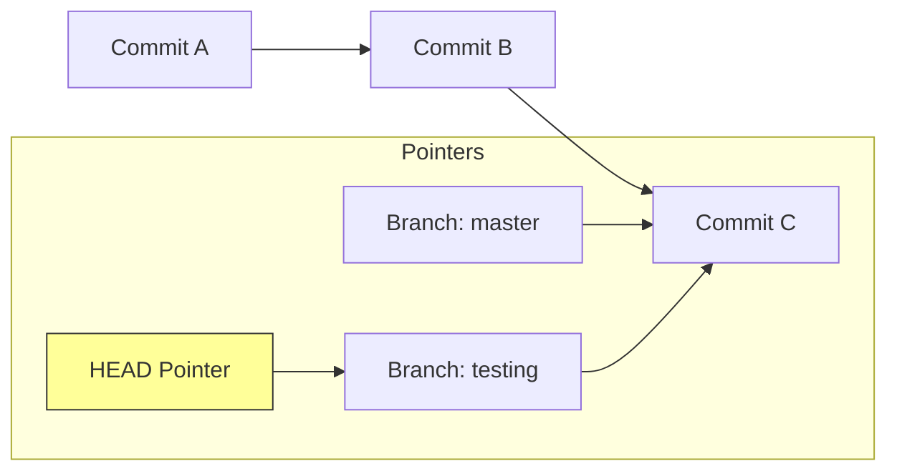

# الفصل الأول: إيه هو Git أصلاً؟ (The Core Concepts)

### 🔑 Key Takeaways

- الـ Git مش بيحفظ التغييرات (Deltas)، هو بيحفظ لقطات كاملة (Snapshots).
- كل حاجة في Git شغالة بـ Checksum اسمه **SHA-1**.
- عندنا 3 حالات (States) للملفات لازم تفهمهم كويس جداً.

## 1. لقطات مش فروقات (Snapshots, Not Differences)

أغلب أنظمة الـ Version Control القديمة (زي SVN) كانت بتحفظ "التغيير" اللي حصل في الملف. لكن Git تفكيره مختلف تماماً. الـ Git بيبص للداتا بتاعتك كأنها "لقطة" (Snapshot) لنظام ملفات صغير. كل مرة بتعمل `commit`، الـ Git بياخد صورة لكل ملفاتك في اللحظة دي وبيخزن مرجع (Reference) للصورة دي. وعشان يوفر مساحة، لو الملف ماتغيرش، مش بيحفظه تاني، بيشاور بس على النسخة القديمة اللي حفظها قبل كده.

> [!NOTE] ملحوظة ع الماشي ده اللي بيخلي Git سريع جداً، لأنه بيتعامل مع "mini filesystem" مش مجرد حساب فروقات.

## 2. الـ Three States (أهم حاجة تفهمها)

عشان ماتتلخبطش وأنت شغال، لازم تعرف إن أي ملف في مشروعك بيمر بـ 3 مراحل أساسية:

1. **Modified**: أنت عدلت الملف بس لسه ماقولتش للـ Git يسجله.
2. **Staged**: أنت علمت على الملف وقولت للـ Git "خد ده معاك في الـ Commit الجاية".
3. **Committed**: الداتا اتحفظت خلاص في قاعدة البيانات (الـ Repository) بتاعتك.

ده بيخلينا نقسم المشروع لـ 3 أقسام رئيسية:

- **Working Directory**: ده "صندوق الرمل" (Sandbox) بتاعك اللي شغال فيه وتعدل براحتك.
- **Staging Area (Index)**: دي منطقة الانتظار، بتجهز فيها الملفات قبل ما تعملها Save.
- **Git Directory (.git)**: ده المخزن الحقيقي اللي فيه الميتا داتا والـ Object Database.

```mermaid
graph LR
    WD[Working Directory] -- git add --> SA[Staging Area]
    SA -- git commit --> GR[Git Repository (.git)]
    GR -- git checkout --> WD
    style WD fill:#f96,stroke:#333,stroke-width:2px
    style SA fill:#69f,stroke:#333,stroke-width:2px
    style GR fill:#6f9,stroke:#333,stroke-width:2px
```

---

# الفصل الثاني: أساسيات الشغل (Git Basics)

### 🔑 Key Takeaways

- ازاي تبدأ مشروع وتعمل أول Commit.
- إيه اللي بيحصل فعلياً لما بتكتب `git add` و `git commit`.

## 1. التجهيز (Setup)

قبل أي حاجة، لازم تعرف الـ Git أنت مين، لأن كل Commit بيتسجل باسمك وإيميلك.

```
# بتعرف اسمك للـ Git
git config --global user.name "Ahmed Developer"

# بتعرف إيميلك
git config --global user.email ahmed@example.com
```

## 2. دورة الحياة (The Workflow) "Under the hood"

تعالى نشوف إيه اللي بيحصل لما بتكتب الأوامر دي بجد في الـ **Git Internals**:

1. **`git init`**: بيعمل فولدر `.git` فاضي عشان يبدأ يخزن فيه الـ Objects.
2. **`git add file.txt`**: هنا الـ Git بياخد محتوى الملف، وبيعمله ضغط (Hash) وبيحسب الـ **SHA-1** بتاعه (كود من 40 حرف)، وبيخزنه كـ **Blob Object** في الداتا بيز. وبعدين بيحدث الـ Index عشان يشاور على الـ Blob ده.
3. **`git commit`**: هنا الـ Git بيعمل حاجتين:
    - بيعمل **Tree Object** (زي الفولدر) بيجمع فيه أسماء الملفات والـ Blobs بتاعتها.
    - بيعمل **Commit Object** شايل بياناتك (Author)، والتاريخ، ورسالة الـ Commit، وبيشاور على الـ Tree دي، وبيشاور كمان على الـ Commit اللي قبله (Parent).

```mermaid
graph TD
    C1[Commit 1 <br/> SHA-1: 98ca9...] --> T1[Tree <br/> SHA-1: 92ec2...]
    T1 --> B1[Blob: README]
    T1 --> B2[Blob: main.c]

    C2[Commit 2 <br/> SHA-1: 34ac2...] --> C1
    C2 --> T2[Tree <br/> SHA-1: 184ca...]
    T2 --> B1
    T2 --> B3[Blob: main.c <br/> (New Version)]

    style C1 fill:#f9f,stroke:#333
    style C2 fill:#f9f,stroke:#333
    style T1 fill:#9ff,stroke:#333
    style T2 fill:#9ff,stroke:#333
```

> [!WARNING] تحذير هام الأمر `git commit -a` بيخليك تنط مرحلة الـ Staging وتعمل commit لكل الملفات المتعدلة (Tracked) مرة واحدة، بس خلي بالك عشان ممكن ترفع ملفات مش عايزها بالغلط.

---

# الفصل الثالث: الفروع (Git Branching) - الميزة القاتلة

### 🔑 Key Takeaways

- الـ Branches في Git رخيصة جداً وسريعة (Lightweight).
- الـ Branch مجرد مؤشر (Pointer) بيتحرك معاك.
- الـ HEAD هو اللي بيقولك "أنت واقف فين دلوقتي".

## 1. يعني إيه Branch؟

في أنظمة تانية، لما بتعمل Branch بتنسخ ملفات المشروع كلها، وده بياخد وقت. في Git، الـ Branch هو مجرد ملف صغير فيه 40 حرف (SHA-1) بيشاور على آخر Commit أنت عملته. بس كده! عشان كده هو سريع جداً.

الفرع الافتراضي اسمه `master` (ومؤخراً بقى `main` في GitHub)، وأنت شغال هو بيتحرك معاك أوتوماتيك مع كل Commit جديد.

## 2. ازاي بنتحرك؟ (HEAD)

الـ **HEAD** ده مؤشر خاص بيشاور على "الفرع الحالي" اللي أنت شغال عليه. لما بتعمل `git checkout testing`، أنت بتقول للـ Git: "حرك الـ HEAD خليه يشاور على فرع testing".



## 3. الدمج (Merging)

لما تخلص شغل في فرع جانبي وعايز ترجعه للرئيسي، بنعمل `merge`.

- لو مفيش شغل حصل في الرئيسي، الـ Git بيعمل حاجة اسمها **Fast-forward** (ببساطة بيزق المؤشر لقدام).
- لو حصل تغيير في الفرعين، الـ Git بيعمل **Merge Commit** جديد بيربط الفرعين ببعض.

> [!INFO] معلومة تقنية لو حصل **Merge Conflict** (تضارب)، يعني عدلت نفس السطر في الفرعين، الـ Git هيوقف العملية ويطلب منك تفتح الملف وتختار التعديل الصح، وبعدين تعمل `git add` عشان تعلمه إنه اتحل.

---

# تطبيق عملي (Code Snippet) 🚀

دي تجميعة لأهم الأوامر اللي هتحتاجها عشان تبدأ مشروع وتطبق اللي اتعلمناه:

```bash
# 1. ابدأ مشروع جديد
mkdir my_project
cd my_project
git init

# 2. ضيف ملف وعدله
echo "Hello Git" > README.md
git status # هتلاقيه Untracked

# 3. جهز الملف (Staging)
git add README.md
git status # هتلاقيه ready to be committed

# 4. احفظ الشغل (Commit)
git commit -m "Initial commit: added readme"

# 5. اعمل فرع جديد وجرب فيه
git branch feature-login
git checkout feature-login
# أو في خطوة واحدة: git checkout -b feature-login

# 6. عدل في الفرع الجديد
echo "Login code" > login.js
git add login.js
git commit -m "Added login feature"

# 7. ارجع للرئيسي وادمج الشغل
git checkout master
git merge feature-login

# 8. امسح الفرع الفرعي لو مش محتاجه
git branch -d feature-login
```

