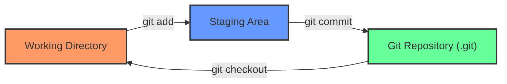
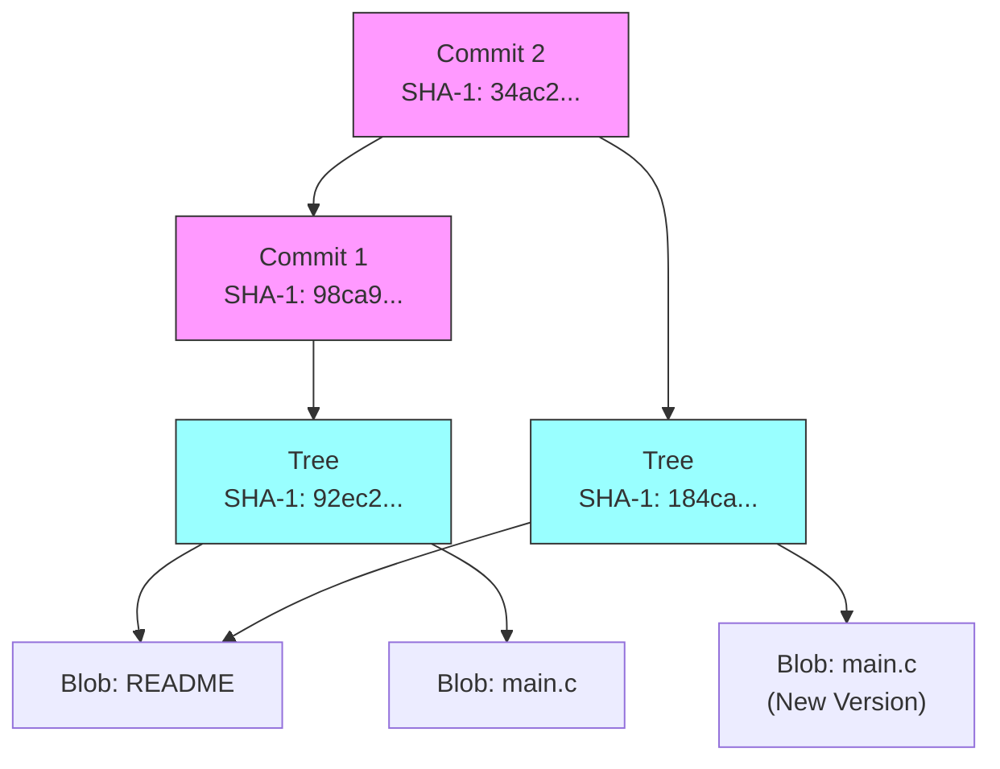
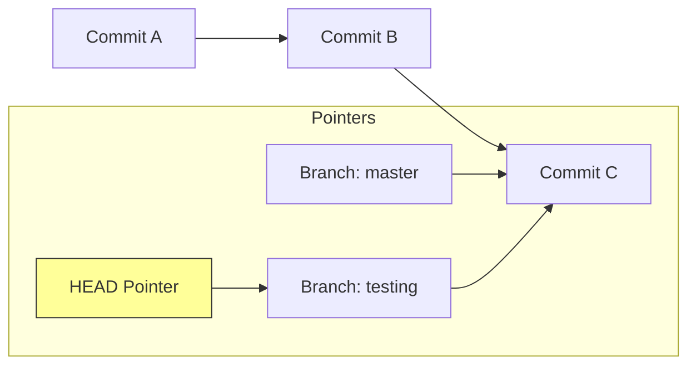

# الفصل الأول: إيه هو Git أصلاً؟ (The Core Concepts)

### 🔑 Key Takeaways

- الـ Git مش بيحفظ التغييرات (Deltas)، هو بيحفظ لقطات كاملة (Snapshots).
- كل حاجة في Git شغالة بـ Checksum اسمه **SHA-1**.
- عندنا 3 حالات (States) للملفات لازم تفهمهم كويس جداً.

## 1. لقطات مش فروقات (Snapshots, Not Differences)

أغلب أنظمة الـ Version Control القديمة (زي SVN) كانت بتحفظ "التغيير" اللي حصل في الملف. لكن Git تفكيره مختلف تماماً. الـ Git بيبص للداتا بتاعتك كأنها "لقطة" (Snapshot) لنظام ملفات صغير. كل مرة بتعمل `commit`، الـ Git بياخد صورة لكل ملفاتك في اللحظة دي وبيخزن مرجع (Reference) للصورة دي. وعشان يوفر مساحة، لو الملف ماتغيرش، مش بيحفظه تاني، بيشاور بس على النسخة القديمة اللي حفظها قبل كده.

> [!NOTE] ملحوظة ع الماشي ده اللي بيخلي Git سريع جداً، لأنه بيتعامل مع "mini filesystem" مش مجرد حساب فروقات.

## 2. الـ Three States (أهم حاجة تفهمها)

عشان ماتتلخبطش وأنت شغال، لازم تعرف إن أي ملف في مشروعك بيمر بـ 3 مراحل أساسية:

1. **Modified**: أنت عدلت الملف بس لسه ماقولتش للـ Git يسجله.
2. **Staged**: أنت علمت على الملف وقولت للـ Git "خد ده معاك في الـ Commit الجاية".
3. **Committed**: الداتا اتحفظت خلاص في قاعدة البيانات (الـ Repository) بتاعتك.

ده بيخلينا نقسم المشروع لـ 3 أقسام رئيسية:

- **Working Directory**: ده "صندوق الرمل" (Sandbox) بتاعك اللي شغال فيه وتعدل براحتك.
- **Staging Area (Index)**: دي منطقة الانتظار، بتجهز فيها الملفات قبل ما تعملها Save.
- **Git Directory (.git)**: ده المخزن الحقيقي اللي فيه الميتا داتا والـ Object Database.



---

# الفصل الثاني: أساسيات الشغل (Git Basics)

### 🔑 Key Takeaways

- ازاي تبدأ مشروع وتعمل أول Commit.
- إيه اللي بيحصل فعلياً لما بتكتب `git add` و `git commit`.

## 1. التجهيز (Setup)

قبل أي حاجة، لازم تعرف الـ Git أنت مين، لأن كل Commit بيتسجل باسمك وإيميلك.

```bash
# بتعرف اسمك للـ Git
git config --global user.name "Ahmed Developer"

# بتعرف إيميلك
git config --global user.email ahmed@example.com
```

## 2. دورة الحياة (The Workflow) "Under the hood"

تعالى نشوف إيه اللي بيحصل لما بتكتب الأوامر دي بجد في الـ **Git Internals**:

1. **`git init`**: بيعمل فولدر `.git` فاضي عشان يبدأ يخزن فيه الـ Objects.
2. **`git add file.txt`**: هنا الـ Git بياخد محتوى الملف، وبيعمله ضغط (Hash) وبيحسب الـ **SHA-1** بتاعه (كود من 40 حرف)، وبيخزنه كـ **Blob Object** في الداتا بيز. وبعدين بيحدث الـ Index عشان يشاور على الـ Blob ده.
3. **`git commit`**: هنا الـ Git بيعمل حاجتين:
    - بيعمل **Tree Object** (زي الفولدر) بيجمع فيه أسماء الملفات والـ Blobs بتاعتها.
    - بيعمل **Commit Object** شايل بياناتك (Author)، والتاريخ، ورسالة الـ Commit، وبيشاور على الـ Tree دي، وبيشاور كمان على الـ Commit اللي قبله (Parent).



> [!WARNING] تحذير هام الأمر `git commit -a` بيخليك تنط مرحلة الـ Staging وتعمل commit لكل الملفات المتعدلة (Tracked) مرة واحدة، بس خلي بالك عشان ممكن ترفع ملفات مش عايزها بالغلط.

---

# الفصل الثالث: الفروع (Git Branching) - الميزة القاتلة

### 🔑 Key Takeaways

- الـ Branches في Git رخيصة جداً وسريعة (Lightweight).
- الـ Branch مجرد مؤشر (Pointer) بيتحرك معاك.
- الـ HEAD هو اللي بيقولك "أنت واقف فين دلوقتي".

## 1. يعني إيه Branch؟

في أنظمة تانية، لما بتعمل Branch بتنسخ ملفات المشروع كلها، وده بياخد وقت. في Git، الـ Branch هو مجرد ملف صغير فيه 40 حرف (SHA-1) بيشاور على آخر Commit أنت عملته. بس كده! عشان كده هو سريع جداً.

الفرع الافتراضي اسمه `master` (ومؤخراً بقى `main` في GitHub)، وأنت شغال هو بيتحرك معاك أوتوماتيك مع كل Commit جديد.

## 2. ازاي بنتحرك؟ (HEAD)

الـ **HEAD** ده مؤشر خاص بيشاور على "الفرع الحالي" اللي أنت شغال عليه. لما بتعمل `git checkout testing`، أنت بتقول للـ Git: "حرك الـ HEAD خليه يشاور على فرع testing".



## 3. الدمج (Merging)

لما تخلص شغل في فرع جانبي وعايز ترجعه للرئيسي، بنعمل `merge`.

- لو مفيش شغل حصل في الرئيسي، الـ Git بيعمل حاجة اسمها **Fast-forward** (ببساطة بيزق المؤشر لقدام).
- لو حصل تغيير في الفرعين، الـ Git بيعمل **Merge Commit** جديد بيربط الفرعين ببعض.

> [!INFO] معلومة تقنية لو حصل **Merge Conflict** (تضارب)، يعني عدلت نفس السطر في الفرعين، الـ Git هيوقف العملية ويطلب منك تفتح الملف وتختار التعديل الصح، وبعدين تعمل `git add` عشان تعلمه إنه اتحل.

---

# تطبيق عملي (Code Snippet) 🚀

دي تجميعة لأهم الأوامر اللي هتحتاجها عشان تبدأ مشروع وتطبق اللي اتعلمناه:

```bash
# 1. ابدأ مشروع جديد
mkdir my_project
cd my_project
git init

# 2. ضيف ملف وعدله
echo "Hello Git" > README.md
git status # هتلاقيه Untracked

# 3. جهز الملف (Staging)
git add README.md
git status # هتلاقيه ready to be committed

# 4. احفظ الشغل (Commit)
git commit -m "Initial commit: added readme"

# 5. اعمل فرع جديد وجرب فيه
git branch feature-login
git checkout feature-login
# أو في خطوة واحدة: git checkout -b feature-login

# 6. عدل في الفرع الجديد
echo "Login code" > login.js
git add login.js
git commit -m "Added login feature"

# 7. ارجع للرئيسي وادمج الشغل
git checkout master
git merge feature-login

# 8. امسح الفرع الفرعي لو مش محتاجه
git branch -d feature-login
```

---


# المرحلة الأولى: البداية (Setup & Local Work)

### 1. تجهيز المشروع (Init with main)

أول خطوة في التاسك إننا نعمل الفولدر ونعرف Git عليه. الكتاب بيقولنا إن الـ Default branch زمان كان اسمه `master`، بس حديثاً بقى `main`. عشان تظبط ده من الأول:

```bash
# 1. اعمل الفولدر وادخل جواه
mkdir TaskManagerApp
cd TaskManagerApp

# 2. ظبط الـ default branch يبقى main (لو مش معمول)
git config --global init.defaultBranch main

# 3. ابدأ الـ Repo
git init
```

> [!INFO] Under the hood لما بتكتب `git init`، الـ Git بيعمل فولدر مخفي اسمه `.git`. الفولدر ده هو "المخ" بتاع المشروع، بيبقى فيه الـ Database اللي بيتخزن فيها الـ Objects والـ HEAD pointer.

### 2. أول ملف و Commit

أنت مطلوب منك تضيف README. هنا الـ Git بيستخدم حاجة اسمها **The Three States** اللي اتكلمنا عليهم قبل كده:

1. **Working Directory:** الملف اللي لسه كاتبه.
2. **Staging Area (Index):** لما تعمل `git add`.
3. **Repository:** لما تعمل `git commit`.

```bash
# اكتب وصف المشروع
echo "# Task Manager App\nThis is a simple app to manage daily tasks." > README.md

# ضيف الملف للـ Staging Area
git add README.md

# احفظه في الداتا بيز
git commit -m "Initial Commit: Add README with project description"
```

---

# المرحلة الثانية: الطلوع لايف (Remote & GitHub)

### 3. ربط المشروع بـ GitHub

عشان ترفع شغلك، لازم تعمل Repo فاضي على GitHub الأول (من زرار "New Repository" اللي في الموقع). بعدين تربط اللي عندك (Local) باللي فوق (Remote).

```bash
# ضيف اللينك بتاع الـ Repo (ده مجرد اسم دلع للينك بنسميه origin)
git remote add origin https://github.com/YourUser/TaskManagerApp.git

# ارفع كودك للفرع main
git push -u origin main
```

> [!NOTE] ليه `-u`؟ الـ `-u` دي اختصار لـ `--set-upstream`. دي بتخليك بعد كده تكتب `git push` أو `git pull` علطول من غير ما تحتاج تكتب اسم الفرع والسيرفر كل مرة.

---

# المرحلة الثالثة: الشغل الاحترافي (Branches & Ignoring)

### 4. الفروع (Feature Branch)

في الشغل الصح، مش بنكتب كود في الـ `main` علطول. بنعمل فرع جديد لكل Feature. الكتاب بيسميها "Topic Branches".

```bash
# اعمل فرع جديد وحول عليه في نفس الوقت
git checkout -b feature-login

# اكتب الكود بتاعك
echo "console.log('Login logic here');" > login.js

# اعمل Commit
git add login.js
git commit -m "Add basic login logic"
```

### 5. ملف الـ .gitignore

أنت مش عايز ترفع ملفات الملاحظات الشخصية (`notes.txt`). الـ Git بيوفرلك ملف اسمه `.gitignore` عشان تقول له "ماتشوفش الملفات دي".

```bash
# اعمل ملف الملاحظات
echo "Meeting at 5 PM" > notes.txt

# قول للـ Git يتجاهله
echo "notes.txt" >> .gitignore

# لو عملت git status دلوقتي، مش هيشوف notes.txt بس هيشوف .gitignore
git add .gitignore
git commit -m "Add gitignore to exclude notes"
```

---

# المرحلة الرابعة: التعاون والخناقات (Collaboration & Conflicts)

### 6. إضافة Collaborator

عشان صاحبك يشتغل معاك، لازم تديله صلاحية. من على GitHub:

1. ادخل على **Settings** في الـ Repo بتاعك.
2. اختار **Collaborators** من القائمة الشمال.
3. اكتب الـ Username بتاعه واضغط **Add collaborator**.

### 7. محاكاة الـ Conflict (الخناقة)

عشان تعمل المحاكاة دي لوحدك، ممكن تعمل حركتين: تعدل ملف على GitHub مباشرة (كأن صاحبك هو اللي عدله)، وتعدل نفس السطر عندك على الجهاز.

1. **على GitHub:** افتح `README.md` وعدل السطر الأول خليه: `# Task Manager App - Pro Version` واعمل Commit.
2. **على جهازك (Local):** عدل نفس السطر في `README.md` خليه: `# Task Manager App - Lite Version` واعمل Commit.

دلوقتي لو حاولت تعمل `git pull` عشان تجيب شغل "صاحبك"، الـ Git هيصوت ويقولك **CONFLICT**.

```bash
git pull origin main
# Auto-merging README.md
# CONFLICT (content): Merge conflict in README.md
# Automatic merge failed; fix conflicts and then commit the result.
```

### 8. حل الـ Conflict

لما تفتح الملف، هتلاقي الـ Git حطلك علامات عشان يوريك الفرق:

```bash
<<<<<<< HEAD
# Task Manager App - Lite Version
=======
# Task Manager App - Pro Version
>>>>>>> al3424... (hash from github)
```

**الحل:** امسح العلامات دي (`<<<`, `===`, `>>>`) واختار الجملة اللي أنت عايزها (أو اكتب جملة جديدة تجمع الاتنين). وبعدين:

```bash
git add README.md
git commit -m "Merge conflict resolved: Update project title"
git push origin main
```

---

# المرحلة الخامسة: التراجع (Revert vs Reset) 🔥

دي أهم نقطة طلبتها، والفرق بينهم جوهري جداً "Under the hood".

### السيناريو:

أنت عملت Commit فيها كود غلط، وعايز ترجع في كلامك.

### 1. `git revert` (الطريقة الآمنة - Safe)

ده بيعمل **Commit جديد** بيعكس اللي حصل في الـ Commit الغلط.

- **ليه نستخدمه؟** لو الكود اترفع خلاص على GitHub والناس شافته. ماينفعش تمسح التاريخ عشان متلخبطش التيم.
- **بيعمل إيه؟** لو الـ Commit القديمة كانت "إضافة سطر"، الـ Revert هتعمل commit جديدة "مسح السطر".

```bash
# ارجع في كلامك عن آخر commit بس سجل ده في التاريخ
git revert HEAD
```

### 2. `git reset` (آلة الزمن - Dangerous)

ده بيمسح التاريخ وكأن الـ Commit لم تكن. بنستخدمه بس لو الشغل لسه عندك (Local) ومحدش شافه. الكتاب بيشرح إن ليه 3 أنواع بناءً على الـ "Three Trees":

#### أ) Soft Reset (`--soft`)

- **بيعمل إيه؟** بيرجع الـ `HEAD` لورا خطوة، بس **بيسيب شغلك في الـ Staging Area**.
- **الاستخدام:** لو عملت commit ونسيت ملف، وعايز ترجع الـ commit تتفتح تاني عشان تزود الملف وتعملها commit تاني.

```bash
# ارجع خطوة لورا وسيب الملفات جاهزة (Staged)
git reset --soft HEAD~1
```

#### ب) Hard Reset (`--hard`)

- **بيعمل إيه؟** ده "النووي". بيرجع الـ `HEAD` لورا، و **بيمسح أي تغييرات في الـ Staging و الـ Working Directory**.
- **الاستخدام:** لو عكيت الدنيا وعايز ترمي كل شغلك وترجع لآخر نقطة نضيفة.

```bash
# امسح كل حاجة وارجع زي ما كنت في الكوميت اللي فاتت
git reset --hard HEAD~1
```

### مخطط يوضح الفرق (Mermaid)

```mermaid
graph TD
    subgraph History
    C1[Commit 1] --> C2[Commit 2]
    C2 --> C3[Commit 3 <br/> (Mistake)]
    end

    subgraph Revert_Action
    C3 --> C4[Commit 4 <br/> (Revert of C3)]
    Note1[التاريخ بيزيد وكله تمام]
    end

    subgraph Reset_Action
    C2 -.-> C3
    C2 --> NewHead[HEAD is now here]
    Note2[Commit 3 اتمسحت من التاريخ]
    end
```

### ملخص سريع للتاسك:

1. لو الشغل **Local** بس وعايز تكنسله تماماً: `git reset --hard`.
2. لو الشغل **Local** وعايز تعدل عليه: `git reset --soft`.
3. لو الشغل **Public** (على GitHub): استخدم `git revert`.

بالتوفيق في التاسك يا بطل! لو وقفت في أي خطوة عرفني.