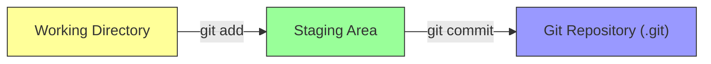
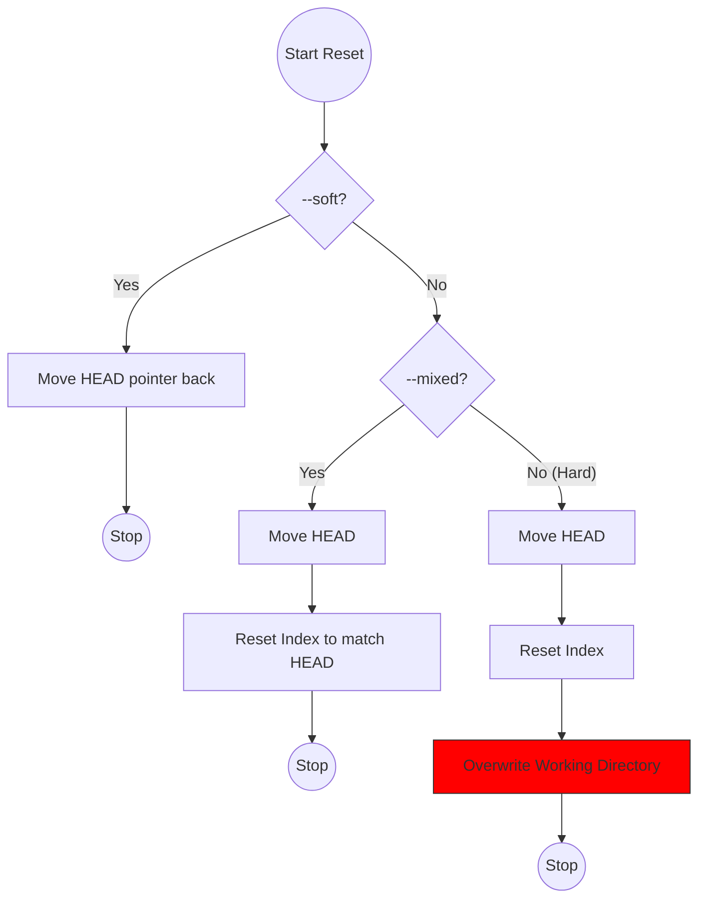
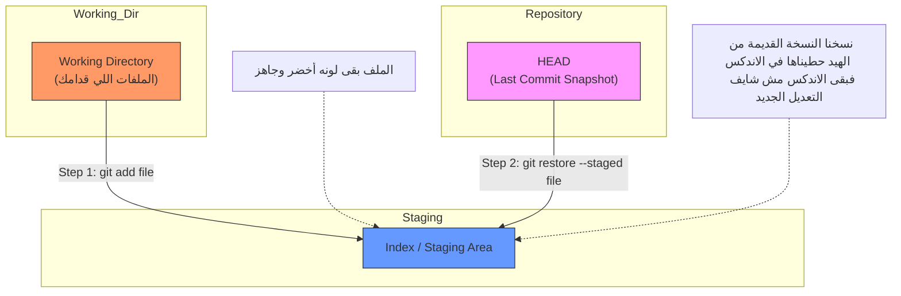
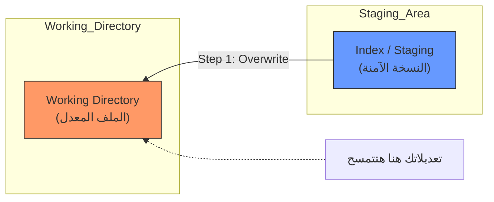
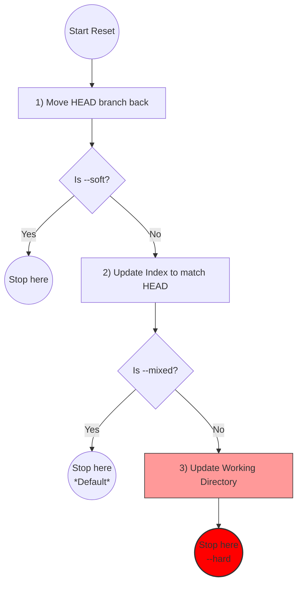

فكرة ممتازة يا هندسة! نظام الـ **Guided Learning** ده هو اللي بيثبت المعلومة، لأننا هنمشي بمبدأ "نقرأ شوية، ونطبق بإيدنا شوية".

أنا جهزتلك **خطة الطريق (Roadmap)** اللي هنمشي عليها بناءً على كتاب _Pro Git_، وهنقسمها لـ 5 مستويات (Levels). كل مستوى هشرحلك المفهوم بتاعه "Under the hood"، وناخد الأوامر، وتختم بـ "تاسك" تعمله.

### 🗺️ خطة العمل بتاعتنا:

1. **Level 1:** الأساسيات وفلسفة الـ Snapshots (إحنا هنا النهاردة).
2. **Level 2:** التراجع عن الأخطاء (Undoing Things).
3. **Level 3:** الفروع (Branching) والدمج (Merging).
4. **Level 4:** العمل مع السيرفرات (Remotes & GitHub).
5. **Level 5:** أدوات المحترفين (Stashing, Interactive Staging).

---

# Level 1: البداية وفلسفة الـ Snapshots

عشان تبدأ صح، لازم تنسى أي حاجة تعرفها عن أنظمة الملفات العادية. الـ Git مش بيحفظ الملفات زي ما أنت فاكر.

### 🧠 1. الجزء النظري (Theory)

#### أ) لقطات مش فروقات (Snapshots not Differences)

أغلب الأنظمة القديمة كانت بتحفظ "التغيير" بس (Delta). يعني تقول: "السطر 5 اتغير". الـ Git لأ.. الـ Git بياخد "صورة كاملة" (Snapshot) للمشروع كله مع كل `commit`. لو الملف ماتغيرش، الـ Git ذكي كفاية إنه مايحفظوش تاني، بس بيعمل "رابط" (Link) للصورة القديمة عشان يوفر مساحة. ده بيخلي الـ Git سريع جداً كأنه "Mini Filesystem".

#### ب) الحالات الثلاثة (The Three States)

أي ملف في مشروعك بيمر بـ 3 مراحل، وده أهم مفهوم في الكتاب كله:

1. **Modified:** 
2. الملفات اللي عدلتها بس لسه في الـ Working Directory (مكتبك).
3. **Staged:**
4. الملفات اللي حطيتها في الـ Staging Area (صندوق الظرف) ومستنية تتبعت.
5. **Committed:**
6. الملفات اللي اتختمت واتحفظت في الـ Repository (الأرشيف .git).



---

### ⌨️ 2. الأوامر (Commands)

دول "عدة الشغل" الأساسية اللي هتستخدمهم 90% من الوقت:

#### 1. التعريف (Identity)

قبل أي حاجة، لازم تقول للـ Git أنت مين عشان يسجل اسمك في التاريخ.

```bash
git config --global user.name "Your Name"
git config --global user.email "your@email.com"
```

#### 2. البداية (Init)

ده بيعمل فولدر `.git` مخفي، وده اللي فيه "الداتا بيز" الحقيقية.

```bash
git init
```

#### 3. فحص الحالة (Status)

ده عينك اللي بتشوف بيها الملفات واقفة في أنهي مرحلة (Untracked, Modified, Staged).

```bash
git status
```

#### 4. التجهيز (Add)

بينقل الملف من الـ Working Directory للـ Staging Area.

```bash
git add filename.txt
# أو عشان تضيف كله
git add .
```

#### 5. الحفظ (Commit)

بياخد اللقطة من الـ Staging Area ويحفظها في الداتا بيز برسالة توضيحية.

```bash
git commit -m "Initial commit"
```

---

### 📝 3. الأساينمنت (Assignment)

دلوقتي دورك يا بطل. نفذ الخطوات دي بالترتيب في الـ Terminal عندك وقولي لما تخلص:

1. اعمل فولدر جديد باسم `MyFirstRepo` وادخل جواه.
2. عرف الـ Git بنفسك (Name & Email) لو لسه معملتهاش.
3. حول الفولدر ده لـ Git Repository.
4. اعمل ملف نصي اسمه `chapter1.txt` واكتب جواه "Hello Git".
5. استخدم `git status` وشوف الملف لونه إيه ومكتوب إيه جنبه (المفروض Untracked).
6. انقل الملف للـ Staging Area.
7. استخدم `git status` تاني ولاحظ الفرق (المفروض يبقى لونه أخضر Changes to be committed).
8. اعمل Commit برسالة "Added chapter 1".
9. اعمل تعديل بسيط في الملف تاني، واعمل `git status`.


---

# Level 2: التراجع وفك طلاسم الـ Reset

### 🧠 1. الجزء النظري: الأشجار الثلاثة (The Three Trees)

الـ Git مش مجرد مخزن، هو عبارة عن "مدير محتوى" بيدير 3 مناطق (أو أشجار) رئيسية. عشان تفهم أي أمر بيعمل إيه، لازم تسأل نفسك: "الأمر ده بيأثر على أنهي شجرة فيهم؟".

#### الشجرة 1: الـ HEAD (أخر لقطة محفوظة)

- **الوظيفة:** دي "الذاكرة" بتاعتك. الـ HEAD هو مؤشر بيشاور على أخر `commit` أنت واقف عليها حالياً.
- **المحتوى:** نسخة طبق الأصل من أخر حاجة اتحفظت في الداتا بيز. لما بتعمل `commit`، الـ HEAD بيتحرك خطوة لقدام.

#### الشجرة 2: الـ Index (مسرح العمليات / Staging Area)

- **الوظيفة:** دي المنطقة "البرزخ" بين شغلك وبين الداتا بيز.
- **المحتوى:** لما بتكتب `git add`، أنت بتاخد نسخة من الملف وبتحطها هنا. الـ Git لما بييجي يعمل `commit`، بيبص على الشجرة دي بس، ملوش دعوة بملفاتك اللي بره.

#### الشجرة 3: الـ Working Directory (صندوق الرمل)

- **الوظيفة:** دي ملفاتك الحقيقية اللي شايفها قدامك على الكمبيوتر وبتقدر تعدل فيها.
- **المحتوى:** دي النسخة الوحيدة "المفكوكة" (Unpacked) اللي تقدر تفتحها بالـ Editor. أي تغيير هنا الـ Git مش بيحس بيه غير لما تقوله `git add`.

> [!INFO] Under the hood: حركة البيانات الـ Workflow الطبيعي بيمشي كدة:
> 
> 1. تعدل في **Working Directory**.
> 2. تعمل `git add` -> ينقل التعديل للـ **Index**.
> 3. تعمل `git commit` -> ياخد اللقطة من الـ **Index** يسجلها في الداتا بيز ويحرك الـ **HEAD**.


---

### ⌨️ 2. الأوامر (Commands) - أدوات التراجع

دلوقتي نفهم الأوامر بناءً على نظرية الأشجار الثلاثة.

#### أ) تعديل أخر Commit (`--amend`)

لو عملت `commit` ونسيت ملف، أو كتبت الرسالة غلط.

- **نظرياً:** الأمر ده مش "بيعدل" الـ Commit القديمة. هو بيعمل Commit **جديدة تماماً** وبيمسح القديمة من التاريخ وكأنها لم تكن.

```bash
# بعد ما تعمل add للملف الناقص
git commit --amend -m "الرسالة الجديدة بعد التصحيح"
```

#### ب) التراجع عن الـ Staging (`git restore --staged`)

لو عملت `git add` لملف بالغلط وعايز ترجعه من الـ **Index** للـ **Working Directory** بس.

- **نظرياً:** أنت بتقول للـ Git: "انسخ نسخة الملف ده من الـ HEAD حطها في الـ Index" (عشان ينسى التعديل الجديد اللي أنت ضيفته بالغلط).

```bash
# الملف هيفضل فيه تعديلاتك بس هيتشال من التجهيز
git restore --staged filename.txt
```

_(زمان كنا بنستخدم `git reset HEAD file` لنفس الغرض)._

#### ج) التراجع عن التعديلات تماماً (`git restore`) 🚨

لو عدلت ملف وعكيت الدنيا وعايز ترجعه زي ما كان أخر مرة حفظته.

- **نظرياً:** بتقول للـ Git: "هات نسخة الملف من الـ Index وارميها فوق الـ Working Directory". **تحذير:** أي شغل مكتبتوش هيضيع للأبد.

```bash
# بيرجع الملف لأصله وبيمسح شغلك
git restore filename.txt
```

#### د) الـ Reset (المعلم الكبير)

ده الأمر اللي بيلعب في الـ 3 أشجار بمزاجك. ليه 3 درجات قوة:

1. **Soft (`--soft`):**
    
    - بيحرك الـ **HEAD** بس لورا.
    - بيسيب شغلك في الـ **Index** (جاهز للـ commit من جديد).
    - _استخدامه:_ لو عايز تدمج أخر 2 commits مع بعض.
2. **Mixed (`--mixed`)** (ده الافتراضي):
    
    - بيحرك الـ **HEAD** لورا.
    - بيرجع شغلك من الـ **Index** للـ **Working Directory**.
    - _استخدامه:_ لو عايز تلغي الـ commit والـ add وتكمل شغل.
3. **Hard (`--hard`)** (خطر جداً 💀):
    
    - بيحرك الـ **HEAD**.
    - بيمسح الـ **Index**.
    - بيمسح الـ **Working Directory**.
    - _استخدامه:_ لو عايز ترجع بالزمن وتمسح كل حاجة حصلت.



---
ولا يهمك يا هندسة، أنت جيت عند أكتر حتة بتعقد الناس وهي الفرق بين الـ **HEAD** والـ **Index** والـ **Working Directory**. حقك تتلخبط لأننا بنتعامل مع حاجات مش شايفينها بعيننا.

تعالى نبسطها خالص وننسى "أوامر" شوية ونركز في "تخيل" الموقف.

---

# 🧠 تبسيط المفهوم: نظرية "عربية التسوق" (The Shopping Cart)

تخيل إننا في سوبر ماركت، والعملية ماشية كالتالي:

1. **الرفوف (Working Directory):** دي البضاعة اللي قدامك (الملفات)، تقدر تمسك أي منتج، تفتحه، تبدله، أو ترميه.
2. **عربية التسوق (Staging Area / Index):** دي العربية اللي بتحط فيها الحاجات اللي نويت تشتريها خلاص.
3. **الفاتورة القديمة (HEAD):** دي أخر فاتورة دفعتها وأنت خارج المرة اللي فاتت.

### إيه اللي بيحصل لما بتعمل `git add`؟

أنت بتشيل "علبة لبن" (الملف المعدل) من الرف، وتحطها في "عربية التسوق".

- **الحالة:** اللبن موجود في العربية (Staged) ومستعد للدفع (Commit).

### إيه اللي بيحصل لما بتعمل `git restore --staged`؟

أنت بصيت في العربية، وقررت إنك **مش عايز تشتري اللبن دلوقتي**، بس مش عايز ترميه، أنت عايز ترجعه الرف تاني عشان تفكر.

- **الأمر ده بيعمل إيه؟** بيمد إيده في "عربية التسوق" ويرجع الحاجة زي ما كانت في "الفاتورة القديمة" (يعني بيشيلها من العربية).
- **هل اللبن اتدلق؟** لأ، اللبن لسه موجود سليم على الرف (Working Directory) قدامك، بس مبقاش في العربية.

---

# 🔍 تحت الكبوت (Under the Hood)

أنت قولت جملة مهمة: _"مش عارف أتخيل تحرك الهيد"_. **خد المفاجأة دي:** في الأمر `git restore --staged`، الـ **HEAD** مش بيتحرك من مكانه! 😲

الـ HEAD ده عامل زي "ختم" ثابت على أخر Commit. الأمر ده مش بيحرك الختم، الأمر ده **بينسخ** نسخة من الملف اللي عند الـ HEAD ويرميها في الـ Index.

### بص على الرسمة دي (Visualizing Data Flow):



### السيناريو بالتفصيل الممل:

1. **البداية:** عندك ملف `file.txt` مكتوب فيه "Hello". (موجود في الـ 3 أماكن زي بعض).
2. **التعديل:** فتحت الملف وخليته "Hello World". (دلوقتي الـ Working Directory بس هو اللي اتغير).
3. **التجهيز (`git add`):** أخدت نسخة من "Hello World" حطيتها في الـ Index.
    - دلوقتي لو عملت `commit`، هيتحفظ "Hello World".
4. **التراجع (`git restore --staged`):** أنت قولت "يووه، أنا مكنتش عايز أعمل add دلوقتي".
    - الـ Git بيروح للـ **HEAD** (اللي لسه فيه "Hello" القديمة).
    - بياخد نسخة من "Hello".
    - يرميها في الـ **Index** فوق "Hello World".
    - **النتيجة:** الـ Index رجع فيه "Hello" (زي الـ HEAD بالظبط)، فالـ Git بيبص يلاقي الـ Index زي الـ HEAD فبيعتبر إن "مفيش حاجة معمولة ليها Staging".
    - **بس خلي بالك:** ملفك بره (في الـ Working Directory) لسه فيه "Hello World" ماتمسحتش.

> [!TIP] الزتونة الأمر `git restore --staged` معناه ببساطة: "يا git، خلي منطقة الـ Staging نسخة طبق الأصل من الـ HEAD للملف ده، وانسى الـ `git add` اللي أنا عملتها من شوية".

---

# ⌨️ نطبق تاني عشان تثبت

تعالى نعيد الأساينمنت اللي فات بس بالتركيز على الحتة دي بس.

**1. جهز المسرح:**

```bash
# اكتب كلمة في ملف واحفظها
echo "Version 1" > demo.txt
git add demo.txt
git commit -m "First version"
```

_دلوقتي الـ 3 أشجار (HEAD, Index, WorkDir) فيهم "Version 1"._

**2. عدل الملف واعمله Stage (الغلطة):**

```bash
echo "Version 2" > demo.txt
git add demo.txt
git status
```

_هتلاقي الملف لونه **أخضر** (Changes to be committed). الـ Index دلوقتي فيه "Version 2"._

**3. صلح الغلطة (Unstage):**

```bash
git restore --staged demo.txt
git status
```

_هتلاقي الملف رجع لونه **أحمر** (Changes not staged). ليه؟_ _لأن الـ Git جاب "Version 1" من الـ HEAD وحطها في الـ Index. فبقى الـ Index والـ HEAD متطابقين (مفيش تغييرات جاهزة)، لكن الـ Working Directory لسه فيه "Version 2"._

**4. اتأكد إن شغلك مضعش:**

```bash
cat demo.txt
```

_هتلاقيه لسه بيطبع "Version 2". يعني إحنا لغينا التجهيز بس، ملمسناش الملف نفسه._

---
تمام يا بطل، وصلنا للمحطة الثالثة والأخيرة في "Level 2" وهي أخطرهم. 🚨

إحنا اتكلمنا عن التراجع عن الـ Staging (إننا نطلع الملف من الصندوق ونرجعه على المكتب). دلوقتي هنتكلم عن **التخلص من التعديلات نهائياً** (إننا نمسك الورقة اللي عدلناها ونقطعها ونرميها في الزبالة ونطبع نسخة جديدة نضيفة من السيستم).

الأمر ده هو: `git restore` (بدون `--staged`).

---

#  ج) التراجع عن التعديلات تماماً (`git restore`) 🚨

### 🧠 1. النظرية: إيه اللي بيحصل "تحت الكبوت"؟

عشان تفهم الأمر ده، لازم تفتكر إن الـ **Working Directory** (الملفات اللي قدامك) هو المكان الوحيد اللي التعديلات فيه مش "محفوظة" في داتا بيز الـ Git. هي مجرد ملفات على الهارد.

لما بتكتب الأمر `git restore filename`، إنت بتقول للـ Git:

1. روح للـ **Index (Staging Area)**.
2. هات نسخة الملف ده زي ما هي متسجلة هناك بالظبط.
3. **انسخها** وارميها فوق الملف اللي موجود حالياً في الـ **Working Directory**.

**النتيجة:** أي تعديل كتبته في الملف ولسه معملتوش `add` هيتمسح فوراً ويستبدل بالنسخة القديمة.

> [!WARNING] تحذير هام جداً الأمر ده **Destructive** (مدمر). أي تعديل هتعمله ومش هتكون عملتله Commit، لو استخدمت الأمر ده عليه، **هيضيع للأبد** ومفيش أي طريقة سحرية في Git ترجعه، لأنه أصلاً مدخلش الداتا بيز,.

### 🕸️ المخطط البصري (Data Flow)

بص للرسمة دي عشان تشوف اتجاه الداتا بيتحرك إزاي عكس `git add`:



---

### ⌨️ 2. الأوامر (Commands)

#### الطريقة الحديثة (Git 2.23+)

الأمر ده بيخلي الملف يرجع زي ما كان في الـ Index (يعني زي آخر مرة عملت `git add` أو زي الـ `HEAD` لو مكنتش عملت add).

```bash
git restore <filename>
```

#### الطريقة القديمة (Classic)

زمان (وفي أغلب الشروحات القديمة) كنا بنستخدم `git checkout`. الأمر ده كان "جوكر" بيعمل حاجات كتير، وعشان كدة فصلوه لـ `switch` و `restore` في النسخ الجديدة لتسهيل الفهم.

```bash
git checkout -- <filename>
```

_الـ `--` دي معناها "اللي جاي ورايا ده اسم ملف مش اسم فرع"._

---

---
### 📝 3. الأساينمنت (Assignment) - العملية الجراحية

عشان تحس بقلبك بيقع وأنت بتمسح كود، هنعمل التجربة دي. ركز جداً وامشي بالترتيب:

1. **اكتب كود مهم:** افتح ملف `chapter1.txt` اللي عملناه قبل كدة، واكتب جواه سطر جديد: `Important configuration code: Secret = 12345`
    
2. **شوف الحالة:** اعمل `git status`. هتلاقي الملف لونه أحمر (Modified but not staged).
    
3. **اللحظة الحاسمة:** دلوقتي افترض إنك اكتشفت إن الكود ده غلط وعايز ترجع الملف زي ما كان الصبح. نفذ الأمر:
    
    ```
    git restore chapter1.txt
    ```
    
4. **التأكد من الكارثة (أو النظافة):** افتح الملف تاني أو استخدم أمر `cat chapter1.txt`. _المفروض تلاقي السطر اللي كتبته اختفى تماماً والملف رجع لاصله._
    
5. **جرب السيناريو المركب (للمحترفين):**
    
    - اكتب سطر "Line A" واعمل `git add` (دلوقتي الـ Index فيه Line A).
    - اكتب سطر تاني "Line B" تحتيه وماتعملش add (دلوقتي الـ WorkDir فيه A و B).
    - اعمل `git restore chapter1.txt`.
    - _سؤال ليك:_ تفتكر الملف هيرجع فاضي؟ ولا هيرجع فيه "Line A" بس؟ (فكر في الرسمة فوق).
---
تمام يا هندسة، وصلنا للوحش الكبير: **`git reset`**. 🦖

الأمر ده هو "سكينة الجيش السويسري" في Git، بيعمل حاجات كتير، وعشان كده بيلخبط ناس كتير. بس لو فهمته بنظرية **"الأشجار الثلاثة"** (The Three Trees) اللي الكتاب بيشرحها، هيبقى في جيبك الصغير.

في القسم ده، إحنا مش بنتكلم على ملف واحد زي `restore`، إحنا بنتكلم على **"تحريك التاريخ"** كله.

---

#  د) الـ Reset (المعلم الكبير - The Time Machine) ⏳

### 🧠 1. النظرية: إيه اللي بيحصل لما بنعمل Reset؟

لما بنستخدم `git reset` عشان نرجع بالزمن (مثلاً `git reset HEAD~1`)، إحنا فعلياً بنحرك مؤشر الـ **HEAD** (والفرع اللي إحنا عليه) خطوة لورا.

الفرق بين أنواع الـ Reset (الـ Soft و Mixed و Hard) هو: **"أنت عايز الـ Git يوقف شغل فين بالظبط؟"**

تخيل العملية بتتم على 3 خطوات ورا بعض، وكل نوع بيزود خطوة عن اللي قبله:

#### الخطوة 1: حرك الـ HEAD بس (`--soft`)

- **أمر:** `git reset --soft HEAD~1`
- **اللي بيحصل:** الـ Git بيرجع مؤشر الـ Branch خطوة لورا.
- **حالة الملفات:**
    - **HEAD:** رجع للماضي.
    - **Index (Staging):** لسه فيه شغلك الجديد (كأنك لسه عامل `git add`).
    - **Working Directory:** لسه فيه شغلك الجديد.
- **النتيجة:** كأنك عملت "Undo" لآخر `commit` بس، وشغلك لسه جاهز (Staged) عشان تعمله commit تاني.

#### الخطوة 2: حرك الـ HEAD وحدث الـ Index (`--mixed`) _Default_

- **أمر:** `git reset --mixed HEAD~1` (أو `git reset HEAD~1` من غير حاجة).
- **اللي بيحصل:** بيعمل الخطوة 1 (يحرك HEAD)، **وبعدين** يخلي الـ Index شبه الـ HEAD الجديد.
- **حالة الملفات:**
    - **HEAD:** رجع للماضي.
    - **Index:** رجع للماضي (نسي الـ `git add` اللي عملته).
    - **Working Directory:** لسه فيه شغلك الجديد (آمن 100%).
- **النتيجة:** كأنك لغيت الـ `commit` ولغيت الـ `add` كمان. شغلك رجع "Modified" بس مش "Staged".

#### الخطوة 3: دمر كل حاجة (`--hard`) 💀

- **أمر:** `git reset --hard HEAD~1`
- **اللي بيحصل:** بيعمل الخطوة 1 و 2، **وبعدين** يخلي الـ Working Directory شبه الـ Index.
- **حالة الملفات:**
    - **HEAD:** رجع للماضي.
    - **Index:** رجع للماضي.
    - **Working Directory:** رجع للماضي (أي شغل جديد اتمسح!).
- **النتيجة:** كأن الـ commit اللي فاتت دي محصلتش أصلاً، وأي شغل فيها طار.

### 🕸️ المخطط البصري (Reset Workflow)

الرسمة دي من كتاب _Pro Git_ (بتصرف) بتوضح كل أمر بيقف عند أنهي شجرة:



---

### ⌨️ 2. الأوامر (Commands)

#### الـ Soft Reset (تعديل الـ Commit بأثر رجعي)

```
# ارجع خطوة لورا بس سيب الملفات staged
git reset --soft HEAD~1
```

- **الاستخدام:** لما تعمل commit وتكتشف إنك عايز تضم عليها شغل تاني، أو عايز تغير رسالة الـ commit وتزود ملفات، فبترجعها للـ Staging وتعملها commit تاني.

#### الـ Mixed Reset (إلغاء التجهيز - Unstage All)

```
# ارجع خطوة لورا ورجع الملفات unstaged
git reset HEAD~1
```

- **الاستخدام:** لما تعمل commit وعايز تفكها عشان تقسمها لـ 2 commits صغيرين مثلاً. الملفات بترجعلك "modified" وأنت تختار تعمل `add` لإيه ومش لإيه.

#### الـ Hard Reset (النووي - Destroy Changes)

```
# ارجع بالزمن وامسح أي حاجة حصلت
git reset --hard HEAD~1
```

- **الاستخدام:** لما تعك الدنيا تماماً وعايز ترجع لآخر نقطة نضيفة (Clean State). **خلي بالك:** أي شغل مش معمول له commit هيضيع للأبد.

---

### 📝 3. الأساينمنت (Assignment) - رحلة عبر الزمن

عشان تثبت، هنعمل تجربة آمنة نطبق فيها الـ 3 أنواع. جهز مشروعك ونفذ التالي:

1. **اكتب كود واحفظه (Commit 1):**
    
    - افتح ملف `file.txt` واكتب "Version 1".
    - `git commit -am "Commit 1"`
2. **عدل واحفظ تاني (Commit 2):**
    
    - غير النص لـ "Version 2".
    - `git commit -am "Commit 2"`
3. **عدل واحفظ تالت (Commit 3):**
    
    - غير النص لـ "Version 3".
    - `git commit -am "Commit 3"`
    - _دلوقتي `git log --oneline` المفروض يوريك 3 commits._
4. **تجربة الـ Soft:**
    
    - نفذ: `git reset --soft HEAD~1` (ده هيرجعك لـ Commit 2).
    - اعمل `git status`. (المفروض تلاقي ملفك معدل وجاهز "Staged").
    - _ملاحظة:_ لو عملت commit دلوقتي، هتبقى كأنك عدلت Commit 3.
5. **تجربة الـ Mixed:**
    
    - نفذ: `git reset --mixed HEAD~1` (أو `git reset HEAD~1`) (ده هيرجعك لـ Commit 1).
    - اعمل `git status`. (المفروض تلاقي ملفك معدل بس "Not Staged").
    - _ملاحظة:_ الملف لسه فيه "Version 3"، بس الـ Git شالها من الـ Index.
6. **تجربة الـ Hard (النهاية الدرامية):**
    
    - نفذ: `git reset --hard HEAD` (لاحظ إني كتبت HEAD بس عشان أرجع الملف زي ما هو في الـ commit الحالية اللي هي Commit 1، لأني رجعت بالزمن مرتين فوق).
    - افتح الملف `file.txt`.
    - _المفروض تلاقي "Version 1" بس، وكل تعديلاتك طارت._

**طبق الخطوات دي وقولي لما تخلص "تمت المهمة" عشان نبقى قفلنا ملف الـ Local Git ونستعد للخطوة الكبيرة: الـ Branching!** 🚀
---

### ملخص الفرق بين الأمرين اللي بيلخبطوا:

|الأمر|بيأثر على إيه؟|النتيجة|
|:--|:--|:--|
|`git restore --staged file`|**Staging Area (Index)**|بيلغي الـ `git add`. الملف بيرجع Unstaged (أحمر) بس تعديلاتك لسه موجودة في الملف.|
|`git restore file`|**Working Directory**|**خطر!** بيمسح تعديلاتك اللي في الملف وبيرجعه زي أخر Commit.|

كده الصورة وضحت شوية ولا لسه في "غباشة" على الـ HEAD؟,,
---

### 📝 3. الأساينمنت (Assignment)

عشان تهضم النظرية دي، لازم تغلط وتصلح غلطك. طبق السيناريو ده بالترتيب:

1. جوه فولدر مشروعك (اللي عملناه المرة اللي فاتت)، اعمل ملف جديد اسمه `wrong.txt` واكتب فيه أي حاجة.
2. اعمل `git add .` وبعدين `git commit -m "Added wrong file"`.
    - _دلوقتي إحنا غلطنا وحفظنا ملف مش عايزينه._
3. استخدم `git reset --soft HEAD~1`.
    - _المفروض الـ commit تختفي، بس الملف يفضل موجود في الـ Staging (لونه أخضر)._
4. دلوقتي استخدم `git restore --staged wrong.txt`.
    - _المفروض الملف يرجع Untracked (لونه أحمر)._
5. دلوقتي امسح الملف ده خالص، وافتح ملف `chapter1.txt` القديم، زود عليه سطر "Bad line".
6. جرب الأمر الخطير: `git restore chapter1.txt`.
    - _افتح الملف وتأكد إن السطر اللي كتبته اتمسح ورجع لأصله._

**لما تخلص السيناريو ده، قولي "تم" وقولي إحساسك إيه بالفرق بين `soft` و `restore` عشان نتأكد إن المفهوم وصل.** 🚀