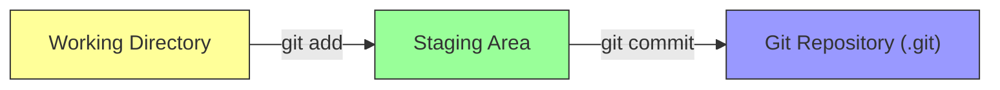
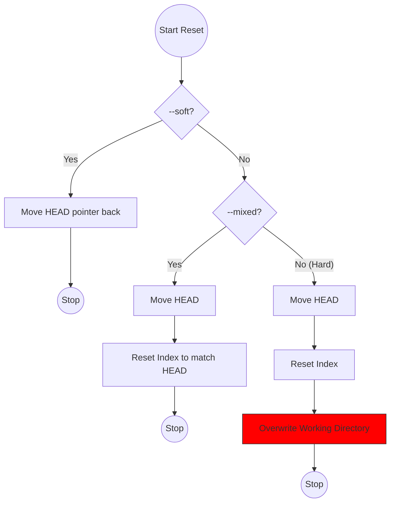

فكرة ممتازة يا هندسة! نظام الـ **Guided Learning** ده هو اللي بيثبت المعلومة، لأننا هنمشي بمبدأ "نقرأ شوية، ونطبق بإيدنا شوية".

أنا جهزتلك **خطة الطريق (Roadmap)** اللي هنمشي عليها بناءً على كتاب _Pro Git_، وهنقسمها لـ 5 مستويات (Levels). كل مستوى هشرحلك المفهوم بتاعه "Under the hood"، وناخد الأوامر، وتختم بـ "تاسك" تعمله.

### 🗺️ خطة العمل بتاعتنا:

1. **Level 1:** الأساسيات وفلسفة الـ Snapshots (إحنا هنا النهاردة).
2. **Level 2:** التراجع عن الأخطاء (Undoing Things).
3. **Level 3:** الفروع (Branching) والدمج (Merging).
4. **Level 4:** العمل مع السيرفرات (Remotes & GitHub).
5. **Level 5:** أدوات المحترفين (Stashing, Interactive Staging).

---

# Level 1: البداية وفلسفة الـ Snapshots

عشان تبدأ صح، لازم تنسى أي حاجة تعرفها عن أنظمة الملفات العادية. الـ Git مش بيحفظ الملفات زي ما أنت فاكر.

### 🧠 1. الجزء النظري (Theory)

#### أ) لقطات مش فروقات (Snapshots not Differences)

أغلب الأنظمة القديمة كانت بتحفظ "التغيير" بس (Delta). يعني تقول: "السطر 5 اتغير". الـ Git لأ.. الـ Git بياخد "صورة كاملة" (Snapshot) للمشروع كله مع كل `commit`. لو الملف ماتغيرش، الـ Git ذكي كفاية إنه مايحفظوش تاني، بس بيعمل "رابط" (Link) للصورة القديمة عشان يوفر مساحة. ده بيخلي الـ Git سريع جداً كأنه "Mini Filesystem".

#### ب) الحالات الثلاثة (The Three States)

أي ملف في مشروعك بيمر بـ 3 مراحل، وده أهم مفهوم في الكتاب كله:

1. **Modified:** 
2. الملفات اللي عدلتها بس لسه في الـ Working Directory (مكتبك).
3. **Staged:**
4. الملفات اللي حطيتها في الـ Staging Area (صندوق الظرف) ومستنية تتبعت.
5. **Committed:**
6. الملفات اللي اتختمت واتحفظت في الـ Repository (الأرشيف .git).



---

### ⌨️ 2. الأوامر (Commands)

دول "عدة الشغل" الأساسية اللي هتستخدمهم 90% من الوقت:

#### 1. التعريف (Identity)

قبل أي حاجة، لازم تقول للـ Git أنت مين عشان يسجل اسمك في التاريخ.

```bash
git config --global user.name "Your Name"
git config --global user.email "your@email.com"
```

#### 2. البداية (Init)

ده بيعمل فولدر `.git` مخفي، وده اللي فيه "الداتا بيز" الحقيقية.

```bash
git init
```

#### 3. فحص الحالة (Status)

ده عينك اللي بتشوف بيها الملفات واقفة في أنهي مرحلة (Untracked, Modified, Staged).

```bash
git status
```

#### 4. التجهيز (Add)

بينقل الملف من الـ Working Directory للـ Staging Area.

```bash
git add filename.txt
# أو عشان تضيف كله
git add .
```

#### 5. الحفظ (Commit)

بياخد اللقطة من الـ Staging Area ويحفظها في الداتا بيز برسالة توضيحية.

```bash
git commit -m "Initial commit"
```

---

### 📝 3. الأساينمنت (Assignment)

دلوقتي دورك يا بطل. نفذ الخطوات دي بالترتيب في الـ Terminal عندك وقولي لما تخلص:

1. اعمل فولدر جديد باسم `MyFirstRepo` وادخل جواه.
2. عرف الـ Git بنفسك (Name & Email) لو لسه معملتهاش.
3. حول الفولدر ده لـ Git Repository.
4. اعمل ملف نصي اسمه `chapter1.txt` واكتب جواه "Hello Git".
5. استخدم `git status` وشوف الملف لونه إيه ومكتوب إيه جنبه (المفروض Untracked).
6. انقل الملف للـ Staging Area.
7. استخدم `git status` تاني ولاحظ الفرق (المفروض يبقى لونه أخضر Changes to be committed).
8. اعمل Commit برسالة "Added chapter 1".
9. اعمل تعديل بسيط في الملف تاني، واعمل `git status`.


---

# Level 2: التراجع وفك طلاسم الـ Reset

### 🧠 1. الجزء النظري: الأشجار الثلاثة (The Three Trees)

الـ Git مش مجرد مخزن، هو عبارة عن "مدير محتوى" بيدير 3 مناطق (أو أشجار) رئيسية. عشان تفهم أي أمر بيعمل إيه، لازم تسأل نفسك: "الأمر ده بيأثر على أنهي شجرة فيهم؟".

#### الشجرة 1: الـ HEAD (أخر لقطة محفوظة)

- **الوظيفة:** دي "الذاكرة" بتاعتك. الـ HEAD هو مؤشر بيشاور على أخر `commit` أنت واقف عليها حالياً.
- **المحتوى:** نسخة طبق الأصل من أخر حاجة اتحفظت في الداتا بيز. لما بتعمل `commit`، الـ HEAD بيتحرك خطوة لقدام.

#### الشجرة 2: الـ Index (مسرح العمليات / Staging Area)

- **الوظيفة:** دي المنطقة "البرزخ" بين شغلك وبين الداتا بيز.
- **المحتوى:** لما بتكتب `git add`، أنت بتاخد نسخة من الملف وبتحطها هنا. الـ Git لما بييجي يعمل `commit`، بيبص على الشجرة دي بس، ملوش دعوة بملفاتك اللي بره.

#### الشجرة 3: الـ Working Directory (صندوق الرمل)

- **الوظيفة:** دي ملفاتك الحقيقية اللي شايفها قدامك على الكمبيوتر وبتقدر تعدل فيها.
- **المحتوى:** دي النسخة الوحيدة "المفكوكة" (Unpacked) اللي تقدر تفتحها بالـ Editor. أي تغيير هنا الـ Git مش بيحس بيه غير لما تقوله `git add`.

> [!INFO] Under the hood: حركة البيانات الـ Workflow الطبيعي بيمشي كدة:
> 
> 1. تعدل في **Working Directory**.
> 2. تعمل `git add` -> ينقل التعديل للـ **Index**.
> 3. تعمل `git commit` -> ياخد اللقطة من الـ **Index** يسجلها في الداتا بيز ويحرك الـ **HEAD**.


---

### ⌨️ 2. الأوامر (Commands) - أدوات التراجع

دلوقتي نفهم الأوامر بناءً على نظرية الأشجار الثلاثة.

#### أ) تعديل أخر Commit (`--amend`)

لو عملت `commit` ونسيت ملف، أو كتبت الرسالة غلط.

- **نظرياً:** الأمر ده مش "بيعدل" الـ Commit القديمة. هو بيعمل Commit **جديدة تماماً** وبيمسح القديمة من التاريخ وكأنها لم تكن.

```bash
# بعد ما تعمل add للملف الناقص
git commit --amend -m "الرسالة الجديدة بعد التصحيح"
```

#### ب) التراجع عن الـ Staging (`git restore --staged`)

لو عملت `git add` لملف بالغلط وعايز ترجعه من الـ **Index** للـ **Working Directory** بس.

- **نظرياً:** أنت بتقول للـ Git: "انسخ نسخة الملف ده من الـ HEAD حطها في الـ Index" (عشان ينسى التعديل الجديد اللي أنت ضيفته بالغلط).

```bash
# الملف هيفضل فيه تعديلاتك بس هيتشال من التجهيز
git restore --staged filename.txt
```

_(زمان كنا بنستخدم `git reset HEAD file` لنفس الغرض)._

#### ج) التراجع عن التعديلات تماماً (`git restore`) 🚨

لو عدلت ملف وعكيت الدنيا وعايز ترجعه زي ما كان أخر مرة حفظته.

- **نظرياً:** بتقول للـ Git: "هات نسخة الملف من الـ Index وارميها فوق الـ Working Directory". **تحذير:** أي شغل مكتبتوش هيضيع للأبد.

```bash
# بيرجع الملف لأصله وبيمسح شغلك
git restore filename.txt
```

#### د) الـ Reset (المعلم الكبير)

ده الأمر اللي بيلعب في الـ 3 أشجار بمزاجك. ليه 3 درجات قوة:

1. **Soft (`--soft`):**
    
    - بيحرك الـ **HEAD** بس لورا.
    - بيسيب شغلك في الـ **Index** (جاهز للـ commit من جديد).
    - _استخدامه:_ لو عايز تدمج أخر 2 commits مع بعض.
2. **Mixed (`--mixed`)** (ده الافتراضي):
    
    - بيحرك الـ **HEAD** لورا.
    - بيرجع شغلك من الـ **Index** للـ **Working Directory**.
    - _استخدامه:_ لو عايز تلغي الـ commit والـ add وتكمل شغل.
3. **Hard (`--hard`)** (خطر جداً 💀):
    
    - بيحرك الـ **HEAD**.
    - بيمسح الـ **Index**.
    - بيمسح الـ **Working Directory**.
    - _استخدامه:_ لو عايز ترجع بالزمن وتمسح كل حاجة حصلت.



---

### 📝 3. الأساينمنت (Assignment)

عشان تهضم النظرية دي، لازم تغلط وتصلح غلطك. طبق السيناريو ده بالترتيب:

1. جوه فولدر مشروعك (اللي عملناه المرة اللي فاتت)، اعمل ملف جديد اسمه `wrong.txt` واكتب فيه أي حاجة.
2. اعمل `git add .` وبعدين `git commit -m "Added wrong file"`.
    - _دلوقتي إحنا غلطنا وحفظنا ملف مش عايزينه._
3. استخدم `git reset --soft HEAD~1`.
    - _المفروض الـ commit تختفي، بس الملف يفضل موجود في الـ Staging (لونه أخضر)._
4. دلوقتي استخدم `git restore --staged wrong.txt`.
    - _المفروض الملف يرجع Untracked (لونه أحمر)._
5. دلوقتي امسح الملف ده خالص، وافتح ملف `chapter1.txt` القديم، زود عليه سطر "Bad line".
6. جرب الأمر الخطير: `git restore chapter1.txt`.
    - _افتح الملف وتأكد إن السطر اللي كتبته اتمسح ورجع لأصله._

**لما تخلص السيناريو ده، قولي "تم" وقولي إحساسك إيه بالفرق بين `soft` و `restore` عشان نتأكد إن المفهوم وصل.** 🚀