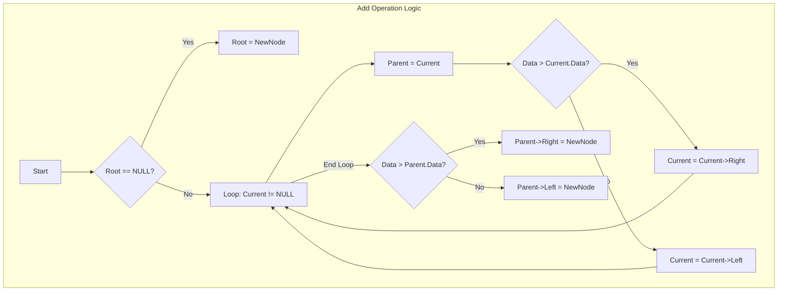

طلباتك أوامر يا هندسة. ولا يهمك، نلغي الـ Excalidraw خالص ونركز في "تفصيص" الكود حتة حتة عشان تهضمه كويس.

إحنا هنمسك الكود ده "مشرط وجفت"، كل دالة (Function) لوحدها وتحتها "الزتونة" بتاعتها بتعمل إيه وليه مكتوبة كدة.

---

### [[Data Structures]]/Binary Search Tree - Code Breakdown

#### 1. The Blueprint (`Node` Class)

ده "القالب" اللي هنعمل منه الطوب بتاع العمارة بتاعتنا.


```C++
class Node {
public :
    int data;       // The value stored in the node
    Node * left;    // Pointer to the left child (Smaller value)
    Node * right;   // Pointer to the right child (Larger value)
    
    Node(int data){
        this->data = data;
        left = NULL;  // Initially, a new node has no children
        right = NULL;
    }
    ~Node(){
        // Destructor logic if needed
    }
};
```

**الشرح:**

- **Structure:** كل `Node` شايلة 3 حاجات: القيمة (`data`)، وعنوانين (`Pointers`) للي تحتها.
    
- **Constructor:** أول ما بنعمل `new Node(50)`، هو أوتوماتيك بيخلي الـ `left` و `right` بـ `NULL`. دي خطوة مهمة عشان ميبقاش فيهم "Garbage Values" وتعمل Crash.
    

---

#### 2. The Insertion Logic (`add` Function)

دي أهم دالة، هي اللي بتبني الشجرة. الكود هنا مكتوب بطريقة **Iterative** (لوب مش ريكيرجن).

C++

```C++
void add(int data){
    // 1. Create the new block in Memory (Heap)
    Node * newNode = new Node(data); 
    
    // Case A: The Tree is Empty
    if(root == NULL){
        root = newNode; // The new node becomes the King (Root)
    }
    // Case B: The Tree has data
    else{
        Node * current = root; // The "Scout" pointer (runs ahead)
        Node * parent = NULL;  // The "Hook" pointer (stays one step behind)
        
        // Step 1: Traverse to find the empty spot
        while(current != NULL){
            parent = current; // Save the last valid node before moving
            
            if(data > current->data){
                current = current->right; // Go Right if value is larger
            } else {
                current = current->left;  // Go Left if value is smaller
            }
        }
        
        // Step 2: Link the new node to the parent
        // At this point, 'current' is NULL, but 'parent' is holding the connection point
        if(data > parent->data){
            parent->right = newNode;
        } else {
            parent->left = newNode;
        }
    }
}
```

**الشرح:**

- **الزتونة (Trailing Pointer Technique):**
    
    - إحنا محتاجين نوصل لمكان فاضي (`NULL`) عشان نحط فيه النود الجديدة.
        
    - بس لو وصلنا للـ `NULL` بالـ Pointer اللي اسمه `current`، هنكون "وقعنا من الشجرة" ومش هنعرف نربط النود الجديدة بحاجة.
        
    - **الحل:** بنمشي بـ Pointer تاني اسمه `parent` ورا الـ `current` بخطوة واحدة. أول ما الـ `current` يقع في الـ NULL، الـ `parent` بيكون واقف عند "أبوه" ويمسكه يربط فيه الـ `newNode`.
        

---

#### 3. Search Logic (`getNodeByData`)

دي الدالة اللي بتدور "هل الرقم ده موجود ولا لأ؟".

C++

```C++
Node * getNodeByData(int data){
    Node * current = root; // Start from the top
    
    while(current != NULL){
        if(data == current->data){
            return current; // Found it! Return the address
        }
        else if(data > current->data){
            current = current->right; // Target is larger? Go Right
        }
        else{
            current = current->left;  // Target is smaller? Go Left
        }
    }
    return NULL; // Reached dead end, value not found
}
```

**الشرح:**

- **Binary Search Logic:** الميزة هنا إننا مش بنلف على كل العناصر. في كل خطوة بنستبعد نص الشجرة تقريباً (يا يمين يا شمال).
    
- ده اللي بيخلي الـ BST سريعة جداً في الـ Search (Time Complexity: `O(log n)`).
    

---

#### 4. The Tricky Part (`getParent`)

بما إن الـ Node مش شايلة عنوان أبوها (مفيش `parent pointer` جوا الـ Node struct)، لازم ندور من فوق عشان نجيب الأب.

C++

```C++
Node * getParent(Node * current){ // 'current' is the node we want to find the parent for
    // Edge Case: Root has no parent
    if(current == root){
        return NULL;
    }
    
    if(current != NULL){
        Node * parent = root; // Start search from top
        while (parent != NULL){
            // Check if 'parent' is directly connected to 'current'
            if(parent->left == current || parent->right == current){
                return parent; // Found the parent!
            } else {
                // Keep searching down
                if(current->data > parent->data){
                    parent = parent->right;
                } else {
                    parent = parent->left;
                }
            }
        }
    }
    return NULL;
}
```

**الشرح:**

- **الفكرة:** إحنا بنعمل Search عادي جداً، بس بدل ما ندور على الـ `Value`، إحنا بنبص "تحت رجلينا".
    
- بنسأل الـ Node اللي إحنا واقفين عليها: "يا حاجة، هل ابنك اللي عاليمين أو اللي عالشمال هو الـ Node اللي بندور عليها دي؟". لو أيوة، يبقى إحنا وجدنا الـ Parent.
    

---

#### 5. Max Value Logic (`getMaxRight`)

عايزين نجيب أكبر قيمة في الـ Sub-tree دي.

C++

```C++
Node * getMaxRight(Node * current){
    if(current == NULL){
        return NULL;
    }
    // Keep going right until you hit the wall
    while(current->right != NULL){
        current = current->right;
    }
    return current; // This is the right-most node
}
```

**الشرح:**

- في عالم الـ Binary Search Tree، الكبير دايماً بيروح **يمين**.
    
- عشان تجيب "كبير المنطقة"، خليك ماشي يمين، يمين، يمين.. لحد ما تلاقي الـ `right` بـ `NULL`. النود دي هي الماكس.
    

---

### ملخص سريع (Obsidian Note)

Code snippet



كده التقسيمة دي أريحلك في الفهم يا بطل؟ لو فيه دالة معينة لسه "معصلجة" معاك قولي ونعيد عليها.