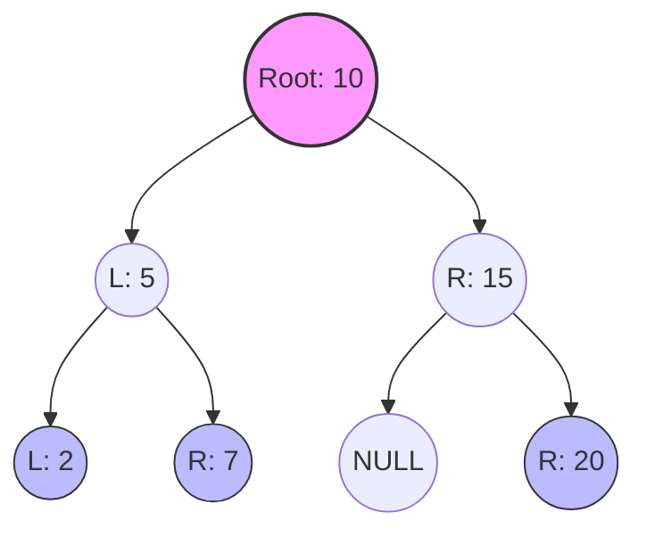

عظيم جداً! اختيار موفق يا بطل. الـ **Tree** والـ **Binary Tree** دول هما "العمود الفقري" لأغلب الـ Advanced Algorithms اللي هتقابلها، من أول تنظيم الـ Files عندك عالجهاز لحد الـ Databases والـ Routing Protocols.1

إحنا متعودين إننا نرص الداتا ورا بعض (زي الـ Array أو الـ Linked List)، بس الحياة مش دايماً طابور.. الحياة ساعات بتبقى "شجرة".

تعال نفصص الموضوع ونشوف إيه اللي بيحصل تحت الكبوت في الـ Memory.

---

### 1. The Hook (المقدمة: تشبيه من الحياة)

بص يا سيدي، تخيل إنك مدير شركة كبيرة. هل ينفع كل الموظفين يبقوا واقفين في طابور واحد وكل واحد بيسلم الشغل للي بعده؟ (ده اللي بنسميه **Linear Data Structure** زي الـ Linked List). طبعاً لأ، الدنيا هتعطل.

الصح إن فيه "مدير كبير" (ده الـ **Root**)، تحته مديرين أقسام (دول **Internal Nodes**)، وتحت كل مدير قسم فيه موظفين صغيرين ملهوش سلطة على حد تحتهم (دول الـ **Leaf Nodes**).

أهو ده بالضبط الـ **Tree Data Structure**. هي طريقة تنظيم **Hierarchical** (هرمية)، مش **Sequential** (تسلسلية).

أما الـ **Binary Tree** بقى، فهي حالة خاصة جداً وشيك: تخيل إن قانون الشركة بيقول "أي مدير ممنوع يشرف على أكتر من موظفين اتنين بس". يا واحد **Left**، يا واحد **Right**، يا مفيش خالص. التحديد ده بيخلينا نقدر نعمل عمليات Search و Sorting بسرعة مرعبة بعدين (زي في الـ BST).

---

### 2. The Deep Dive (الشرح التقني)

عشان تفهم الليلة، لازم تتخيل الـ Memory Layout:

- **Non-Contiguous Memory:** في الـ Array، الأماكن جنب بعضها في الـ RAM. في الـ Tree، كل **Node** ممكن تكون مرمية في مكان مختلف في الـ Heap.
    
- **Linking:** وعشان نربطهم، كل Node شايلة الـ Data بتاعتها، ومعاها **Pointers** بتشاور على الـ Children بتوعها (عنوانهم في الميموري).
    
- **Recursive Nature:** الـ Tree ميزتها إنها **Recursive**؛ يعني الـ Left Child هو كمان عبارة عن Root لـ Sub-tree صغيرة.2 دي "الزتونة" في كتابة كود الـ Trees.
    

**المصطلحات المهمة (Terminology):**

- **Root:** الجد الأكبر، ملوش Parent.
    
- **Parent / Child:** العلاقة المباشرة بين الـ Nodes.
    
- **Leaf:** الـ Node اللي ملهاش أي Children (آخر العنقود).
    
- **Height:** أطول مسار من الـ Root لحد أبعد Leaf.
    
- **Depth:** المسافة من الـ Root لحد Node معينة.3
    

---

### 3. The Obsidian Note

خد الـ Snippet دي وحطها في الـ Obsidian بتاعك عشان تذاكر منها:

Markdown


# [[Data Structures]]/Trees

> [!INFO] Definition
> A **Tree** is a hierarchical data structure consisting of nodes connected by edges. 
> A **Binary Tree** is a specific type where each node has at most **two children** (Left and Right).

## Key Concepts
- **Root**: The topmost node (entry point).
- **Edge**: The link connecting two nodes (represents the Pointer).
- **Leaf**: A node with no children (`left == NULL` && `right == NULL`).
- **Sub-tree**: A tree formed by a child node and its descendants.

## Memory Representation
Each node is a structure allocated on the **Heap**, containing:
1. `Data` (Payload)
2. `Pointer` to Left Child
3. `Pointer` to Right Child

## Mermaid Visualization


---

### 4. The Animation (Excalidraw Script)

السكربت ده هيرسم لك **Binary Tree** بتتبني قدام عينك، وهيوضح إزاي الـ Pointer بيخرج من الـ Parent يمسك في الـ Child.

_انسخ الكود ده وحطه في Obsidian وشغله بـ Excalidraw Script Engine._

JavaScript

```js
/* Excalidraw Script: Binary Tree Construction Animation 
  Author: Prof. Binary
  Description: Visualizes creating a Root node and attaching Left/Right children via pointers.
*/

const ea = ExcalidrawAutomate;
ea.reset();

// Helper function to sleep for animation effect
const sleep = (ms) => new Promise((resolve) => setTimeout(resolve, ms));

async function drawTree() {
  // 1. Create the Root Node
  const rootId = ea.addElement({
    type: "ellipse",
    x: 400,
    y: 100,
    width: 80,
    height: 80,
    backgroundColor: "#ffc9c9",
    strokeColor: "#000000",
    fillStyle: "solid",
  });
  ea.addText(425, 125, "Root");
  await ea.addElementsToView(true, true);
  await sleep(800);

  // 2. Create Left Child (initially disconnected)
  const leftId = ea.addElement({
    type: "ellipse",
    x: 300,
    y: 250,
    width: 80,
    height: 80,
    backgroundColor: "#a5d8ff",
    strokeColor: "#000000",
    fillStyle: "solid",
  });
  ea.addText(325, 275, "Left");
  await ea.addElementsToView(true, true);
  await sleep(800);

  // 3. Draw Pointer (Arrow) from Root to Left
  ea.addArrow([rootId, leftId], {
    strokeColor: "#000000",
    strokeWidth: 2,
    startArrowHead: null,
    endArrowHead: "arrow",
  });
  await ea.addElementsToView(true, true);
  await sleep(800);

  // 4. Create Right Child
  const rightId = ea.addElement({
    type: "ellipse",
    x: 500,
    y: 250,
    width: 80,
    height: 80,
    backgroundColor: "#a5d8ff",
    strokeColor: "#000000",
    fillStyle: "solid",
  });
  ea.addText(520, 275, "Right");
  await ea.addElementsToView(true, true);
  await sleep(800);

  // 5. Draw Pointer (Arrow) from Root to Right
  ea.addArrow([rootId, rightId], {
    strokeColor: "#000000",
    strokeWidth: 2,
    startArrowHead: null,
    endArrowHead: "arrow",
  });
  await ea.addElementsToView(true, true);
}

drawTree();
```

---

### 5. C Implementation

ده الكود اللي بيحول الكلام النظري ده لواقع. هنستخدم `struct` و `pointers` والـ `malloc` عشان نحجز أماكن في الـ **Heap**.

C

```c
#include <stdio.h>
#include <stdlib.h>

// Definition of the Tree Node structure
// Each node contains data and pointers to its children
struct Node {
    int data;
    struct Node* left;  // Pointer to the Left child
    struct Node* right; // Pointer to the Right child
};

// Function to create a new Node in the Heap
struct Node* createNode(int value) {
    // Allocate memory for the new node dynamically
    struct Node* newNode = (struct Node*)malloc(sizeof(struct Node));
    
    // Check if memory allocation failed
    if (newNode == NULL) {
        printf("Memory allocation failed!\n");
        return NULL;
    }

    // Initialize data and set children pointers to NULL (Leaf node initially)
    newNode->data = value;
    newNode->left = NULL;
    newNode->right = NULL;

    return newNode;
}

int main() {
    // 1. Create the Root node
    struct Node* root = createNode(1);

    // 2. Attach children nodes to the root
    // The arrows in our diagrams are essentially these assignments
    root->left = createNode(2);
    root->right = createNode(3);

    // 3. Attach a child to the Left node (Creating a deeper level)
    root->left->left = createNode(4);

    /* Tree Structure Created:
             1
           /   \
          2     3
         /
        4
    */

    printf("Root Data: %d\n", root->data);
    printf("Left Child Data: %d\n", root->left->data);
    
    // Always remember to free allocated memory in a real application!
    return 0;
}
```

---

الخطوة الجاية يا هندسة؟

تحب ندخل في الـ Tree Traversal (إزاي نلف على الـ Nodes دي بـ InOrder, PreOrder, PostOrder) ونشوف مين فيهم بيستخدم Stack ومين Recursion؟ ولا تحب نشوف الـ Binary Search Tree (BST) وازاي بتسرع البحث؟