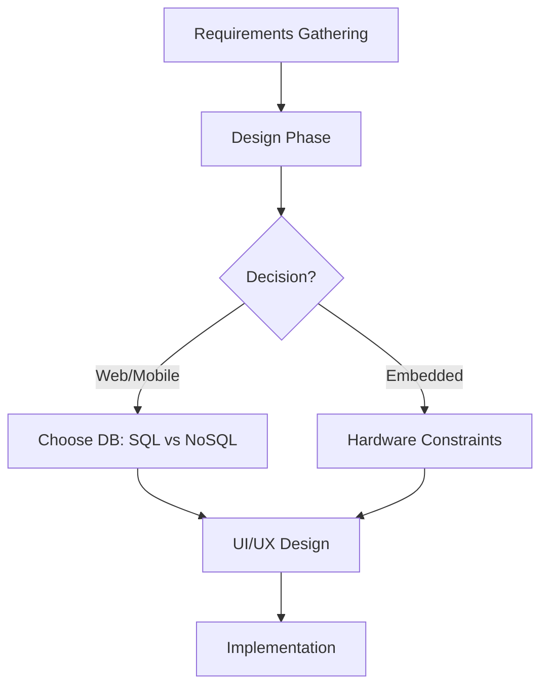
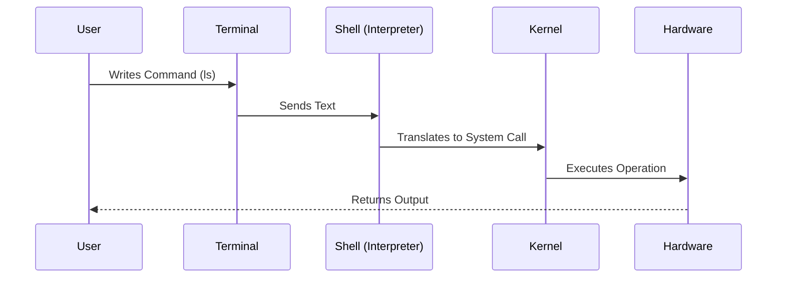
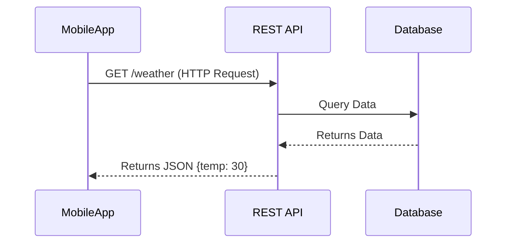
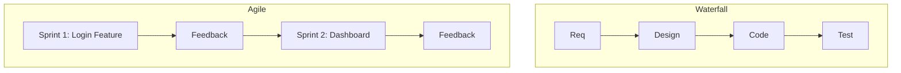
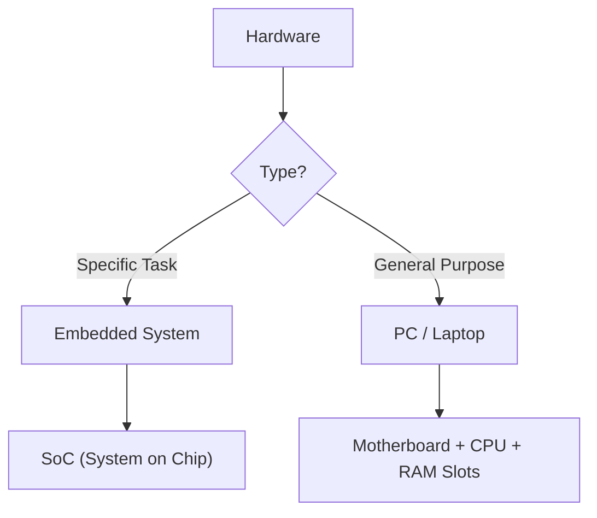
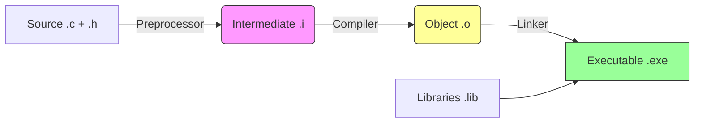
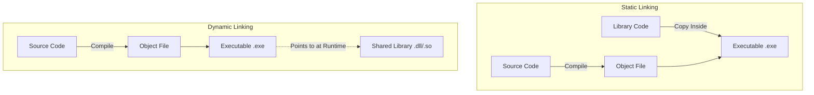
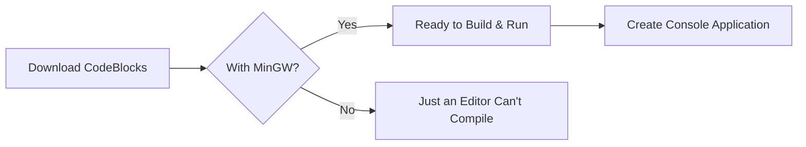
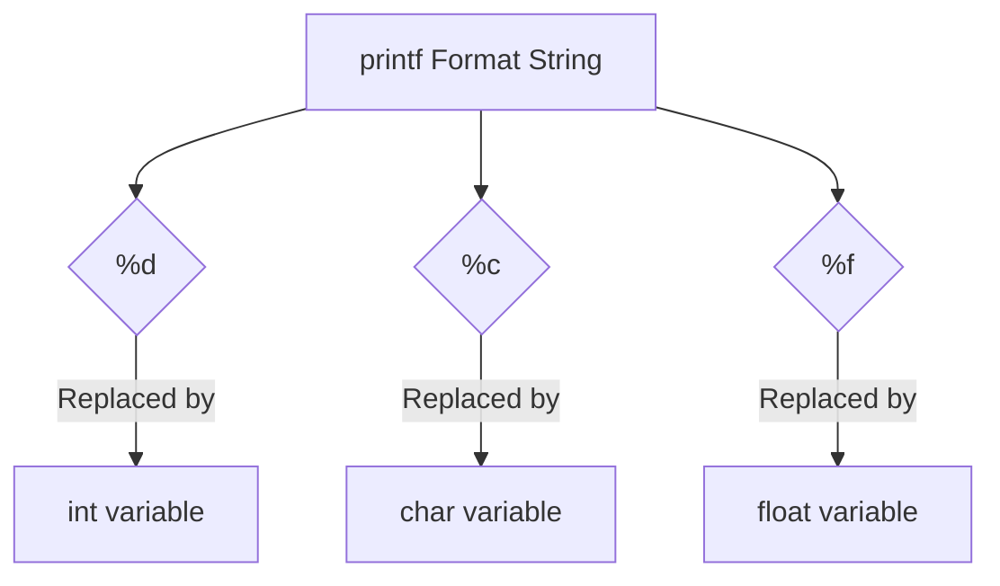
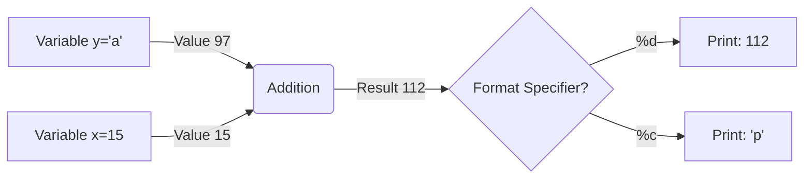

## 1. 🔄 [[SDLC]] & Design Decisions

عشان نعمل أي سوفت وير محترم، لازم نمشي على **[[Software Development Life Cycle]]**. العملية مش "يلا نكتب كود"، لأ، دي مراحل مرتبة:

> [!abstract] Planning & Requirements
> 
> بنقعد مع الـ Client نشوف هو عايز ايه؟ (Web, Mobile, Embedded?).

> [!abstract] Design
> 
> هنا بيتدخل الـ [[Solution Architect]]. بنقرر السيستم ده هيكون [[Web App]] ولا [[Embedded System]]؟
> 
> - لو ويب، هنستخدم أنهي **[[Database]]**؟ (**[[SQL]]** vs **[[NoSQL]]**).
>     

> [!example] معلومة
> 
> فيسبوك مثلًا بيستخدم أكتر من 10 أنواع Database، مش نوع واحد.




---

## 2. 🔌 The Concept of [[Interfaces]]

الـ Interface هو الوسيط بين أي حاجتين عايزين يكلموا بعض.

### 🛠️ Physical Interface

> [!quote] أمثلة
> 
> زي زرار اللمبة (بينك وبين الكهرباء) أو الـ [[Pins]] في الـ Chips (بين الـ IC والعالم الخارجي).

### 💻 Software Interface

ودول 3 أنواع رئيسية:

1. **[[GUI]] (Graphical User Interface):**
    
    - لليوزر العادي (زراير، ماوس).
        
2. **[[CLI]] (Command Line Interface):**
    
    - للـ Developers والـ Servers.
        
3. **[[API]] (Application Programming Interface):**
    
    - لما App يكلم App تاني (زي Frontend يكلم Server).
        

> [!tip] نصيحة مينا ناجي
> 
> الـ [[CLI]] مش رفاهية، دي أساس شغلك كمهندس. السيرفرات في العالم مفيهاش شاشات (Headless)، بتتعامل معاها [[SSH]] وشاشة سوداء. لو اعتمدت على الـ GUI هتبقى "يوزر" مش "ديفلوبر".

---

## 3. 🚀 Why [[CLI]] is Superior? (Power & Speed)

ليه بنوجع دماغنا بالشاشة السوداء؟

> [!success] Speed
> 
> تخيل عايز تعمل 100 فايل؟ بالـ [[GUI]] هتقعد تعمل Right Click -> New File ميت مرة. بالـ [[CLI]] سطر واحد.

> [!warning] Resources
> 
> الـ [[GUI]] بيستهلك [[RAM]] كتير (زي Chrome بياكل الرامات). السيرفرات محتاجين نوفر فيها Resources للـ Requests مش للواجهة.

> [!info] Remote Access
> 
> لما تكونكت على سيرفر بعيد بـ [[SSH]] (Text only) أسرع بكتير وأوفر في النت من إنك تنقل صورة وفيديو بـ TeamViewer.

**Code Reconstruction: Bash Script for Mass File Creation**

Bash

```bash
# TODO: Check video at [10:24] for context
# Creating 100 files in less than a second
touch file{1..100}

# Listing files that start with 'file1' only (Filtering)
ls file1*
```

---

## 4. 🏗️ [[CLI]] Architecture (Terminal vs Shell)

لما بتفتح الشاشة السوداء، إنت بتشغل سلسلة من العمليات:

|**المكون**|**الوصف**|
|---|---|
|**[[Terminal]]**|ده مجرد Window (المكان اللي بتكتب فيه).|
|**[[Shell]]**|ده الـ **[[Interpreter]]** اللي بياخد كلامك يترجمه.|
|**[[Kernel]]**|قلب الـ OS اللي بيكلم الهاردوير.|

> [!note] ملحوظة
> 
> ممكن تغير الـ Shell اللي شغال في الـ Background. الطبيعي بيكون bash، بس ممكن تخليه python أو mysql.




---

## 5. 📜 Introduction to [[Scripting]]

بدل ما نكتب الأوامر كل مرة سطر سطر، بنحطهم في فايل (Script).

في اللينكس، الـ Extension (زي .py أو .txt) مش بيفرق، اللينكس بيعتمد على محتوى الفايل والـ Permissions.

**Code Reconstruction: Simple Python Script Logic**

Python

```bash
# script_file (No extension needed in Linux)

# Logic mentioned at [27:08]
print(10)
# Or complex logic loops
```

عشان ترن الفايل ده قدامك طريقتين:

> [!question] **طرق التشغيل**
> 
> 1. **تنادي الـ Interpreter باسمه:** `python3 script_file` (ده هيشتغل علطول).
>     
> 2. **تنادي الفايل نفسه:** `./script_file` (ده هيضرب Error في الأول لأنه مش عارف مين يشغله وكمان محتاج إذن execute).
>     

---


## 1. [[Environment Variables]] & The `PATH`

ليه لما بتكتب `python` في الـ Terminal بتشتغل، ولما بتكتب اسم سكريبت انت عامله مش بيشتغل غير لما تحدد مكانه؟

- **The Problem:** الـ [[Shell]] مش ساحر، هو ميعرفش مكان كل فايل في الجهاز.
- **The Solution ([[PATH]]):** ده متغير في السيستم (Variable) محطوط فيه "عناوين" الفولدرات اللي فيها البرامج المشهورة (زي `/bin` أو `C:\Windows`).
- لما بتكتب كوماند، الـ OS بيدور عليه جوه العناوين دي. لو مش موجود، لازم تكتب الـ Full Path بتاعه (مثلاً `./script.sh`).

[!TIP] Mina's Advice لو عايز تشغل برنامج باسمه من غير ما تكتب عنوانه، لازم تضيف الفولدر بتاعه جوه الـ [[Environment Variable]] اللي اسمه `PATH`.

## 2. The "Magic Line" ([[Shebang]])

في اللينكس، الـ Extension (زي `.py`) مش هو اللي بيحدد الفايل ده هيشتغل بإيه. اللي بيحدد هو الـ **Shebang** في أول سطر.

- **Syntax:** `#!/path/to/interpreter`
- **Function:** بتقول للـ Kernel: "يا عم الحاج، الفايل ده يترجم بـ Python 3 مش بـ Bash".

**Code Reconstruction: Python Script with Shebang**

```bash
#!/usr/bin/python3
# The line above is the Shebang (Magic Line) [40:16]

print("Hello from Script running directly!")
```

_عشان يشتغل لازم تديله صلاحية Execute:_ `chmod +x script_file`

---

## 3. [[API]] & Web Services

الـ API هي "الواجهة البرمجية". لو الـ API دي بتشتغل عبر الإنترنت، بنسميها **[[Web Service]]**.

### أنواع الـ APIs (Styles):

1. **[[REST API]]:** (الأشهر) بيستخدم بروتوكول [[HTTP]] وبينقل الداتا بصيغة [[JSON]] (خلاط بين الـ String والـ Object).
    - **Verbs:** GET (هات داتا), POST (ابعت داتا), PUT (عدل), DELETE (امسح).
2. **[[SOAP]]:** قديم، بيستخدم [[XML]].
3. **[[GraphQL]]:** (بتاع Facebook) بتطلب اللي انت عايزه بس.
4. **[[gRPC]]:** (بتاع Google) سريع جداً.
5. **[[MQTT]]:** (للـ [[IoT]]) خفيف جداً، بيشتغل بنظام Pub/Sub (زي الشات).



---

## 4. Server Concepts & Networking

السيرفر هو **Software** في المقام الأول، مش بس حديد.

- ممكن تحول لابتوبك لسيرفر لو نزلت عليه [[Apache]] (ويب سيرفر) أو [[MongoDB]] (داتابيز سيرفر).
- حتى شريحة [[ESP32]] الصغيرة ممكن تبقى Web Server (بس Limited Resources).

### العمارة والشقة (IP & Port Logic) [74:00]

عشان توصل لسيرفر (تخيل إنك بتوصل دليفري)، محتاج 3 حاجات:

1. **[[Protocol]]:** وسيلة المواصلات (HTTP, MQTT).
2. **[[IP Address]]:** عنوان العمارة.
    - **[[Localhost]]:** (127.0.0.1) ده عنوان "بيتك انت" للتجربة (Loopback).
3. **[[Port]]:** رقم الشقة جوه العمارة.
    - مينفعش شقتين (2 Services) ياخدوا نفس الرقم في نفس الوقت.

```
graph LR
    A[Client Request] --> B{IP Address?}
    B -->|Found| C[Server Machine (Building)]
    C --> D{Port Number?}
    D -->|80| E[Web Server (Apache)]
    D -->|27017| F[DB Server (MongoDB)]
```

**Code Reconstruction: Managing Services (Linux)**

```bash
# Checking status of a service (e.g., MongoDB) [67:20]
systemctl status mongod

# Starting the service (Opening the "Apartment")
systemctl start mongod

# Connecting to the DB (Entering the "Apartment")
mongosh
```

---

## 5. [[SDLC]] Models (Development Methodologies)

إزاي بننفذ خطوات الـ SDLC؟ الشركات بتختار موديل من دول:

### A. [[Waterfall Model]] (الشلال)

- **الفكرة:** تخلص كل مرحلة تماماً قبل ما تخش في اللي بعدها.
- **المشكلة:** التست (Testing) بيجي في الآخر خالص. لو اكتشفنا مصيبة، بنعيد من الأول. "التستر بيقعد ينتخ طول المشروع ويصحى في الآخر".

### B. [[V-Model]]

- **الفكرة:** لكل مرحلة ديفلوبمنت، يقابلها مرحلة تست (Unit Test, Integration Test, System Test).
- **الميزة:** التست بيبدأ بدري، مش في الآخر.

### C. [[Agile]] (The King)

- **الفكرة:** منعملش البرنامج كله مرة واحدة. بنقسمه حتت صغيرة (**Sprints**).
- **[[Sprint]]:** مدتها أسبوع أو اتنين، بنطلع فيها "حته" شغالة (Feature) ونوريها للعميل.
- **Feedback:** بناخد رأي العميل بدري ونعدل.



---


## 1. 🖥️ [[Computing System]] Anatomy

أي نظام كمبيوتر (سواء لابتوب أو تكييف) عامل زي جسم الإنسان، بيتكون من 3 حاجات أساسية `[01:44]`:

- **[[CPU]] (المخ):** بيعمل Processing.
    
- **[[Memory]] (الذاكرة):** بيخزن فيها الداتا.
    
- **[[Input/Output Peripherals]] (الأطراف):** إيدين ورجلين عشان يتعامل مع العالم الخارجي (Sensor, Screen, Motor).
    

### ⚖️ The Difference between [[Embedded System]] & [[General Purpose Computer]]

> [!example] **Embedded System**
> 
> - **Definition:** كمبيوتر "مخنوق" (Limited Resources) بيعمل **One Specific Task** `[03:28]`.
>     
> - **Example:** التكييف (بيقيس حرارة ويشتغل)، الميكروويف (تايمر). مينفعش التكييف فجأة يشغل Games.
>     
> - **Architecture:** غالبًا **[[SoC]]** (System on Chip)، يعني البروسيسور والرامات والـ IO كلهم في شريحة واحدة `[04:53]`.
>     

> [!info] **General Purpose**
> 
> - **Definition:** جهاز "بتاع كله" (Multiple Tasks) زي اللابتوب.
>     
> - **Architecture:** غالبًا **System on Board**، يعني المذربورد عليها الـ CPU لوحده والرامات لوحدها `[05:36]`.
>     

Code snippet



---

## 2. ⚙️ Execution Environments (تشغيل الكود فين؟)

عشان تشغل كود على الهاردوير، عندك 3 مستويات `[07:15]`:

1. **[[Bare Metal]]:**
    
    - بتكتب كود على الحديد مباشرة (Direct Hardware Access).
        
    - مفيش OS. ده اللي بنعمله في المايكروكنترولر البسيط.
        
2. **[[RTOS]] (Real-Time OS):**
    
    - "لايبراري كبيرة" بتدير الوقت بصرامة (Hard Timing).
        
    - مهم في العربيات (Airbag) والروبوتات الطبية، عشان الأمر يتنفذ في الـ Millisecond `[07:39]`.
        
3. **[[General Purpose OS]]:**
    
    - زي Windows/Linux. السوفت وير بيعتمد على الـ OS مش الهاردوير مباشرة.
        

---

## 3. 📜 From [[Machine Code]] to [[C Language]]

- **Machine Code (0s & 1s):** لغة الكهرباء.
    
    - _المشكلة:_ معتمدة كليًا على الهاردوير (Not Portable) وصعب تتحفظ `[12:36]`.
        
- **[[Assembly]]:** استخدمنا كلمات (Mnemonics) زي `ADD` بدل الأصفار والوحايد.
    
    - _المشكلة:_ لسه معتمدة على الهاردوير. لو غيرت البروسيسور، هتعيد كتابة الكود `[16:10]`.
        
- **[[C Language]] (The Savior):** لغة Portable.
    
    - السنتاكس (Syntax) زي `if` و `for` ثابت ومش بيعتمد على الهاردوير.
        
    - _ملحوظة:_ السي بتحتاج "مترجم" يحولها للغة الآلة `[19:12]`.
        

---

## 4. 🛠️ The [[Toolchain]] (The Build Process)

عشان نحول الكود الـ C (High Level) لـ Machine Code، بنعدي على سلسلة مراحل اسمها Toolchain. العملية دي في الـ IDE بتبقى زرار "Build"، بس ورا الكواليس بيحصل الآتي `[24:00]`:

### المرحلة 1: [[Preprocessor]] (نظرية البطاطس والفراخ)

الـ Preprocessor ده "أكيل"، بياخد الفراخ (الكود المهم) ويرمي البطاطس (الحاجات اللي ملهاش لازمة في الترجمة) `[24:26]`.

- **Input:** Source Code (`.c`) + Headers (`.h`).
    
- **Action:**
    
    1. بيشيل الـ Comments (البطاطس).
        
    2. بيعمل Text Replacement (زي `#define`).
        
    3. بيجيب محتوى الـ Header Files يحطه جوه الـ `.c`.
        
- **Output:** فايل `.i` (Intermediate File).
    

### المرحلة 2: [[Compiler]]

بياخد الـ `.i` ويترجمه لـ **[[Assembly]]** أو **[[Machine Code]]** مباشرة (حسب ذكاء الكومبايلر الحديث).

- **Input:** `.i` file.
    
- **Output:** `.o` (Object File). ده Machine Code بس "مقطع" مش كامل، ميعرفش عناوين الفانكشنز اللي في فايلات تانية.
    

### المرحلة 3: [[Linker]] (المجمع)

بيمسك كل الـ Object Files والـ **[[Libraries]]** (زي المكتبة اللي فيها `printf`) ويربطهم ببعض `[27:00]`.

- **Action:** بيجمع كل الـ `.o` files في فايل واحد قابل للتشغيل.
    
- **Output:** `.exe` أو `.elf` (Executable File).
    

> [!TIP] Mina's Advice [39:00]
> 
> لما بتدوس Build في CodeBlocks، هو بينادي على سكريبت اسمه [[Makefile]]. السكريبت ده هو اللي بيقول: "يا preprocessor اشتغل، يا compiler خد الناتج، يا linker جمعهم". في الشركات الكبيرة، الـ Build ممكن ياخد ساعات، فبنكتب الـ Makefiles دي بايدينا عشان نتحكم في العملية.

**Code Reconstruction: What happens in Preprocessing?**

C

```c
// Source Code (.c)
#include <stdio.h> // Header file
#define MAX 100

// This comment will be removed (Potato)
void main() {
    int x = MAX; // MAX will be replaced by 100
}

/*
   AFTER PREPROCESSING (.i file):
   - The content of stdio.h is pasted here.
   - Comments are gone.
   - Code becomes:
   void main() {
       int x = 100;
   }
*/
```

Code snippet



---
## [40:00 - 132:00] Linking Types, Execution Models & Language Classifications

## 1. 🔗 [[Static Linking]] vs. [[Dynamic Linking]]

بعد ما الكومبايلر بيخلص، بيجي دور الـ **[[Linker]]**. هنا عندنا طريقين لربط الـ **[[Libraries]]** بالكود بتاعك:

### A. [[Static Linking]] (The C Way)

> [!abstract] الفكرة
> 
> بناخد نسخة من اللايبراري (زي printf) نحشرها جوه الـ .exe بتاعك.

- **الميزة:** البرنامج "ضامن نفسه". مش محتاج أي فايلات خارجية عشان يشتغل.
    
- **العيب:** حجم الفايل بيكبر جداً (Code Size Bloat). لو عندك 10 برامج بيستخدموا نفس المكتبة، هتبقى مكررة 10 مرات في الهارد والرام.
    

### B. [[Dynamic Linking]] (The DLL Way)

> [!abstract] الفكرة
> 
> الـ .exe بيبقى فيه "إشارة" بس لمكان اللايبراري. الربط بيحصل في الـ [[Run Time]].

- **الميزة:** توفير مساحة رهيب. (Shared Library).
    
- **العيب:** **[[Dependency Hell]]**.
    
    > [!failure] Dependency Hell
    > 
    > فاكرين لما تفتح لعبة وتقولك Missing .dll؟ هي دي المشكلة. البرنامج راح يدور على المكتبة ملقاهاش فعمل Crash.
    

Code snippet



---

## 2. ☕ [[Java Architecture]] (Write Once, Run Anywhere)

الـ [[C Language]] بتطلع exe بيعتمد على الـ OS والـ Hardware. لو غيرت الويندوز لينكس، الكود مش هيشتغل.

الجافا حلت المشكلة دي بذكاء:

1. **Intermediate Code:** الكود بيترجم لحاجة اسمها **[[Bytecode]]** (ملف `.class` أو `.jar`).
    
2. **[[JVM]] (Java Virtual Machine):** دي "مكينة وهمية" بتنزل على أي جهاز (Windows, Mac, Linux).
    
3. **Execution:** الـ JVM بتاخد الـ Bytecode وتشغله.
    
4. **نوع اللينكينج:** الجافا بتستخدم Dynamic Linking. اللايبراريز موجودة جوه الـ JVM مش جوه الكود بتاعك.
    

> [!TIP] Mina's Insight
> 
> عشان تبرمج جافا بتنزل [[JDK]] (جواها الكومبايلر والـ JVM). عشان تشغل بس بتنزل [[JRE]] (جواها الـ JVM والـ Libraries بس).

---

## 3. ⚡ [[Compiler]] vs. [[Interpreter]] (Analogy Time)

إيه الفرق في الـ Performance وطريقة الشغل؟

|**وجه المقارنة**|**[[Compiler]] (رئيس الجمهورية)**|**[[Interpreter]] (كولر المترجم)**|
|---|---|---|
|**طريقة الشغل**|بيترجم الخطاب (الكود) كله مرة واحدة قبل ما ينطق حرف.|بيترجم سطر بسطر وينفذه فوراً (Live).|
|**Errors**|لو في غلطة في آخر سطر، البرنامج مش هيطلع أصلاً (Build Fail).|هينفذ أول 99 سطر، ويجي عند السطر 100 يضرب (Crash).|
|**Speed**|أسرع في الـ **[[Run Time]]** (لأن الترجمة حصلت خلاص).|أبطأ (لأن كل مرة بنترجم واحنا شغالين).|
|**Example**|C, C++, Rust|Python, PHP, Ruby|

### The Hybrid: [[JIT Compiler]] (Just-In-Time)

ده "اختراع" موجود في الجافا والـ Modern JS Engines.

> [!info] كيف يعمل؟
> 
> هو Interpreter في الأساس، بس لو لقى كود بيتكرر كتير (Loop مثلاً)، بيقوم مترجمه لـ Machine Code ويحفظه (Caches it). فبيبقى سريع زي الكومبايلر في الحتت دي.

---

## 4. 🐍 The Truth About [[Python]]

> [!question] سؤال المقابلة: البايثون Compiler ولا Interpreter؟
> 
> الإجابة الصح: Python is a Language Specification. طريقة تشغيلها بتعتمد على الـ Implementation:

- **[[CPython]] (Default):** ده اللي بننزله من الموقع الرسمي. بيحول الكود لـ Bytecode وبعدين يشغله بـ Interpreter.
    
- **[[PyPy]]:** بيستخدم JIT Compiler (أسرع بكتير).
    
- **[[Jython]]:** بيرن على الـ Java VM.
    

---

## 5. 🏗️ Type Systems (The 4 Quadrants)

### A. [[Static Typing]] vs. [[Dynamic Typing]]

> [!example] **Static (C/C++)**
> 
> - **الوصف:** لازم تحدد النوع (`int x`). الذاكرة بتتحجز صح من الأول.
>     
> - **الأداء:** عالي جداً (Optimized).
>     

> [!warning] **Dynamic (Python/JS)**
> 
> - **الوصف:** بتكتب `x = 5` وبعدين `x = "Mina"`.
>     
> - **المشكلة:** الـ **[[Memory Fragmentation]]**. لما بتغير النوع، هو بيحجز مكان جديد ويسيب القديم فاضي (Holes).
>     
> - **الحل:** بيحتاج **[[Garbage Collector]]** (المكنسة) عشان ينظف الذاكرة، وده بياكل من الـ CPU.
>     

### B. [[Strong Typing]] vs. [[Weak Typing]]

> [!example] **Strong (Python)**
> 
> - صارم جداً.
>     
> - `"10" + 10 = Error` (مينفعش تجمع نص ورقم).
>     

> [!warning] **Weak (JavaScript)**
> 
> - "بيمشي الدنيا" (**Implicit Casting**).
>     
> - `"10" + 10 = "1010"` (حول الرقم لنص ولزقهم).
>     

**Code Reconstruction: Strong vs Weak Example**

Python

```python
# Python (Strong)
# print("10" + 5) # Raises TypeError: can only concatenate str (not "int") to str
```

JavaScript

```js
// JavaScript (Weak)
console.log("10" + 5); // Output: "105" (Implicit Coercion)
console.log("10" == 10); // True (Values match)
console.log("10" === 10); // False (Types don't match - Strict check)
```

---

## 6. 🧠 Programming [[Paradigms]]

طريقة تفكيرك في كتابة الكود:

### [[Imperative Programming]] (How)

بتقول للكمبيوتر "اعمل لوب، هات المتغير، اجمعه، خزنه". بتركز على الخطوات.

- **مثال:** C, C++.
    

### [[Declarative Programming]] (What)

بتقول للكمبيوتر "انا عايز النتيجة دي" وهو يتصرف في الخطوات.

- **مثال:** **[[SQL]]** (`SELECT * FROM Users`), HTML, Functional Programming (Python map/reduce).
    

**Code Reconstruction: Summing an Array (Paradigm Shift)**

Python

```python
# 1. Imperative Style (C-style thinking)
def sum_imperative(arr):
    total = 0
    for x in arr:      # Explicit Loop (Step by step)
        total += x
    return total

# 2. Declarative Style (Functional thinking)
from functools import reduce
def sum_declarative(arr):
    # Just tell it WHAT to do: Reduce this list by adding
    return reduce(lambda a, b: a+b, arr)
```

---


### 1. 🛠️ [[IDE]] Setup & The Toolchain Trap

عشان نكتب C، بنستخدم **[[CodeBlocks]]**، بس فيه "فخ" بيقع فيه المبتدئين:

> [!failure] The Trap
> 
> لو نزلت CodeBlocks لوحده، ده مجرد Text Editor (زي Notepad بس ملون). مش هيعرف يحول الكود لبرنامج يشتغل.

> [!success] The Solution
> 
> لازم تنزل النسخة اللي معاها [[MinGW]]. دي الـ [[Toolchain]] اللي جواها الـ Compiler (GCC) والـ Linker. من غيرها الكود بلوكس "جثة هامدة".

> [!info] Linux Users
> 
> انت كده كده برنس، هننزل الـ GCC من الـ Terminal [01:02].

Code snippet



---

### 2. 🛡️ Anatomy of C Code (The Security Guard Analogy)

لما عملنا Create Project، الكود نزل بالشكل ده. تعال نفصصه بمبدأ "أمن الشركة" `[04:22]`:

#### A. [[Header Files]] & [[Prototypes]]

ليه بنكتب `#include <stdio.h>`؟

- **المشكلة:** أنت بتستخدم فانكشن اسمها `printf`. الكومبايلر "غلبان" ميعرفش دي مين ولا جاية منين.
    
- **الحل:** الـ Include ده بيدي "صورة" الفانكشنز للكومبايلر عشان ميعملش Error ويقولك "مين printf دي؟".
    

> [!example] التشبيه (مينا ناجي)
> 
> لو "مينا" رايح يزور شركة، لازم يبعت صورته (Prototype) للأمن عشان يدخلوه. لو راح من غير كارت، الأمن هيوقفه.

#### B. The [[Entry Point]] (main)

- `main()`: دي نقطة البداية. أي كود براها مش هيتنفذ إلا لو ناديناه جواها.
    
- `return 0`: دي رسالة للـ OS `[07:16]`.
    
    - `0`: معناها Correct Exit (البرنامج خلص بسلام).
        
    - `Non-Zero`: معناها Crash (البرنامج مات مخنوق).
        

C

```c
#include <stdio.h> // Security Pass (Header File)

int main() {
    // Code execution starts here
    printf("Hello World");
    return 0; // Tell Windows/Linux: "We finished successfully"
}
```

---

### 3. 🖨️ [[Output]] & Escape Sequences

الـ printf عشان تطبع نص، لازم يتحط بين Double Quotes (" ").

بس لو عايز تعمل حاجات خاصة (زي سطر جديد أو صوت)، بنستخدم [[Escape Sequences]]:

- `\n`: انزل سطر جديد (New Line) `[11:53]`.
    
- `\t`: سيب مسافة كبيرة (Tab) `[17:13]`.
    
- `\a`: اعمل صوت إنذار (Alarm/Beep) - دي هتعمل صوت "تيت" في الويندوز `[12:20]`.
    

> [!tip] Mina's Note
> 
> لو كتبت printf("Hello"); printf("World"); هيلزقوا في بعض HelloWorld. لازم تحط \n عشان تفصلهم، لأن الكمبيوتر "غبي" وبينفذ حرفياً اللي بتقوله.

---

### 4. ☕ [[Variables]] & Data Types (The Cup Analogy)

البرنامج عبارة عن (Instructions + Data).

> [!abstract] The Cup Analogy
> 
> مينفعش تشيل "شاي" (Data) في الهواء. لازم "كوبايه" (Variable) تشيله [13:07].

**[[Static Typing]]:** الـ C لغة صارمة ("رخم"). لازم تقول للكوبايه دي هتشيلي إيه بالظبط قبل ما تصب فيها.

- `int`: للأرقام الصحيحة (5, 10).
    
- `float`: للأرقام العشرية (5.5).
    
- `char`: للحروف ('A', 'S').
    

**Code Reconstruction: Defining Variables**

C

```c
int x = 5;       // Cup for Integers
char c = 'S';    // Cup for Characters
float y = 5.5;   // Cup for Floats
```

---

### 5. 🧩 [[Format Specifiers]] (Placeholders)

لو جربت تطبع المتغيرات دي بـ `printf(x)` هيضرب Error (أو هيطبع خزعبلات). ليه؟

الـ printf محتاجة "خريطة" أو "مكان محجوز" (Placeholder) عشان تعرف نوع الداتا اللي جيالها.

بنشيل المتغير ونحط مكانه علامة % مع حرف يدل على نوعه [15:10]:

- `%d`: مكان للـ Decimal (Integer).
    
- `%f`: مكان للـ Float.
    
- `%c`: مكان للـ Character.
    

Code snippet



**Code Reconstruction: Correct Printing Logic**


```c
int x = 5;
float y = 5.5;
char z = 'S';

// Wrong: printf(x, y, z);
// Right: Using Format Specifiers
printf("Int: %d, Char: %c, Float: %f \n", x, z, y);

// Controlling Float Precision (Bonus mentioned at 16:15)
// %.2f means print only 2 digits after dot
printf("Precise Float: %.2f", y);
```

---

[15:00 - 31:25] Data Representation, ASCII & Casting

بما إنك طلبت التفصيل وعدم الاختصار، ده شرح دقيق لكل كلمة ومثال اتقال في الجزء ده، بالأرقام والأمثلة اللي استخدمها المهندس مينا بالظبط.

## 1. The "Two-Faced Coin" Analogy (ASCII)
في الدقيقة [17:45]، المهندس مينا شرح مفهوم جوهري في الـ C:
*   **الحقيقة:** الكمبيوتر ميعرفش حاجة اسمها "حرف" (`'S'` أو `'a'`). هو بيخزن كل حاجة كأرقام.
*   **التمثيل:** حرف الـ `'a'` مثلًا متخزن في الميموري كرقم **97**. ده اسمه **[[ASCII Code]]**.
*   **التشبيه:** المتغير (`char`) عامل زي **العملة المعدنية** (ملك وكتابة). أنت اللي بتختار تشوف أنهي وش فيها وأنت بتطبع:
    *   لو استخدمت `%c`: هتشوف الوش اللي عليه الرسمة (الحرف 'a').
    *   لو استخدمت `%d`: هتشوف الوش اللي عليه القيمة (الرقم 97).

**Code Reconstruction: The Dual Face of Char**
```c
char y = 'a'; 

// Seeing the Character face
printf("Char: %c \n", y); // Output: a

// Seeing the Numeric face (ASCII)
printf("ASCII: %d \n", y); // Output: 97
```

---

## 2. Arithmetic on Characters (حسابات الحروف)
في الدقيقة [27:20]، طالب سأل: "هو أنا ينفع أجمع رقم على حرف؟".
الإجابة كانت **نعم**، ودي قوة الـ C.

*   **المعادلة:** `x (15) + y ('a' aka 97)`.
*   **الحساب:** الكمبيوتر بيجمع `15 + 97 = 112`.
*   **النتيجة:**
    *   لو طبعت الناتج بـ `%d`: هيطلع **112**.
    *   لو طبعت الناتج بـ `%c`: هيروح يدور في جدول الـ ASCII مين الحرف اللي رقمه 112؟ هيلاقيه حرف **`'p'`**.



---

## 3. The Float Trap (المطب اللي بيطلع أرقام هيروغليفية)
في الدقيقة [20:45]، جربنا نجمع `int` مع `float`.
*   **المتغيرات:** `x = 5` (int) و `z = 5.5` (float).
*   **العملية:** `x + z`.
*   **الناتج:** `10.5` (نوعه float).

**الكارثة:**
لو حاولت تطبع الناتج ده باستخدام `%d` (بتاع الانتجر)، الـ `printf` هتتلخبط لأن طريقة تخزين الـ float في الميموري مختلفة تماماً عن الـ int.
*   **النتيجة:** هيطلع رقم عشوائي (Garbage) أو "رقم هيروغليفي" زي ما المهندس مينا قال، أو أحياناً `0`.
*   **الحل:** لازم تستخدم `%f` طالما الناتج فيه كسر [21:42].

---

## 4. Number Systems (Hexadecimal & Binary)
في الدقيقة [22:45]، اتنقلنا لنقطة إن الرقم `15` ممكن يتشاف بأشكال كتير:
1.  **Decimal (%d):** `15` (النظام العشري بتاعنا).
2.  **Hexadecimal (%x):** `f` (النظام السداسي عشر).
    *   *قاعدة:* الأرقام من 0-9 زي ما هي، ومن 10-15 بتبقى حروف (A, B, C, D, E, F).
3.  **Binary:** `1111` (لغة الآلة).
4.  **Octal:** `17` (النظام الثماني).

[!TIP] Mina's Rule
"الداتا هي هي (كهرباء في الميموري)، الفرق بس أنت لابس نظارة شكلها إيه وأنت بتبص عليها."

**Code Reconstruction: Viewing 15 in Hex**
```c
int x = 15;
printf("Decimal: %d \n", x); // Output: 15
printf("Hex: %x \n", x);     // Output: f
```

---

## 5. Explicit Casting (الإجبار اليدوي)
في الدقيقة [29:20]، طالبة سألت: "لو أنا بجمع `float` + `int` وعايزة الناتج يطلع `int` (أطير الكسر)؟".
هنا لازم نعمل **[[Explicit Casting]]**.

*   **محاولة 1 (غلط):** `(int)x + z`
    *   ده هيحول `x` بس لـ int (وهي أصلاً int)، وبعدين يجمع عليها `z` (اللي هي float). الناتج هيفضل float (10.5).

*   **محاولة 2 (صح):** `(int)(x + z)` [30:40]
    *   هنا بنقول للكمبيوتر: "اجمع الأول `5 + 5.5 = 10.5`، وبعدين حول الناتج النهائي لـ `int`".
    *   النتيجة: `10` (الكسر طار).
    *   *تنبيه:* لازم ساعتها نستخدم `%d` في الطباعة لأننا خلاص حولناه لرقم صحيح.

```c
int x = 5;
float z = 5.5;

// Casting the SUM not just the variable
printf("Result: %d", (int)(x + z)); // Output: 10

```
