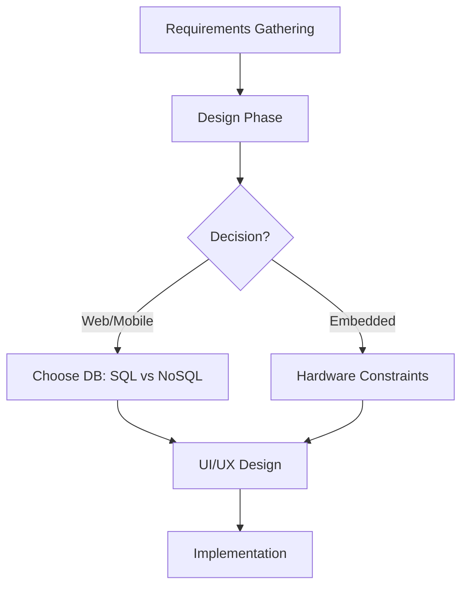
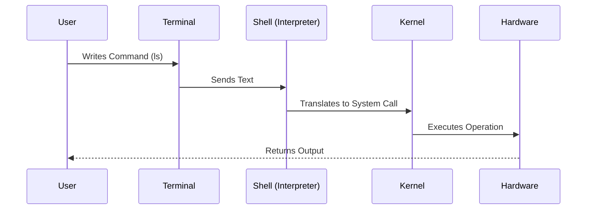
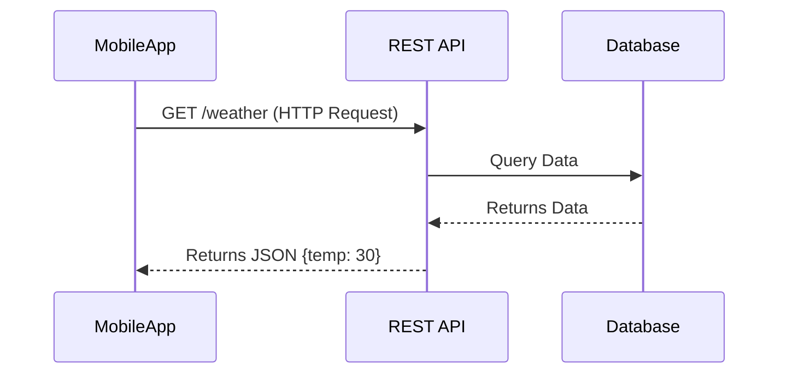
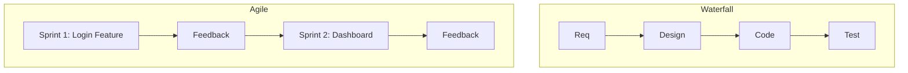

## 1. 🔄 [[SDLC]] & Design Decisions

عشان نعمل أي سوفت وير محترم، لازم نمشي على **[[Software Development Life Cycle]]**. العملية مش "يلا نكتب كود"، لأ، دي مراحل مرتبة:

> [!abstract] Planning & Requirements
> 
> بنقعد مع الـ Client نشوف هو عايز ايه؟ (Web, Mobile, Embedded?).

> [!abstract] Design
> 
> هنا بيتدخل الـ [[Solution Architect]]. بنقرر السيستم ده هيكون [[Web App]] ولا [[Embedded System]]؟
> 
> - لو ويب، هنستخدم أنهي **[[Database]]**؟ (**[[SQL]]** vs **[[NoSQL]]**).
>     

> [!example] معلومة
> 
> فيسبوك مثلًا بيستخدم أكتر من 10 أنواع Database، مش نوع واحد.




---

## 2. 🔌 The Concept of [[Interfaces]]

الـ Interface هو الوسيط بين أي حاجتين عايزين يكلموا بعض.

### 🛠️ Physical Interface

> [!quote] أمثلة
> 
> زي زرار اللمبة (بينك وبين الكهرباء) أو الـ [[Pins]] في الـ Chips (بين الـ IC والعالم الخارجي).

### 💻 Software Interface

ودول 3 أنواع رئيسية:

1. **[[GUI]] (Graphical User Interface):**
    
    - لليوزر العادي (زراير، ماوس).
        
2. **[[CLI]] (Command Line Interface):**
    
    - للـ Developers والـ Servers.
        
3. **[[API]] (Application Programming Interface):**
    
    - لما App يكلم App تاني (زي Frontend يكلم Server).
        

> [!tip] نصيحة مينا ناجي
> 
> الـ [[CLI]] مش رفاهية، دي أساس شغلك كمهندس. السيرفرات في العالم مفيهاش شاشات (Headless)، بتتعامل معاها [[SSH]] وشاشة سوداء. لو اعتمدت على الـ GUI هتبقى "يوزر" مش "ديفلوبر".

---

## 3. 🚀 Why [[CLI]] is Superior? (Power & Speed)

ليه بنوجع دماغنا بالشاشة السوداء؟

> [!success] Speed
> 
> تخيل عايز تعمل 100 فايل؟ بالـ [[GUI]] هتقعد تعمل Right Click -> New File ميت مرة. بالـ [[CLI]] سطر واحد.

> [!warning] Resources
> 
> الـ [[GUI]] بيستهلك [[RAM]] كتير (زي Chrome بياكل الرامات). السيرفرات محتاجين نوفر فيها Resources للـ Requests مش للواجهة.

> [!info] Remote Access
> 
> لما تكونكت على سيرفر بعيد بـ [[SSH]] (Text only) أسرع بكتير وأوفر في النت من إنك تنقل صورة وفيديو بـ TeamViewer.

**Code Reconstruction: Bash Script for Mass File Creation**

Bash

```bash
# TODO: Check video at [10:24] for context
# Creating 100 files in less than a second
touch file{1..100}

# Listing files that start with 'file1' only (Filtering)
ls file1*
```

---

## 4. 🏗️ [[CLI]] Architecture (Terminal vs Shell)

لما بتفتح الشاشة السوداء، إنت بتشغل سلسلة من العمليات:

|**المكون**|**الوصف**|
|---|---|
|**[[Terminal]]**|ده مجرد Window (المكان اللي بتكتب فيه).|
|**[[Shell]]**|ده الـ **[[Interpreter]]** اللي بياخد كلامك يترجمه.|
|**[[Kernel]]**|قلب الـ OS اللي بيكلم الهاردوير.|

> [!note] ملحوظة
> 
> ممكن تغير الـ Shell اللي شغال في الـ Background. الطبيعي بيكون bash، بس ممكن تخليه python أو mysql.




---

## 5. 📜 Introduction to [[Scripting]]

بدل ما نكتب الأوامر كل مرة سطر سطر، بنحطهم في فايل (Script).

في اللينكس، الـ Extension (زي .py أو .txt) مش بيفرق، اللينكس بيعتمد على محتوى الفايل والـ Permissions.

**Code Reconstruction: Simple Python Script Logic**

Python

```bash
# script_file (No extension needed in Linux)

# Logic mentioned at [27:08]
print(10)
# Or complex logic loops
```

عشان ترن الفايل ده قدامك طريقتين:

> [!question] **طرق التشغيل**
> 
> 1. **تنادي الـ Interpreter باسمه:** `python3 script_file` (ده هيشتغل علطول).
>     
> 2. **تنادي الفايل نفسه:** `./script_file` (ده هيضرب Error في الأول لأنه مش عارف مين يشغله وكمان محتاج إذن execute).
>     

---


## 1. [[Environment Variables]] & The `PATH`

ليه لما بتكتب `python` في الـ Terminal بتشتغل، ولما بتكتب اسم سكريبت انت عامله مش بيشتغل غير لما تحدد مكانه؟

- **The Problem:** الـ [[Shell]] مش ساحر، هو ميعرفش مكان كل فايل في الجهاز.
- **The Solution ([[PATH]]):** ده متغير في السيستم (Variable) محطوط فيه "عناوين" الفولدرات اللي فيها البرامج المشهورة (زي `/bin` أو `C:\Windows`).
- لما بتكتب كوماند، الـ OS بيدور عليه جوه العناوين دي. لو مش موجود، لازم تكتب الـ Full Path بتاعه (مثلاً `./script.sh`).

[!TIP] Mina's Advice لو عايز تشغل برنامج باسمه من غير ما تكتب عنوانه، لازم تضيف الفولدر بتاعه جوه الـ [[Environment Variable]] اللي اسمه `PATH`.

## 2. The "Magic Line" ([[Shebang]])

في اللينكس، الـ Extension (زي `.py`) مش هو اللي بيحدد الفايل ده هيشتغل بإيه. اللي بيحدد هو الـ **Shebang** في أول سطر.

- **Syntax:** `#!/path/to/interpreter`
- **Function:** بتقول للـ Kernel: "يا عم الحاج، الفايل ده يترجم بـ Python 3 مش بـ Bash".

**Code Reconstruction: Python Script with Shebang**

```bash
#!/usr/bin/python3
# The line above is the Shebang (Magic Line) [40:16]

print("Hello from Script running directly!")
```

_عشان يشتغل لازم تديله صلاحية Execute:_ `chmod +x script_file`

---

## 3. [[API]] & Web Services

الـ API هي "الواجهة البرمجية". لو الـ API دي بتشتغل عبر الإنترنت، بنسميها **[[Web Service]]**.

### أنواع الـ APIs (Styles):

1. **[[REST API]]:** (الأشهر) بيستخدم بروتوكول [[HTTP]] وبينقل الداتا بصيغة [[JSON]] (خلاط بين الـ String والـ Object).
    - **Verbs:** GET (هات داتا), POST (ابعت داتا), PUT (عدل), DELETE (امسح).
2. **[[SOAP]]:** قديم، بيستخدم [[XML]].
3. **[[GraphQL]]:** (بتاع Facebook) بتطلب اللي انت عايزه بس.
4. **[[gRPC]]:** (بتاع Google) سريع جداً.
5. **[[MQTT]]:** (للـ [[IoT]]) خفيف جداً، بيشتغل بنظام Pub/Sub (زي الشات).



---

## 4. Server Concepts & Networking

السيرفر هو **Software** في المقام الأول، مش بس حديد.

- ممكن تحول لابتوبك لسيرفر لو نزلت عليه [[Apache]] (ويب سيرفر) أو [[MongoDB]] (داتابيز سيرفر).
- حتى شريحة [[ESP32]] الصغيرة ممكن تبقى Web Server (بس Limited Resources).

### العمارة والشقة (IP & Port Logic) [74:00]

عشان توصل لسيرفر (تخيل إنك بتوصل دليفري)، محتاج 3 حاجات:

1. **[[Protocol]]:** وسيلة المواصلات (HTTP, MQTT).
2. **[[IP Address]]:** عنوان العمارة.
    - **[[Localhost]]:** (127.0.0.1) ده عنوان "بيتك انت" للتجربة (Loopback).
3. **[[Port]]:** رقم الشقة جوه العمارة.
    - مينفعش شقتين (2 Services) ياخدوا نفس الرقم في نفس الوقت.

```
graph LR
    A[Client Request] --> B{IP Address?}
    B -->|Found| C[Server Machine (Building)]
    C --> D{Port Number?}
    D -->|80| E[Web Server (Apache)]
    D -->|27017| F[DB Server (MongoDB)]
```

**Code Reconstruction: Managing Services (Linux)**

```bash
# Checking status of a service (e.g., MongoDB) [67:20]
systemctl status mongod

# Starting the service (Opening the "Apartment")
systemctl start mongod

# Connecting to the DB (Entering the "Apartment")
mongosh
```

---

## 5. [[SDLC]] Models (Development Methodologies)

إزاي بننفذ خطوات الـ SDLC؟ الشركات بتختار موديل من دول:

### A. [[Waterfall Model]] (الشلال)

- **الفكرة:** تخلص كل مرحلة تماماً قبل ما تخش في اللي بعدها.
- **المشكلة:** التست (Testing) بيجي في الآخر خالص. لو اكتشفنا مصيبة، بنعيد من الأول. "التستر بيقعد ينتخ طول المشروع ويصحى في الآخر".

### B. [[V-Model]]

- **الفكرة:** لكل مرحلة ديفلوبمنت، يقابلها مرحلة تست (Unit Test, Integration Test, System Test).
- **الميزة:** التست بيبدأ بدري، مش في الآخر.

### C. [[Agile]] (The King)

- **الفكرة:** منعملش البرنامج كله مرة واحدة. بنقسمه حتت صغيرة (**Sprints**).
- **[[Sprint]]:** مدتها أسبوع أو اتنين، بنطلع فيها "حته" شغالة (Feature) ونوريها للعميل.
- **Feedback:** بناخد رأي العميل بدري ونعدل.



