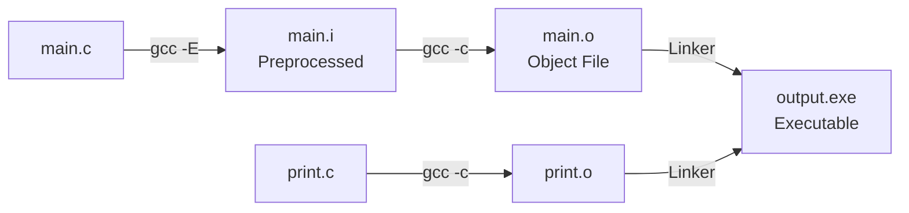
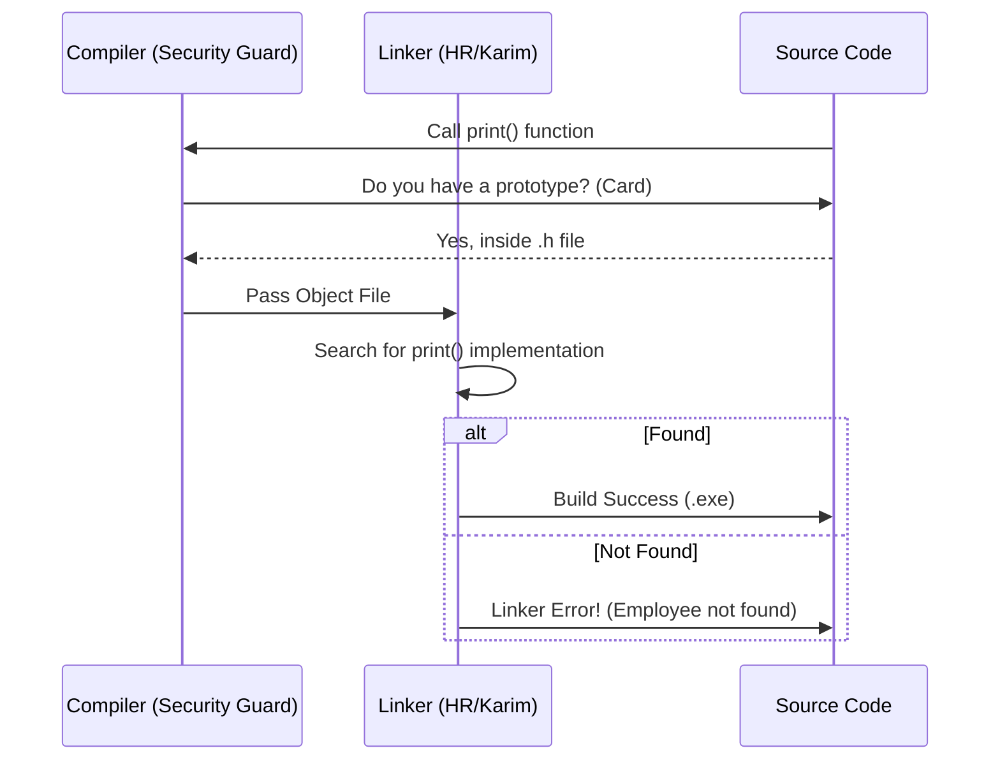
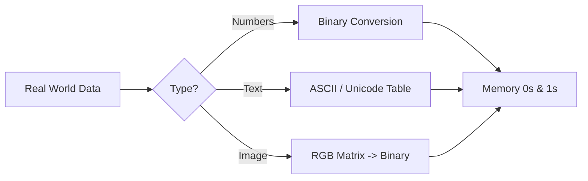
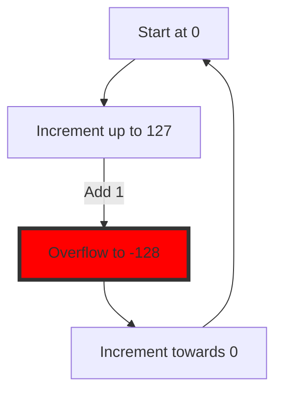
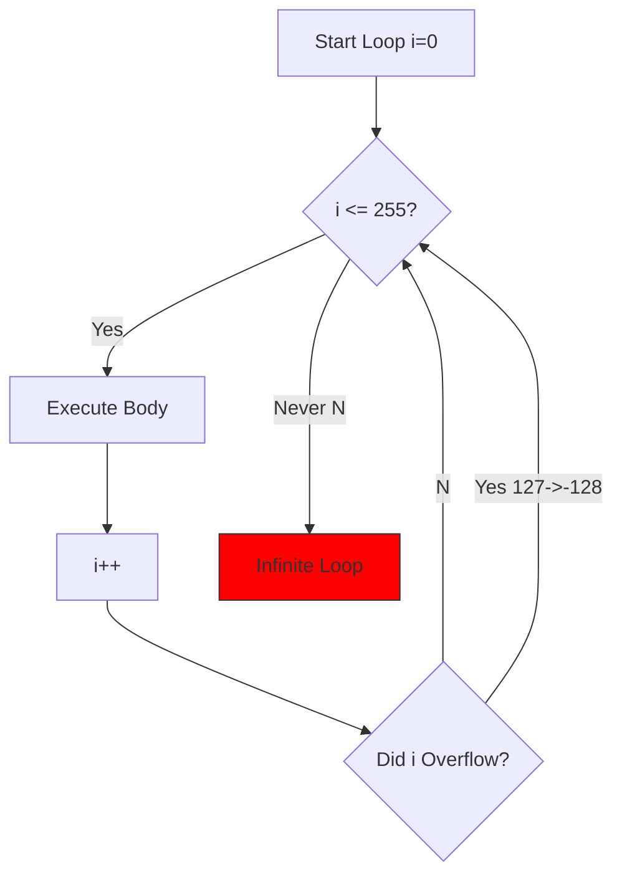
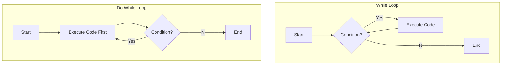

## [00:00 - 40:00] Manual Compilation & Makefiles

## 1. Backend Concepts & Template Engine (Slight Detour)

في بداية اليوم، المهندس مينا راجع على الـ Backend Technologies.

- **Server-Side Rendering:** مش دايمًا السيرفر بيبعت **JSON**. ساعات بيبعت **HTML** جاهز (زي زمان).
    
- **Template Engine:** دي التكنولوجي اللي بتخليك تكتب كود (Logic/Loops) جوه الـ HTML في السيرفر، وبعدين يتحول لـ Pure HTML يتبعت للبراوزر `[Source 4, 5]`.
    

> [!info] ليه بنقول ده؟
> 
> عشان تفهم إن السيرفر ممكن يكون Embedded System (زي ESP32) ويبعت صفحة تحكم (Dashboard) لليوزر.

---

## 2. The Toolchain Under the Hood

احنا متعودين ندوس "Build" في الـ **IDE**. النهاردة هنفتح الكبوت ونشوف إزاي الكود بيتحول من `.c` لـ `.exe` بايدينا باستخدام أوامر الـ **GCC** (Compiler).

### المرحلة 1: Preprocessor (البطاطس والفراخ)

العملية دي بتشيل الـ Comments (البطاطس) وتخلي الكود (الفراخ)، وبتعمل Replace للـ Macros `[Source 46, 50]`.

- **Command:** `gcc -E main.c -o main.i`
    
- **الناتج:** فايل `.i` (Intermediate). لو فتحته هتلاقي الـ `#include` اتشالت واتحط مكانها محتوى الفايل بالكامل، والـ `#define` اتبدلت بقيمتها.
    

### المرحلة 2: Compiler

بيحول الـ `.i` لـ **Assembly** (لغة التجميع).

- **Command:** `gcc -S main.i -o main.s` (مش مذكور بالنص بس دي الخطوة المنطقية).
    

### المرحلة 3: Assembler

بيحول الـ Assembly لـ **Object File** (Binary Code بس مش شغال لوحده).

- **Command:** `gcc -c main.c -o main.o` `[Source 51]`.
    
- **المشكلة:** الفايل ده `.o` مينفعش يترن (Not Executable) لأنه لسه ماتربطش بالمكتبات.
    

### المرحلة 4: Linker

بيجمع كل الـ Object Files (`main.o`, `print.o`) ويربطهم ببعض ويطلع الـ Executable.

- **Command:** `gcc main.o print.o -o output.exe` `[Source 51]`.
    

Code snippet



---

## 3. The Makefile (Automation)

بدل ما نكتب الأوامر دي كل مرة (ولو عندنا 100 فايل هنتسوح)، بنعمل سكريبت اسمه **Makefile**.

> [!abstract] الهدف
> 
> "يا make، لو سمحت بص على الفايلات، اللي اتعدل بس هو اللي تعيد ترجمته" (Incremental Build) [Source 53].

**Code Reconstruction: Simple Makefile**

Makefile

```bash
# Target: Dependencies
# [TAB] Command

# 1. Final Executable (Linking)
out.exe: main.o print.o
	gcc main.o print.o -o out.exe

# 2. Compiling main.c to main.o
main.o: main.c
	gcc -c main.c -o main.o

# 3. Compiling print.c to print.o
print.o: print.c
	gcc -c print.c -o print.o

# 4. Cleaning (Removing generated files)
clean:
	rm *.o *.exe
```

> [!tip] Mina's Advice
> 
> الـ Makefile كورس لوحده، وفي أدوات أحدث زي CMake، بس لازم تفهم الـ Makefile عشان تعرف الـ Build System شغال إزاي تحت الكبوت، خصوصًا في الـ Embedded Linux.

---

## 4. Header Files & The "Security Guard" Analogy

ليه بنفصل الكود لـ `.h` و `.c`؟

- **Header File (.h):** ده فيه **Function Prototypes**.
    

> [!example] التشبيه (مينا ناجي)
> 
> - **البروتوتايب** ده عامل زي "كارت" بتديه لموظف الأمن (الـ **Compiler**). بتقوله "يا باشا الفانكشن دي اسمها `print` وموجودة جوه، عديها". الأمن (الكومبايلر) هيعديك عشان معاك الكارت.
>     
> - **الخناقة:** مين اللي هيتأكد إن "مينا" ده موظف بجد وموجود جوه؟ ده دور الـ **Linker** (كريم في المثال). لو عديت من الكومبايلر واللينكر ملقاش الفانكشن، هيديك **Undefined Reference** `[Source 47, 48]`.
>     

Code snippet



---

## Data Representation & The Overflow Trap (Day 2 - Part 2 & 3)


## 1. 💾 [[Data Representation]] (كيف يرى الكمبيوتر العالم؟)

الكمبيوتر "غبي" مبيفهمش غير (0, 1). أي داتا في الدنيا (أرقام، صور، صوت) لازم تتحول لـ Binary.

### A. تحويل الأرقام (Decimal to Binary)

الطريقة: بنستخدم طريقة "الأوزان" (Powers of 2).

1, 2, 4, 8, 16, 32, 64, 128

> [!example] مثال عملي [Source 66]
> 
> رقم 105:
> 
> 1. هل الـ 105 فيها 64؟ **اه** (نحط 1). يتبقى 41.
>     
> 2. هل الـ 41 فيها 32؟ **اه** (نحط 1). يتبقى 9.
>     
> 3. هل الـ 9 فيها 8؟ **اه** (نحط 1). يتبقى 1.
>     
> 4. الـ 1 هو 1.
>     
> 
> **النتيجة:** `01101001`.

### B. من Binary لـ [[Hexadecimal]] (ليه بنوجع دماغنا؟)

- **المشكلة:** التعامل مع `01010101110` صعب على العين ومساحته كبيرة في الكتابة.
    
- **الحل:** كل 4 Bits (نص بايت) بيتحولوا لرقم واحد Hex (من 0 لـ F).
    

> [!example] مثال [Source 69]
> 
> الـ 105 باينري هي 0110 1001.
> 
> - أول 4 بت (1001) = **9**.
>     
> - تاني 4 بت (0110) = **6**.
>     
> - **النتيجة:** `0x69`.
>     

> [!tip] Mina's Insight
> 
> الهيكسا مش اختراع جديد، هو مجرد "نظارة" تانية بنشوف بيها نفس الكهرباء اللي جوه الميموري عشان نسهل القراءة. الـ 0x دي بادئة بتقول للكومبايلر "اللي جاي ده هيكسا".

---

## 2. 🖼️ Text & Images Representation

الداتا مش بس أرقام، فيه حروف وصور.

### A. [[ASCII]] vs [[Unicode]]

- **ASCII:** عملنا جدول بيدي لكل حرف رقم (A=65, a=97). بس ده آخره 255 حرف (1 Byte).
    
    - _المشكلة:_ الحروف العربي والصيني ملهاش مكان.
        
- **الحل ([[Unicode]]):** استخدمنا مساحة أكبر (2 Bytes أو أكتر) عشان نخزن كل لغات العالم.
    
    - _Formats:_ ظهر UTF-8, UTF-16, UTF-32. (الجافا بتستخدم UTF-16).
        
    - _في السي:_ إحنا غلابة شغالين ASCII غالباً `[Source 71]`.
        

### B. الصور ([[Pixel]] & [[RGB]])

- الصورة عبارة عن مصفوفة نقط (Pixels).
    
- كل بكسل بيتكون من 3 ألوان: **Red, Green, Blue**.
    
- كل لون بياخد قيمة من 0 لـ 255 (يعني 1 Byte).
    
- إذن البكسل الواحد = 3 Bytes.
    

Code snippet



---

## 3. 🧪 C Data Types (The Cup Analogy)

`[Source 173]`

الداتا مينفعش تترمي في الهواء، لازم "وعاء" (Variable) يشيلها. ونوع الوعاء بيعتمد على نوع الداتا.

### [[Primitive Data Types]]

الحاجات الأساسية اللي جاية مع اللغة.

- `int`: للأرقام الصحيحة.
    
- `char`: للحروف (وهو في الأصل رقم صغير 1 Byte).
    
- `float`: للأرقام العشرية (4 Bytes).
    
- `double`: للأرقام العشرية الكبيرة (8 Bytes).
    
- `void`: الللاشيء.
    

### خدعة الـ char (أهم نقطة)

الـ `char` في الـ C هو في الحقيقة **Integer** مساحته 1 Byte.

- ينفع تخزن فيه حرف `'A'`.
    
- وينفع تخزن فيه رقم `65`.
    
- بالنسبة للميموري، الاتنين واحد (`01000001`).
    

**Code Reconstruction: Char as Number**

C

```c
char x = 10; // Storing number directly
char y = 'A'; // Storing ASCII value of A (65)

// Printing as Character vs Number
printf("%c", y); // Output: A
printf("%d", y); // Output: 65
```

---

## 4. 📏 The sizeof Operator Trap

`[Source 177]`

> [!question] سؤال إنترفيو شهير: هل sizeof فانكشن؟
> 
> - **الإجابة:** لأ، دي **[[Operator]]** (زي الجمع والطرح).
>     
> - **الدليل:** مش لازم تحط أقواس لو بتجيب حجم متغير (`sizeof x` شغالة).
>     
> - **الوظيفة:** بترجع حجم المتغير أو النوع بالـ Bytes.
>     

---

## 5. 🔄 The Overflow Disaster (دائرة الرعب)

`[Source 178 - 180]`

ده أخطر كونسبت اتشرح في السيشن. ماذا يحدث لو المتغير "اتملى على آخره" وزودت عليه واحد؟

### A. [[Signed]] vs [[Unsigned]]

- **Unsigned (بدون إشارة):** بيخزن موجب بس.
    
    - `unsigned char`: من 0 لـ 255.
        
- **Signed (بإشارة):** بيقسم المساحة نصين (نص موجب ونص سالب).
    
    - `signed char`: من -128 لـ +127.
        

### B. The Circle Analogy (الساعة)

تخيل الأرقام مرصوصة على دايرة (زي الساعة).

- لو إنت واقف عند **127** (أقصى اليمين في الموجب) وزودت 1.. مش هتروح لـ 128.
    
- هتقع في "البلاعة" وتروح لأقصى السالب: **-128**.
    

**Code Reconstruction: Overflow Example**

C

```c
char x = 127; // Max limit for signed char
x = x + 1;

printf("%d", x);
// Output: -128 (Catastrophic Logical Error!)
// Not 128 because 128 cannot be represented in signed char.
```

### C. حسابة الـ Overflow

لو حصل Overflow، تحسب القيمة الجديدة إزاي؟ `[Source 191]`

> [!info] قاعدة (للموجب)
> 
> لو الرقم عدى الـ Range، اطرح منه 256 (حجم الدايرة كاملة).
> 
> - **مثال:** لو الناتج المفروض يكون 129.
>     
> - **الحساب:** `129 - 256 = -127`.
>     

Code snippet



---

## 6. 🔧 Type Modifiers (اللعب في الأحجام)

`[Source 180]`

ممكن نغير حجم الـ `int` باستخدام:

- `short int`: يصغر المساحة (غالباً 2 bytes).
    
- `long int`: يكبر المساحة (4 أو 8 bytes حسب الـ OS).
    
- `long long int`: يكبر أكتر (مضمون 8 bytes).
    

> [!warning] Mina's Warning
> 
> حجم الـ int والـ long مش ثابت! بيختلف من ويندوز للينكس ومن 32-bit لـ 64-bit. عشان كده في الـ Embedded بنستخدم أنواع ثابتة زي uint32_t (هناخدها بعدين).

---
## [45:00 - End of Video 3 & Start of Video 4] Operators, Input & Branching Logic

## 1. ⚙️ Operators & The "Interview Traps"

في الجزء ده، المهندس مينا دخل في "منطقة الألغام" اللي بتيجي في انترفيوهات شركات زي Valeo.

### A. Unary vs Binary Operators

- **Binary:** محتاج طرفين (يمين وشمال) زي `+`, `-`, `*`.
    
- **Unary:** طرف واحد بس.
    

> [!danger] The Trap `[Source 193]`
> 
> C
> 
> ```c
> int x = 10;
> x = +5; // دي معناها "موجب 5"، مش "زود 5"
> // x became 5.
> ```

> x += 5; // دي اللي معناها x = x + 5 (Compound Assignment)

### B. Pre-Increment vs Post-Increment (++x vs x++)

القاعدة الذهبية عشان متتلخبطش `[Source 199-200]`:

1. **Post (x++):** نفذ السطر الأول بالقيمة القديمة، وبعدين زود. (Use then Increment).
    
2. **Pre (++x):** زود الأول، وبعدين نفذ السطر بالقيمة الجديدة. (Increment then Use).
    

**Code Reconstruction: The Valeo Style Question**

C

```c
int x = 5;
// Order of operations:
// 1. Post-increment (x++) -> Use 5, x becomes 6.
// 2. Pre-increment (++x) -> x becomes 7, Use 7.
// 3. Add them: 5 + 7 = 12.
int y = x++ + ++x;

printf("%d", y); // Result depends on compiler (Undefined Behavior in standard C),
                 // but following strict rules explained: 12.
```

> [!tip] Mina's Rule
> 
> امشي على القواعد (Rules) ومتحاولش تفهلو، لأن الشركات بتلعب في الحتت دي.

### C. Logical (&&) vs Bitwise (&)

أخطر غلطة ممكن تضيع اللوجيك كله `[Source 195-196]`:

- **Logical `&&`:** بتسأل سؤال "هل اللي على اليمين True و اللي على الشمال True؟".
    
    - النتيجة دايما `0` (False) أو `1` (True).
        
    - _مثال:_ `2 && 5` -> الـ 2 (True) والـ 5 (True) -> النتيجة **1**.
        
- **Bitwise `&`:** بتنزل للميموري وتعمل AND على كل Bit.
    
    - _مثال:_ `2 & 5` ->
        
    - `2 = 010`
        
    - `5 = 101`
        
    - `Result = 000` -> النتيجة **0**.
        

---

## 2. ⌨️ Taking Input (scanf) & The Buffer Issue

لما جينا ناخد Input من اليوزر، ظهرت مشكلة مع الـ `char` `[Source 287-288]`.

> [!failure] المشكلة
> 
> لما بتدوس Enter بعد رقم، الـ Enter ده بيتخزن في الـ Buffer كحرف (\n). لو جيت تاخد char بعده، الـ scanf هتاخد الـ Enter ده وتفتكره هو الحرف اللي انت مدخله.

> [!success] الحل (The Space Trick)
> 
> سيب مسافة قبل الـ %c. المسافة دي بتقول للـ scanf: "كلي أي مسافات أو سطور فاضية قبل ما تاخدي الحرف".

C

```c
int x;
char ch;

scanf("%d", &x); // User enters 5 then Enter
// scanf reads 5, leaves '\n' in buffer

// Wrong: scanf("%c", &ch); // Reads '\n' immediately
// Right:
scanf(" %c", &ch); // EATS the '\n', then waits for char
```

---

## 3. 🚦 Control Flow: Branching (Taking Decisions)

البرنامج مبقاش يمشي سطر سطر، بقينا بناخد قرارات.

### A. The if Statement & The "Assignment Trap"

`[Source 291]`

لو كتبت `if (x = 5)` بدل `if (x == 5)`:

- **الكارثة:** `x = 5` دي عملية إسناد، وقيمتها بـ 5 (اللي هي True).
    
- الشرط هيتحقق دائماً، وقيمة `x` هتتغير لـ 5، واللوجيك باظ.
    

The Solution: [[Yoda Conditions]]

اعكس الشرط. خلي الرقم (Constant) على الشمال.

- `if (5 = x)` -> **Compiler Error** (مينفعش تحط قيمة في رقم 5).
    
- كده الكومبايلر هيحميك من غلطتك.
    

### B. The printf inside if Trick

`[Source 292-294]`

> [!question] سؤال خبيث: "إزاي تطبع كلمة Hello وتحقق الـ else في نفس الوقت؟"

C

```c
// printf returns the number of characters printed.
// printf("Hello") prints Hello and returns 5.
// !5 (Not 5) becomes 0 (False).
if (!printf("Hello")) {
    // This won't run because condition is False
} else {
    printf(" Mina"); // This runs!
}
// Output: Hello Mina
```

### C. The switch Case Limitations

الـ `switch` أسرع من الـ `if-else` (Jump Table)، بس ليها قيود صارمة `[Source 306-310]`:

1. **No Floats:** مينفعش تعمل `switch` على `float`. (لازم `int` أو `char`).
    
2. **Duplicate Cases:** ممنوع تكرر نفس القيمة في الـ `case`.
    
3. **Grouping Cases:** لو عايز تنفذ نفس الكود لحرفين مختلفين (مثلاً a و A)، شيل الـ `break` وخليهم تحت بعض (Fallthrough).
    

C

```c
char c;
scanf(" %c", &c);

switch(c) {
    case 'a': // Grouping cases (The OR logic)
    case 'A':
        printf("Option A selected");
        break;
    case 'b':
        printf("Option B");
        break;
    default:
        printf("Invalid");
}
```

---

## 4. 🔄 Control Flow: Looping & The Infinite Loop Trap

`[Source 314-319]`

رجعنا لموضوع الـ Overflow بس جوه الـ Loops.

Scenario: عايز أعمل Loop تلف على كل حروف الـ ASCII (من 0 لـ 255).

C

```c
// Trap: char is signed by default (-128 to 127)
for (char i = 0; i <= 255; i++) {
    printf("%d ", i);
}
```

**اللي بيحصل:**

1. الـ `i` هتوصل لـ 127.
    
2. `i++` -> بقت **-128** (Overflow).
    
3. -128 أقل من 255؟ أيوة. كمل.
    
4. هتفضل تلف في الدايرة دي للأبد (**Infinite Loop**). عمرها ما هتوصل لـ 255.
    

> [!success] الحل
> 
> استخدم int للعداد، أو unsigned char بس بشرط الكونديشن ميكونش <= 255 (لأنها برضو هتقلب 0 وتعمل Infinite Loop). الأمان استخدم int.

Code snippet



---
## [End of Day 2] Advanced Loops, Optimizations & The "Forbidden" Keywords

## 1. 🚀 Loop Optimization (Decrement vs. Increment)

> [!question] سؤال إنترفيو للأذكياء فقط
> 
> هل الـ Loop من 0 لـ 10 أحسن، ولا من 10 لـ 0؟ [Source 320, 321]

- **الإجابة السطحية:** مش فارقة، الاتنين بيلفوا 10 مرات.
    
- **إجابة الـ Embedded Engineer:** الـ Decrement (النقصان) أحسن وأسرع.
    

> [!info] السبب
> 
> في الـ CPU، عندنا حاجة اسمها ALU و Accumulator. لما الرقم بيوصل لـ 0، الـ CPU بترفع Zero Flag أوتوماتيك [Source 322].

1. **في الـ Increment (i++):** الكمبيوتر محتاج يعمل خطوة زيادة اسمها `CMP` (Compare) عشان يقارن `i` بالرقم 10 (يجيب الـ 10 من الميموري ويقارن).
    
2. **في الـ Decrement (i--):** الكمبيوتر مش محتاج يقارن، هو بس بيبص على الـ **Zero Flag**. لو نور، يبقى خلصنا. وفرنا عملية قراءة ومقارنة من الميموري `[Source 322]`.
    

C

```c
// Slower (Needs Compare Instruction)
for (int i = 0; i < 10; i++) { ... }

// Faster (Uses CPU Zero Flag directly)
for (int i = 10; i > 0; i--) { ... }
```

---

## 2. 🔄 While vs. Do-While (Entry vs. Exit Control)

إيه الفرق الجوهري بينهم؟ `[Source 323, 324]`

### A. While Loop (Entry Control)

- بتسأل الأول وبعدين تدخل. لو الشرط غلط من الأول، مش هتدخل ولا مرة.
    
- **الاستخدام:** لما نكون مش عارفين عدد اللفات (زي قراءة داتا من سينسور لغاية ما تقف).
    

### B. Do-While Loop (Exit Control)

- بتدخل "بصدرها" الأول تنفذ الكود مرة، وبعدين تسأل "أكمل ولا لأ؟".
    
- **الاستخدام:** في الـ Menus. لازم تعرض القائمة لليوزر الأول وبعدين تسأله "عايز حاجة تاني؟" `[Source 324]`.
    

**Code Reconstruction: Menu System using Do-While**

C

```c
char choice;
do {
    printf("1. Drink Tea\n");
    printf("2. Leave\n");
    printf("Continue? (y/n): ");

    // Space before %c to eat buffer newline (Day 1 trick applied)
    scanf(" %c", &choice);

} while (choice == 'y'); // Check condition AFTER execution
```

Code snippet



---

## 3. 🚫 The "Forbidden" Keywords: Break & Continue

`[Source 320, 423]`

المهندس مينا سمى الـ `break` والـ `continue` اسم مميز جداً: **"بدعة الشيطان في البرمجة"**.

**ليه بيكرههم؟**

1. **Spaghetti Code:** بتخلي تتبع الكود صعب (Jump في أي حته).
    
2. **The Infinite Loop Trap:** دي الكارثة الحقيقية.
    

> [!danger] The Infinite Loop Trap
> 
> - في الـ `for` loop، الـ `continue` بتروح لخطوة الـ Increment (`i++`).
>     
> - في الـ `while` loop، لو عملت `continue` قبل السطر اللي بيعمل `i++`، الكود هيلف لنفس النقطة والـ `i` عمرها ما هتزيد، وهتلبس في **Infinite Loop**.
>     

> [!tip] القاعدة
> 
> أي كود بـ break أو continue ينفع يتكتب بـ if-else نظيفة وده اللي بيفرق المبرمج المحترف عن الهاوي [Source 326].

**Code Reconstruction: The Trap**

C

```c
int i = 0;
while (i < 5) {
    if (i == 3) {
        // TRAP: continue here skips the i++ below!
        // The loop will stick at i=3 forever.
        continue;
    }
    printf("%d", i);
    i++; // This is unreachable when i == 3
}
```

---

## 4. 📝 Recap of Day 2

بكده نكون قفلنا اليوم التاني، وغطينا فيه:

- **Toolchain:** إزاي بنحول `.c` لـ `.exe` بايدينا (Manual Compilation & Makefiles).
    
- **Data Representation:** إزاي الأرقام والحروف (ASCII) بتتخزن في الميموري Binary & Hex.
    
- **Data Types:** أحجام الـ `int` و `char` والـ Modifiers (short/long/signed/unsigned).
    
- **Overflow:** الكارثة اللي بتحصل لما الـ `char` يعدي 127.
    
- **Operators:** الألغام بتاعة `x++` vs `++x` والـ Bitwise operations.
    
- **Control Flow:** الـ `if` (Yoda Condition)، الـ `switch`، والـ Loops وتفاصيل الـ Optimization.
    

---


