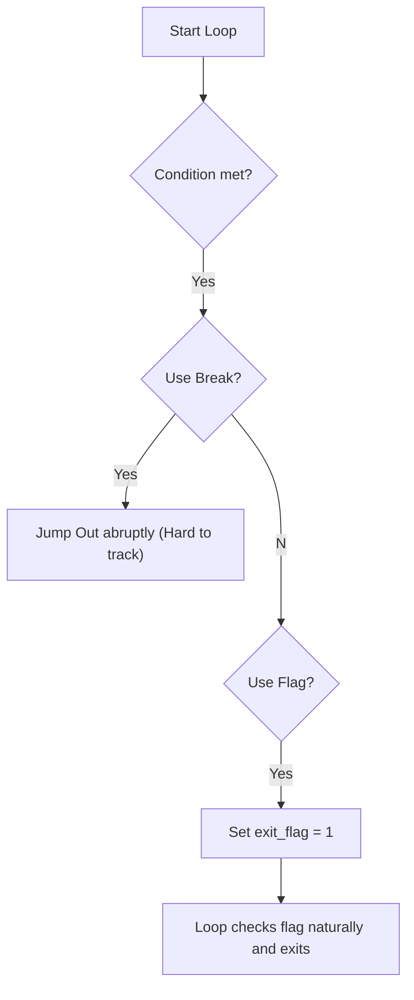
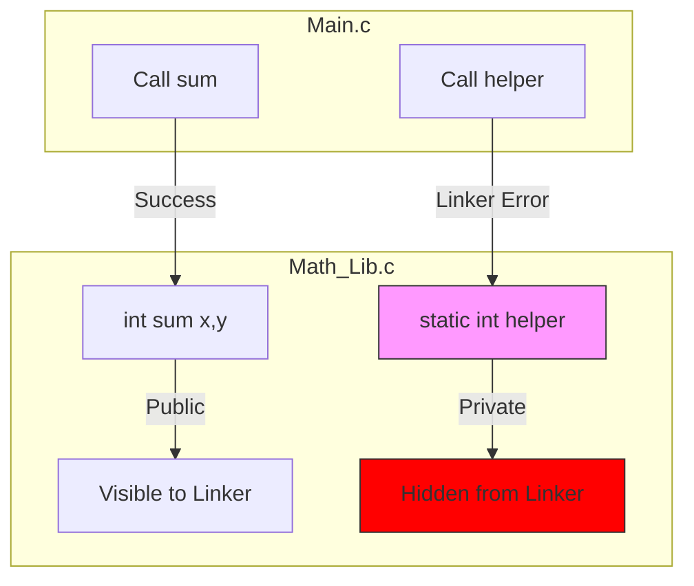
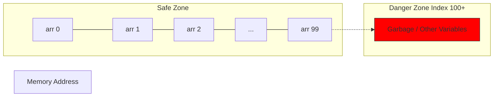
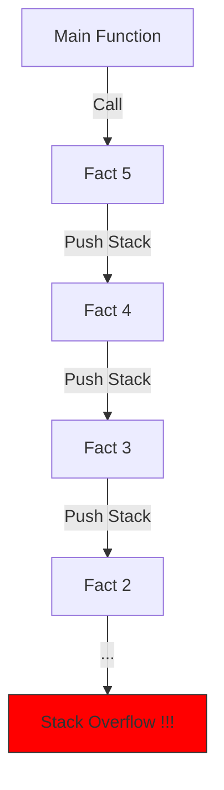
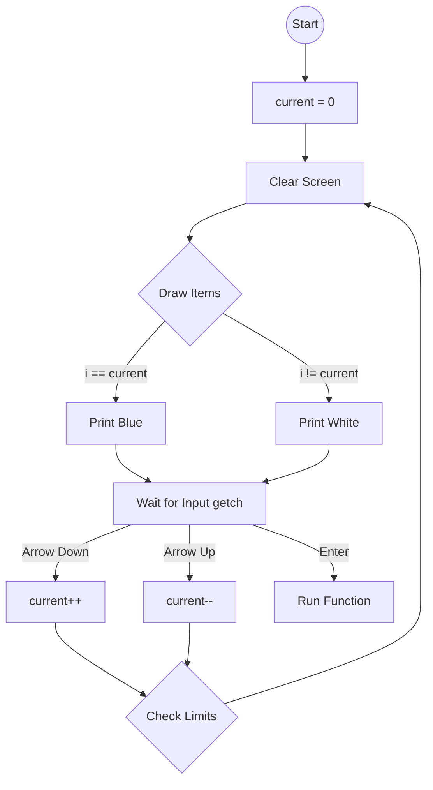

## 1. The [[Infinite Loop]] Trap (For vs. While)

في بداية اليوم، المهندس مينا راجع على "كارثة" بتحصل لما نحول الـ `for` loop لـ `while` loop ومعانا `continue`.
*   **The Scenario:** 
* عايز أعمل Loop من 0 لـ 9 بس أعمل Skip لرقم 5.
*   **In [[For Loop]]:**
* الـ `continue` بتروح تنفذ الـ **Update Expression** (`i++`) فالدنيا بتمشي تمام.
*   **In [[While Loop]]:** 
* لو الـ `i++` مكتوبة *تحت* الـ `continue` (وده العادي)، لما الشرط يتحقق (عند رقم 5) الكود هيعمل Skip للـ `i++` وهيرجع يعيد اللفة والـ `i` لسه بـ 5.
*   **Result:** 
* البرنامج هيدخل في **Infinite Loop** عند رقم 5 ومش هيخرج أبداً.

**Code Reconstruction: The Trap**
```c
// The Trap Code (Don't do this)
int i = 0;
while (i < 10) {
    if (i == 5) {
        continue; // DANGER: Skips i++, i remains 5 forever
    }
    printf("%d\n", i);
    i++; 
}
```

*   **The Fix:** 
* الحل مش إنك تحط `i++` جوه الـ `if` والـ `else` (ده شغل هواة)، الحل إنك **متستخدمش `continue` أصلاً**. استخدم `if` نظيفة:
    ```c
    // Clean Solution
    while (i < 10) {
        if (i != 5) { // Only print if NOT 5
            printf("%d\n", i);
        }
        i++; // Increment happens every time
    }
    ```

---

## 2. The "Demonic" Keywords (`break` & `continue`)

المهندس مينا وصف `break` و `continue` و `goto` بإنهم **"كلمات شيطانية"**.
*   **Readability:** 
* الكود بيبقى صعب التتبع (Spaghetti Code). لو عندك Loop جوه Loop جوه Loop، وعملت `break`، أنت خرجت من أنهي واحدة؟.
*   **The Alternative ([[Flag]]):** 
* استخدم متغير (Flag) يقولك نخرج ولا لأ. ده بيخلي الكود مقروء (Readable) وآمن.



---

## 3. [[Short Circuiting]] (Compiler Optimization)
الكومبايلر ذكي (وكسول). في العمليات المنطقية، مش بينفذ الكود كله لو النتيجة بانت من الأول.

### A. Logical AND (`&&`)
*   القاعدة: "يا نعيش عيشة فل يا نموت إحنا الكل". لازم الطرفين يكونوا True (1).
*   **Optimization:** لو الطرف الأول **Zero (False)**، الكومبايلر **مش هيبص** على الطرف التاني أصلاً (لأن النتيجة كده كده 0).
    *   *Example:* `if (0 && x++)` -> الـ `x` مش هتزيد لأن الكومبايلر طنش النص التاني.

### B. Logical OR (`||`)
*   القاعدة: لو طرف واحد بس True، النتيجة True.
*   **Optimization:** لو الطرف الأول **True (1)**، الكومبايلر **مش هيبص** على الطرف التاني (لأن النتيجة ضمنت تكون 1).

**Code Reconstruction: Short Circuit Trap**
```c
int x = 0;
// First part is 0 (False) -> Second part (x++) is NEVER executed
if (0 && x++) { 
    // ...
}
printf("%d", x); // Output: 0 (x didn't change)

int y = 0;
// First part is 1 (True) -> Second part (y++) is NEVER executed
if (1 || y++) {
    // ...
}
printf("%d", y); // Output: 0
```

---

## 4. Introduction to [[Functions]]
ليه بنستخدم الفانكشنز؟
1.  **Reusability:** بدل ما تكرر نفس الكود 30 مرة، اكتبه مرة وناديه.
2.  **Maintainability:** لو حبيت تعدل، هتعدل في مكان واحد بس.

### The [[ATM Analogy]]
الفانكشن عاملة زي مكنة الـ ATM:
1.  **Input:** بتديها الفيزا والباسورد (Parameters).
2.  **Processing:** بتعمل عمليات حسابية جوه.
3.  **Output:**
    *   يا تديك **Receipt** في جيبك (Return Value).
    *   يا تطلع رسالة على الشاشه بس (Print to Console - `void`).

### No [[Function Overloading]] in C
*   في C++ أو Java، ينفع تعمل 2 فانكشن بنفس الاسم بس بياخدوا inputs مختلفة.
*   **في C:** ممنوع. لو عملت `sum(int a)` و `sum(int a, int b)` الكومبايلر هيضرب Error (Conflicting types).
*   *الحل:* لازم تسميهم أسماء مختلفة (`sum2`, `sum3`).

> [!TIP] Mina's Insight
> الـ `printf` بتاخد عدد لا نهائي من الـ Arguments، دي حالة خاصة في الـ C اسمها **[[Variadic Functions]]** بس مش ده العادي ومش موضوعنا دلوقتي.

---


## [00:00 - 85:00] Static Functions, Arrays Deep Dive & The Recursion Trap

## 1. 🔒 **Static Function** (The Private Access)

إحنا اتعلمنا نفصل الكود لـ .c و .h عشان نعمل API (واجهة) الناس تستخدمها.

بس ساعات بيبقى عندي "مطبخ داخلي" جوه الفايل، فانكشن بتساعدني بس مش عايز حد من بره (زي main.c) يشوفها أو يناديها.

> [!abstract] The Keyword
> 
> نكتب static قبل الفانكشن.
> 
> C
> 
> ```C
> static void internalHelper() { ... }
> ```

- **Effect:** الفانكشن دي بقت **Private** جوه الفايل ده بس (**File Scope**).
    
- **The Linker Behavior:** لو حد من بره حاول يناديها، الـ **Linker** مش هيشوفها وهيدي `Undefined Reference`، حتى لو عملتلها Prototype.
    
- **Java vs C:** انسى الـ OOP بتاع الجافا. هنا `static` مع الفانكشنز معناها **Limiting Scope to File** `[Source 139-142]`.
    

Code snippet



---

## 2. 🧱 **Arrays** (The Contiguous Memory Block)

الـ Array هي نوع من **Derived Data Types**.

- **The Definition:** هي هيكل بيانات (Data Structure) بيحجز أماكن ورا بعض في الميموري (**Contiguous Memory Allocation**) لنفس نوع الداتا.
    
- **The Contract:** لما تكتب `int arr[100]`، أنت بتمضي عقد مع الـ OS: "احجزلي 400 بايت (100 * 4) حتة واحدة". `[Source 147]`
    
- **Access Mechanism:** اسم الـ Array (`arr`) هو في الحقيقة **Pointer** لأول مكان. لما بتقول `arr[i]`، هو بيحسب:
    
    C
    
    ```c
    Address = Start_Address + (Index * SizeOf(Type))
    ```
    
    عشان كده الوصول لأي عنصر بياخد وقت ثابت **O(1)**.
    

### A. The Initialization Trick

عايز تصفر الـ Array كلها بلمسة سحرية؟ `[Source 152]`

> [!tip] خدعة التصفير
> 
> - `int arr[100] = {0};` -> كله أصفار.
>     
> - `int arr[100] = {1};` -> **خدعة:** العنصر الأول بس بـ 1 والباقي كله أصفار.
>     
> - **قاعدة:** طالما اديت قيمة واحدة، الباقي بيتصفر أوتوماتيك (**Partial Initialization**).
>     

### B. The Out of Bounds Trap

الـ C لغة "بايعة قضية". لو عندك Array مقاسها 100، ورحت كتبت في `arr[100]`:

1. **الكومبايلر:** مش هيعترض.
    
2. **الـ OS:** لو المكان ده مش بتاعك، هيعمل Crash (**Access Violation**).
    
3. **المصيبة:** لو المكان ده بتاعك (تبع برنامجك)، هتكتب عليه (Overwrite) وهتبوظ داتا تانية (Corruption) من غير ما تحس. دي اسمها **Buffer Overflow** `[Source 154-155]`.
    

Code snippet



---

## 3. 🚫 **Macros vs. Magic Numbers**

إوعى تكتب رقم ثابت (**Hardcoded**) زي `100` جوه اللوبس `[Source 156-157]`.

- **المشكلة:** لو حبيت تغير حجم الـ Array، هتلف على الكود كله تغير الرقم.
    
- **الحل:** استخدم **Preprocessor Directive** (`#define`).
    

C

```c
#define SIZE 100
int arr[SIZE];
// Preprocessor replaces SIZE with 100 BEFORE compilation.
```

> [!note] ملحوظة
> 
> استخدام const int size = 100 لتعريف حجم الـ Array ممنوع في C89 (القديمة)، لأن الكومبايلر محتاج "رقم صريح" (Constant Literal) مش متغير حتى لو كان const.

---

## 4. 💣 **The Recursion Nightmare** (In Embedded)

المهندس مينا وصف الـ Recursion بـ "العدو" في الـ **Embedded Systems**. ليه؟ `[Source 164-169]`

### A. Context Switching Overhead

لما فانكشن تنادي نفسها، الـ CPU مش مجرد بينط. هو لازم "يحفظ حالته" (**Save Context**):

1. يحط المتغيرات الحالية في الـ **Stack**.
    
2. يحط عنوان الرجوع (**Return Address**).
    
3. يجهز مكان جديد للفانكشن الجديدة.
    

> [!example] التشبيه
> 
> زي ما تكون بتاكل (Context 1)، جالك ضيف، فشلت الأكل في الميكروويف (Save Context) ورحت تقابله (Context 2). لو جالك تليفون وأنت مع الضيف، هتشيل الضيف (Save Context) وترد... وهكذا. التكلفة دي غالية جداً.

### B. Stack Overflow

الـ Stack مساحته محدودة جداً في المايكروكنترولر (ممكن تكون 1KB).

- الـ Recursion بياكل الـ Stack بسرعة رهيبة (**Exponential Growth** أحياناً).
    
- لو الـ Stack اتملى، هيدخل على داتا تانية ويبوظ الدنيا، والسيستم هيعمل **Hard Fault**.
    

> [!warning] القاعدة
> 
> في الـ Embedded، استخدم Loops (Iteration) بدل Recursion دائماً.

Code snippet



---

## 5. 🎮 **Advanced Input: scanf vs getch** (Building a Menu)

عايزين نعمل Menu نتحكم فيها بالأسهم (Arrows) من غير ما نضغط Enter. `[Source 178-181]`

### A. The Problem with scanf

- **Buffered I/O:** بتستنى لما تدوس Enter.
    
- **Echoing:** بتطبع الحروف اللي بتكتبها على الشاشة. (مش حلو لو بتعمل Password أو Menu).
    

### B. The Solution: getch()

دي فانكشن (غالباً في مكتبات زي `conio.h` على ويندوز أو `curses` على لينكس).

- **Unbuffered:** بتقرأ الزرار فوراً بمجرد الضغط.
    
- **No Echo:** مش بتطبع الحرف على الشاشة.
    

### C. Extended Keys (الأسهم)

أزرار الكيبورد العادية بتبعت 1 Byte (ASCII). الأسهم (Up, Down, etc.) بتبعت 2 Bytes (**Sequence**) `[Source 177]`.

1. أول بايت بيكون "إشارة" (مثلاً `0xE0` أو `0` أو `-32`).
    
2. تاني بايت بيكون كود السهم.
    

- **عشان كده:** لازم تنادي `getch()` مرتين عشان تقرأ سهم واحد.
    

**Code Reconstruction: Reading Arrow Keys**

C

```c
char key = getch(); // Read first byte
if (key == -32 || key == 0) { // Check for extended key indicator
    key = getch(); // Read the actual key code
    if (key == 72) printf("Up Arrow");
    else if (key == 80) printf("Down Arrow");
}
```

---

## [85:00 - End of Session] The Interactive Menu Project & Multi-File Architecture

بما إننا خلصنا الـ Arrays والـ Input، دلوقتي هنجمع كل اللي اتعلمناه (Loops, Conditions, Arrays, Functions, Input) عشان نبني Project حقيقي: **"Interactive Menu"**.

ده مش مجرد كود، ده **State Machine** بسيط، وده أساس شغل الـ Embedded Systems (زي شاشة العدادات في العربية أو المنيو بتاعة الـ ATM).

---

### 1. 🎹 Deep Dive: Extended Keys (The Two-Byte Trap)

في الدقيقة، اكتشفنا إن الكيبورد مش بتبعت بايت واحد لكل الزراير.

- **Standard Keys:** حرف الـ A بيبعت `65`. (1 Byte).
    
- **Extended Keys:** الأسهم (Up/Down) والـ F-keys بيبعتوا 2 Bytes.
    
    - **Indicator:** أول بايت بيكون `0xE0` (يعني -32) أو `0`. دي "صفارة إنذار" بتقول: "استعد، اللي جاي مش حرف عادي".
        
    - **Actual Code:** تاني بايت هو كود الزرار نفسه (مثلاً `72` للسهم فوق).
        

> [!failure] The Problem
> 
> لو استخدمت scanf أو getch مرة واحدة، هتاخد الـ Indicator وتفتكره حرف، والبرنامج هيخرف.

> [!success] The Solution
> 
> لازم تنادي getch مرتين.

C

```c
char ch = getch(); // Read first byte
if (ch == -32) {   // Did we receive the "Extended Key" signal?
    ch = getch();  // Yes! Read the SECOND byte (the actual arrow code)

    // Now check the code
    if (ch == 72) printf("Arrow UP");
    else if (ch == 80) printf("Arrow DOWN");
    // ...
}
```

---

### 2. 🎨 The Menu Logic (Highlighting Algorithm)

الفكرة إننا عندنا 3 اختيارات: New, Display, Exit.

عايز لما أدوس "تحت"، الـ Highlight (اللون الأزرق) يتنقل من New لـ Display.

#### The Logic (Step-by-Step):

1. **Cursor Variable:** متغير `int current = 0` بيشاور إحنا واقفين فين.
    
2. **Infinite Loop:** البرنامج شغال مبيفصلش.
    
3. **Drawing Phase:** امسح الشاشة (`system("cls")`) وارسم المنيو من جديد.
    
    - لو `current == 0` -> اطبع "New" باللون الأزرق.
        
    - غير كده -> اطبع "New" باللون الأبيض.
        
    - (كرر ده لكل الاختيارات).
        
4. **Input Phase:** استنى اليوزر يدوس زرار.
    
5. **Update Phase:**
    
    - لو داس Down: `current++`. (مع مراعاة الحدود، لو وصل للآخر يلف للأول).
        
    - لو داس Up: `current--`.
        

Code snippet



**Code Reconstruction: The Menu Skeleton**

C

```c
int current = 0;
char key;

while(1) {
    system("cls"); // Clean old frame

    // --- Drawing the Menu ---
    // Option 1: New
    if(current == 0) SetColor(BLUE); // Hypothetical coloring function
    else SetColor(WHITE);
    printf("1. New\n");

    // Option 2: Display
    if(current == 1) SetColor(BLUE);
    else SetColor(WHITE);
    printf("2. Display\n");

    // Option 3: Exit
    if(current == 2) SetColor(BLUE);
    else SetColor(WHITE);
    printf("3. Exit\n");

    // --- Handling Input ---
    key = getch();
    if(key == -32) { // Extended Key
        key = getch(); // Get the arrow code
        if(key == 72) { // Up
            current--;
            if(current < 0) current = 2; // Loop to bottom
        }
        else if(key == 80) { // Down
            current++;
            if(current > 2) current = 0; // Loop to top
        }
    }
    else if(key == 13) { // Enter Key
        // Execute logic based on 'current'
        if(current == 2) break; // Exit loop
    }
}
```

---

### 3. 📂 Multi-File Architecture (Professional Setup)

`[Source 33-36]` في "Day 3 1"، المهندس مينا شرح إزاي نقسم الكود لـ Modules عشان منكتبش كله في `main.c`. دي مهارة أساسية للـ Lab.

#### A. The Setup

- **Menu.h (The Interface):** فيها الـ **Function Prototypes**. دي اللي بتديها لزميلك عشان يعرف يستخدم كودك.
    
- **Menu.c (The Implementation):** فيها الكود الفعلي (اللوجيك).
    
- **main.c (The Application):** بيعمل `#include "Menu.h"` وينادي الفانكشنز.
    

#### B. The Compilation Process

1. **Preprocessor:** بياخد محتوى `.h` يحطه جوه `.c`.
    
2. **Compiler:** بيترجم كل `.c` لوحده لـ Object File (`.o`).
    
3. **Linker:** بيجمع `main.o` مع `Menu.o` عشان يطلع الـ `.exe`.
    

> [!tip] Mina's Rule
> 
> - استخدم `" "` (Double Quotes) لما تعمل include لفايلاتك أنت (عشان يدور في الفولدر بتاعك الأول).
>     
> - استخدم `< >` للمكتبات القياسية زي `stdio.h` (عشان يدور في مسار الكومبايلر). `[Source 35]`
>     

---

### 4. 🤖 The "Chat GPT" Trap (Warning)

`[Source 179]`

المهندس مينا حكى قصة عن طالب استخدم ChatGPT عشان يحل مشكلة في كود "Line Editor" (حاجة زي vim مصغر).

> [!warning] القصة والدرس
> 
> - **القصة:** الكود كان فيه Logic Error معقد. الطالب سأل GPT، وGPT طلعله حل "شغال" بس الطالب مش فاهم ليه شغال ولا إيه كانت المشكلة أصلاً.
>     
> - **الدرس:** الـ Tools دي بتطلع Output بس مش بتعلمك الـ **Problem Solving**. في الـ Embedded، لو الكود اشتغل وأنت مش فاهم ليه، دي كارثة (ممكن يضرب في Production).
>     
> - **Note:** الـ Output بتاع الـ `getch` وسلوك الـ Buffer ممكن يختلف بين Windows و Linux، والـ AI مش دايماً بياخد باله من الـ Environment Constraints دي.
>     

---
