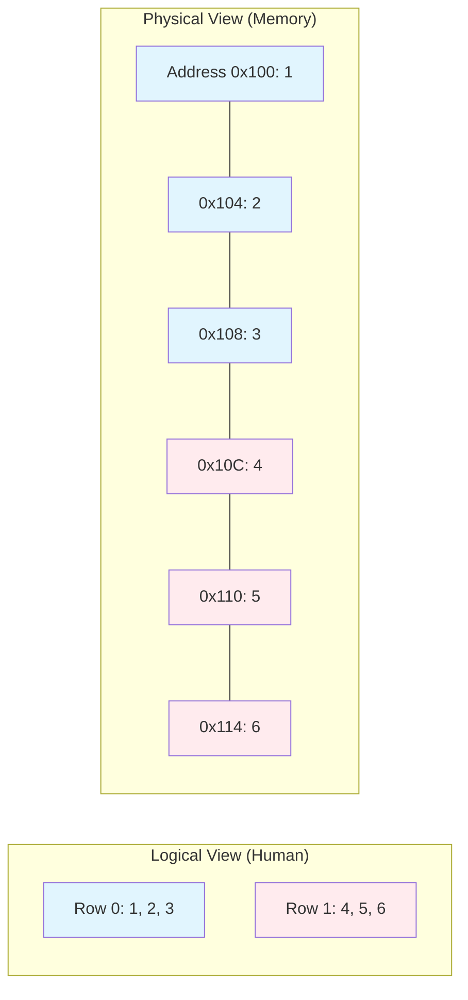

## [00:00 - 87:00] Deep Dive into Arrays, Memory Layout & The 2D Illusion

اليوم الرابع (Day 4) هو "الجسر" اللي بينقلك من عالم الأساسيات لعالم الـ **Pointers** المرعب. المهندس مينا هنا بيمهد الأرض (Psychological Injection) عشان لما تدخل في البوينترز ماتتخضش.

---

## 1. 📏 Array Initialization & The "Golden Rule"

`[Source 1, 44-45]`

**القاعدة:** الـ Array هي مساحة متصلة في الميموري لنفس نوع الداتا.

> [!tip] The Golden Rule
> 
> الـ Initialization لازم يحصل لحظة الـ Declaration.

C

```c
int arr[5] = {0}; // -> كده بيصفر كل العناصر.
int arr[5] = {1}; // -> الأول بـ 1 والباقي أصفار.
```

> [!danger] الغلطة
> 
> مينفعش بعد ما تعرفها تقول arr = {1, 2, 3}. خلاص القطر فات.

---

## 2. 🪤 The sizeof Trap (متى تستخدمه ومتى يوديك في داهية)


عايز تعرف عدد عناصر الـ Array؟

C

```c
// المعادلة:
int count = sizeof(arr) / sizeof(arr[0]);
// بتقسم الحجم الكلي (مثلاً 16 بايت) على حجم العنصر الواحد (4 بايت) = 4 عناصر.
```

> [!warning] Mina's Warning (The Trap)
> 
> - الكلام ده شغال طول ما أنت في نفس الـ Scope اللي عرفت فيه الـ Array.
>     
> - **الكارثة:** لو بعت الـ Array دي لـ Function، هيحصلها **Array Decay** وتتحول لـ Pointer عادي. ساعتها `sizeof` هيرجع حجم البوينتر (4 أو 8 بايت) مش حجم الـ Array كلها.
>     
> - **نصيحة:** لو شوفت السطر ده جوه فانكشن بتاخد Array كباراميتر، "هيبقى يومك أسود".
>     

---

## 3. 📉 The 2D Array Illusion (الوهم الكبير)

`[Source 12, 75, 76]`

هل الميموري فيها صفوف وأعمدة؟ **لأ**. الميموري عبارة عن "شريط طويل" (Linear).

- **الحقيقة:** الـ **2D Array** `arr[2][3]` هي في الحقيقة 1D Array طولها 6 (2×3)، بس إحنا اللي بنقسمها في خيالنا.
    
- **التخزين:** بيتخزنوا **Row-Major Order** (الصف الأول كله، جنبه الصف التاني كله).
    

Code snippet



### Syntax Rules for 2D Arrays

`[Source 52, 53]`

C

```c
int arr[2][3]; // -> صح.
int arr[][3] = {{1,2,3}, {4,5,6}}; // -> صح (الكومبايلر هيعد الصفوف لوحده).
// int arr[2][]; -> Compiler Error!
```

> [!info] ليه Error؟
> 
> عشان الكومبايلر محتاج يعرف "النطة" (Step Size). عشان ينط من الصف الأول للصف التاني، لازم يعرف الصف فيه كام عمود. لو مديتوش عدد العواميد، مش هيعرف يحسب العنوان في الميموري.

---

## 4. 💉 The Pointer Injection (Address vs. Name)

`[Source 19, 20, 99, 100]`

هنا المهندس مينا بيبدأ "يحقن" مفاهيم البوينترز:

1. **اسم الـ Array (`arr`):** هو عنوان أول عنصر.
    
2. **عنوان الـ Array (`&arr`):** هو برضه عنوان أول عنصر (كنفس القيمة الرقمية).
    

> [!example] الفرق الجوهري (The Jump)
> 
> - `arr + 1`: بينط عنصر واحد (مثلاً 4 Bytes).
>     
> - `&arr + 1`: بينط الـ Array كلها (مثلاً لو هي 6 عناصر × 4 بايت = 24 Bytes).
>     
> - **التشبيه:** واحد بينط "بلاطة"، والتاني بينط "الغرفة" كلها.
>     

---

## 5. 🗺️ Flattening Arrays (Manual 2D Implementation)

`[Source 39, 40, 157]`

بما إن الميموري 1D، إحنا ممكن نعمل الـ 2D Array بتاعتنا يدويًا (Custom Logic).

- **الفكرة:** نحجز 1D Array كبيرة، ونتعامل معاها بمعادلة رياضية كأنها 2D.
    
- The Equation: عشان توصل للعنصر في الصف i والعمود j:
    
    Index = (i * Total_Columns) + j
    

**Code Reconstruction: The "Mina Language" Logic**

C

```c
// User input: Rows = 3, Cols = 2
int rows = 3, cols = 2;
int arr[6]; // Size = 3 * 2

// Simulate arr[1][1] (Row 1, Col 1)
int targetRow = 1;
int targetCol = 1;

// The Magic Equation
int flatIndex = (targetRow * cols) + targetCol;
// flatIndex = (1 * 2) + 1 = 3

arr[flatIndex] = 99; // Storing data
```

> [!quote] Mina's Philosophy
> 
> "البرمجة هي فن عمل طبقات (Layers)". السي بتديك ميموري "سايحة"، وأنت بتكتب كود (Logic Layer) يخليها تتصرف كـ Stack أو Queue أو 2D Array. أنت هنا بتعمل "Languague" خاصة بيك فوق السي. [Source 40, 41]

---

## 6. 🧨 The Out of Bounds Disaster

`[Source 4, 8, 66]`

السؤال: لو عندي Array فيها 3 عناصر، وكتبت في العنصر رقم 10 arr[10] = 5؟

الرد: السي مش هتعترض (No Bounds Checking).

**النتيجة:**

1. **لو المكان ده فاضي:** البرنامج هيكمل عادي (**Silent Corruption**).
    
2. **لو المكان ده فيه متغير تاني:** قيمته هتتغير وأنت مش دريان.
    
3. **لو المكان ده تبع الـ OS:** هيحصل Crash (**Access Violation**).
    

> [!bug] مينا: "أنت ونصيبك، ونيتك السالكة".

---
