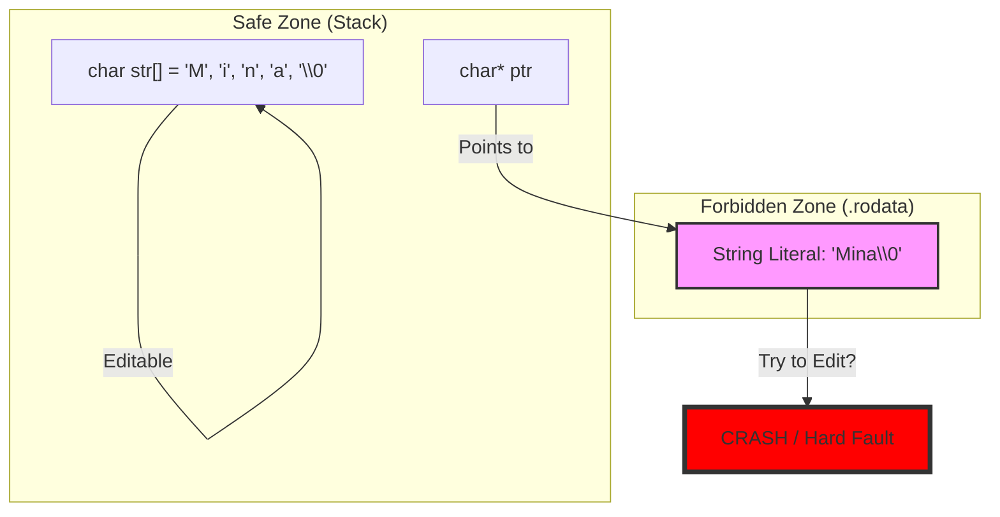

## [00:00 - 45:00] The String Illusion & Memory Secrets

## 1. 🎭 The "No String" Reality & The Golden Key

`[Source 1, 2, 3]`

في السي، مفيش داتا تايب اسمها `string`. دي "كذبة" بنعملها عشان نسهل حياتنا.

- **الحقيقة:** الـ String هو `char array` عادي جداً، بس اتفقنا على **"Golden Key"** (قاعدة ذهبية) عشان نفرقه عن الـ Array العادية.
    
- **The Terminator (\0):**
    
    - في الـ `int arr`، لازم تمشي بـ Loop لحد Size.
        
    - في الـ String، بنمشي لحد ما نخبط في `\0` (**Null Character**).
        
- **ليه 0 بالذات؟** `[Source 6]`: لأن مستحيل "اسم" أو "رقم تليفون" يكون جواه القيمة `0` (NULL في الـ ASCII). ده الرقم الوحيد المضمون إنه مش جزء من الداتا.
    

**Code Reconstruction: The Difference**

C

```c
char arr1[4] = {'M', 'i', 'n', 'a'}; // Character Array (Need Size to loop)
char arr2[] = "Mina";                // String (Has hidden \0 at end)

// Looping Logic
// Array: while(i < SIZE)
// String: while(arr[i] != '\0') -> The Golden Key
```

---

## 2. 🪤 Input Traps: The "Jana Hazem" Bug

`[Source 17, 18]`

المهندس مينا شرح سيناريو كارثي:

- **المشكلة:** لو استخدمت `scanf("%s", name)` ودخلت الاسم "Jana Hazem".
    
    - الـ `scanf` بتعتبر المسافة (Space) هي نهاية المدخلات.
        
    - هتاخد "Jana" بس، وتسيب "Hazem" في الـ Buffer، وده هيبوظ أي `scanf` بعدها.
        
- **الحل (Regex Scanset):** بنقول للـ `scanf`: "اقري كل حاجة لحد ما تلاقي New Line".
    

**Code Reconstruction: The Fix**

C

```c
char name[50];
// scanf("%s", name); // TRAP: Reads "Jana" only

// Correct Way: Read until '\n'
scanf("%[^\n]s", name); // Reads "Jana Hazem" completely
```

---

## 3. 🛠️ The "Developer" vs. "Coder" Mindset (Custom Libs)

`[Source 19, 24]`

المهندس مينا منع استخدام `<string.h>` (زي `strlen`, `strcpy`)، وقال: "لو استخدمت Built-in تبقى Coder، لو كتبتها بايدك تبقى Software Engineer".

### A. mina_strlen Implementation

[Source 21]

بنعد الحروف لحد الـ Null، ومش بنعد الـ Null معانا.

C

```c
int mina_strlen(char* str) {
    int i = 0;
    // Loop until the Golden Key
    while (str[i] != '\0') {
        i++;
    }
    return i;
}
```

### B. mina_strcpy Logic

[Source 35]

لما تنسخ String، لازم تاخد بالك من حاجتين:

1. تنسخ حرف حرف.
    
2. تحط الـ `\0` بايدك في الآخر (لأن اللوب بتقف قبله).
    

C

```c
void mina_strcpy(char* dest, char* src) {
    int i = 0;
    while (src[i] != '\0') {
        dest[i] = src[i]; // Copy char
        i++;
    }
    dest[i] = '\0'; // CRITICAL: Manual Termination
}
```

---

## 4. 💀 The Fatal Memory Mistake (Stack vs. Read-Only)

`[Source 53, 58, 59]`

ده أخطر جزء في الفيديو (الدقيقة 31:00 في الفيديو التاني). الفرق بين تعريفين يبانوا زي بعض، بس واحد فيهم بيوديك في داهية.

### Case 1: Stack Allocation (Safe & Editable)

C

```c
char str[] = "Mina";
str[0] = 'A'; // Valid -> Becomes "Aina"
```

- **مكانها:** `str` عبارة عن Array كاملة محجوزة في الـ **Stack Memory**.
    
- **السلوك:** دي نسختك الخاصة، عدل فيها براحتك.
    

### Case 2: Pointer to String Literal (The Trap)

C

```c
char* str = "Mina";
str[0] = 'A'; // CRASH! (Runtime Error)
```

- **مكانها:** كلمة "Mina" بتتخزن في منطقة محرمة اسمها **Read-Only Data** (أو `.rodata`).
    
- **السلوك:** الـ Pointer `str` موجود في الـ Stack، بس بيشاور على الـ `.rodata`.
    
- **محاولة التعديل:** الـ OS بيلاقي إنك بتحاول تكتب في منطقة Read-Only، فبيعمل Kill Process فوراً.
    

> [!tip] Mina's Insight
> 
> "ده شيطان جديد في الميموري [Source 58]. الشكل التاني ده (char*) بيخليك تشاور على مكان ممنوع اللمس. لو ماعندكش Garbage Collector (زي في الـ C)، المكان ده بيفضل محجوز ومحدش يعرف ينظفه لو غيرت البوينتر."

Code snippet



---

## 5. 🔗 strcat & The Buffer Overflow Risk

`[Source 44, 48]`

دالة الدمج (`mina_strcat`) فيها تريك خبيث:

1. لازم تبدأ الكتابة بعد نهاية الـ String الأول (فوق الـ `\0` بتاعه).
    
2. **المعادلة:** `Dest_Start_Index = strlen(Dest)`.
    
3. **الكارثة:** لو الـ Dest مساحته مش مكفية الـ Src، هتعمل **Buffer Overflow** وتكتب على متغيرات تانية في الميموري.
    

---

