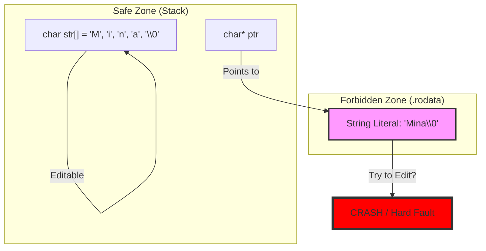
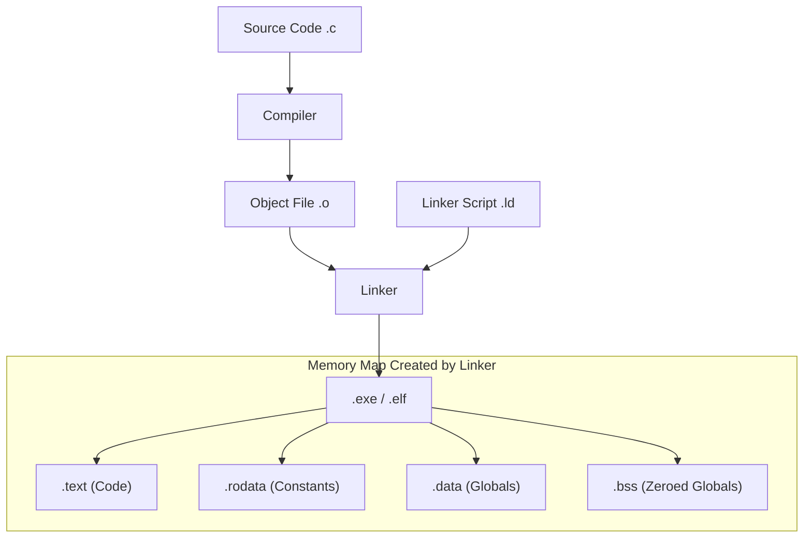

## [00:00 - 45:00] The String Illusion & Memory Secrets

## 1. 🎭 The "No String" Reality & The Golden Key

`[Source 1, 2, 3]`

في السي، مفيش داتا تايب اسمها `string`. دي "كذبة" بنعملها عشان نسهل حياتنا.

- **الحقيقة:** الـ String هو `char array` عادي جداً، بس اتفقنا على **"Golden Key"** (قاعدة ذهبية) عشان نفرقه عن الـ Array العادية.
    
- **The Terminator (\0):**
    
    - في الـ `int arr`، لازم تمشي بـ Loop لحد Size.
        
    - في الـ String، بنمشي لحد ما نخبط في `\0` (**Null Character**).
        
- **ليه 0 بالذات؟** `[Source 6]`: لأن مستحيل "اسم" أو "رقم تليفون" يكون جواه القيمة `0` (NULL في الـ ASCII). ده الرقم الوحيد المضمون إنه مش جزء من الداتا.
    

**Code Reconstruction: The Difference**

C

```c
char arr1[4] = {'M', 'i', 'n', 'a'}; // Character Array (Need Size to loop)
char arr2[] = "Mina";                // String (Has hidden \0 at end)

// Looping Logic
// Array: while(i < SIZE)
// String: while(arr[i] != '\0') -> The Golden Key
```

---

## 2. 🪤 Input Traps: The "Jana Hazem" Bug

`[Source 17, 18]`

المهندس مينا شرح سيناريو كارثي:

- **المشكلة:** لو استخدمت `scanf("%s", name)` ودخلت الاسم "Jana Hazem".
    
    - الـ `scanf` بتعتبر المسافة (Space) هي نهاية المدخلات.
        
    - هتاخد "Jana" بس، وتسيب "Hazem" في الـ Buffer، وده هيبوظ أي `scanf` بعدها.
        
- **الحل (Regex Scanset):** بنقول للـ `scanf`: "اقري كل حاجة لحد ما تلاقي New Line".
    

**Code Reconstruction: The Fix**

C

```c
char name[50];
// scanf("%s", name); // TRAP: Reads "Jana" only

// Correct Way: Read until '\n'
scanf("%[^\n]s", name); // Reads "Jana Hazem" completely
```

---

## 3. 🛠️ The "Developer" vs. "Coder" Mindset (Custom Libs)

`[Source 19, 24]`

المهندس مينا منع استخدام `<string.h>` (زي `strlen`, `strcpy`)، وقال: "لو استخدمت Built-in تبقى Coder، لو كتبتها بايدك تبقى Software Engineer".

### A. mina_strlen Implementation

[Source 21]

بنعد الحروف لحد الـ Null، ومش بنعد الـ Null معانا.

C

```c
int mina_strlen(char* str) {
    int i = 0;
    // Loop until the Golden Key
    while (str[i] != '\0') {
        i++;
    }
    return i;
}
```

### B. mina_strcpy Logic

[Source 35]

لما تنسخ String، لازم تاخد بالك من حاجتين:

1. تنسخ حرف حرف.
    
2. تحط الـ `\0` بايدك في الآخر (لأن اللوب بتقف قبله).
    

C

```c
void mina_strcpy(char* dest, char* src) {
    int i = 0;
    while (src[i] != '\0') {
        dest[i] = src[i]; // Copy char
        i++;
    }
    dest[i] = '\0'; // CRITICAL: Manual Termination
}
```

---

## 4. 💀 The Fatal Memory Mistake (Stack vs. Read-Only)

`[Source 53, 58, 59]`

ده أخطر جزء في الفيديو (الدقيقة 31:00 في الفيديو التاني). الفرق بين تعريفين يبانوا زي بعض، بس واحد فيهم بيوديك في داهية.

### Case 1: Stack Allocation (Safe & Editable)

C

```c
char str[] = "Mina";
str[0] = 'A'; // Valid -> Becomes "Aina"
```

- **مكانها:** `str` عبارة عن Array كاملة محجوزة في الـ **Stack Memory**.
    
- **السلوك:** دي نسختك الخاصة، عدل فيها براحتك.
    

### Case 2: Pointer to String Literal (The Trap)

C

```c
char* str = "Mina";
str[0] = 'A'; // CRASH! (Runtime Error)
```

- **مكانها:** كلمة "Mina" بتتخزن في منطقة محرمة اسمها **Read-Only Data** (أو `.rodata`).
    
- **السلوك:** الـ Pointer `str` موجود في الـ Stack، بس بيشاور على الـ `.rodata`.
    
- **محاولة التعديل:** الـ OS بيلاقي إنك بتحاول تكتب في منطقة Read-Only، فبيعمل Kill Process فوراً.
    

> [!tip] Mina's Insight
> 
> "ده شيطان جديد في الميموري [Source 58]. الشكل التاني ده (char*) بيخليك تشاور على مكان ممنوع اللمس. لو ماعندكش Garbage Collector (زي في الـ C)، المكان ده بيفضل محجوز ومحدش يعرف ينظفه لو غيرت البوينتر."

Code snippet



---

## 5. 🔗 strcat & The Buffer Overflow Risk

`[Source 44, 48]`

دالة الدمج (`mina_strcat`) فيها تريك خبيث:

1. لازم تبدأ الكتابة بعد نهاية الـ String الأول (فوق الـ `\0` بتاعه).
    
2. **المعادلة:** `Dest_Start_Index = strlen(Dest)`.
    
3. **الكارثة:** لو الـ Dest مساحته مش مكفية الـ Src، هتعمل **Buffer Overflow** وتكتب على متغيرات تانية في الميموري.
    

---

## [45:00 - End of Session] Advanced Strings, Memory Internals & The Structure Paradigm

بناءً على طلبك "أركز"، الجزء ده فيه تفاصيل تقنية عميقة جداً (Under the Hood) بخصوص الميموري والـ Linker، والنقلة الكبيرة للـ OOP (بس بالـ C).

---

## 1. 🧵 String Manipulation (Manual Implementation)

المهندس مينا دخل في تفاصيل إزاي نبني دوال الـ String بنفسنا، وطلعنا بكنوز:

### A. mina_strcmp (The Comparison Logic)

[Source 94-97]

بتقارن كلمتين (أو 2 Arrays) حرف بحرف.

- **Return Values:**
    
    - `0`: لو الاتنين متطابقين تماماً.
        
    - `1`: لو الحرف في الكلمة الأولى أكبر (ASCII) من التانية.
        
    - `-1`: لو الحرف في الكلمة الأولى أصغر.
        

> [!note] Mina's Note
> 
> الفانكشن دي بتقارن Content (اللي جوه الصناديق) مش Size (حجم الصناديق).

### B. mina_strcat (The Appending Logic)

[Source 98-109]

عايز تلزق "Mina" في ظهر "Ali".

- **الخوارزمية:**
    
    1. روح لآخر الـ Destination (لحد ما تلاقي `\0`).
        
    2. ابدأ انسخ حروف الـ Source من النقطة دي.
        
    3. حط `\0` جديد في الآخر.
        

> [!danger] The Trap (Buffer Overflow)
> 
> لو الـ Destination حجمه 5 (مكتوب فيه "Ali\0") وأنت عايز تزود "Mina".
> 
> - **النتيجة:** هتكتب في ميموري مش بتاعتك (بعد الـ 5 بايت) -> **Memory Corruption**.
>     

C

```c
void mina_strcat(char* dest, char* src) {
    int i = 0, j = 0;
    // 1. Find end of dest
    while (dest[i] != '\0') {
        i++;
    }
    // 2. Append src
    while (src[j] != '\0') {
        dest[i] = src[j]; // i is continuing from end of dest
        i++;
        j++;
    }
    // 3. Golden Key
    dest[i] = '\0';
}
```

---

## 2. 🚦 Deep Dive: Memory Layout & The Linker Script

`[Source 53, 60-63, 142-145]`

ليه متغير بينزل في الـ **Stack** ومتغير تاني في الـ **Heap** أو **Read-Only Memory**؟ مين "شرطي المرور" اللي بيحدد ده؟

### The Linker Script (.ld)

ده "خريطة" الميموري. ملف تكست إحنا اللي بنكتبه في الـ Embedded Systems.

- بيقول: "من العنوان 0x2000 لـ 0x3000 ده Stack" و "من 0x0000 لـ 0x1000 ده ROM".
    

### Sections

1. **`.text` (Code Segment):** الكود نفسه (Instructions) `[Source 150]`.
    
2. **`.rodata`:** الـ Constants والـ String Literals (`char* p = "Mina"`).
    
3. **`.data`:** المتغيرات الـ Global اللي ليها قيمة ابتدائية.
    
4. **`.bss`:** المتغيرات الـ Global اللي متصفرة.
    

> [!info] #pragma Directive
> 
> لو عايز تجبر متغير معين ينزل في مكان محدد في الميموري (مثلاً عشان توفره لـ Bootloader)، بتستخدم #pragma section. [Source 145].

Code snippet



---

## 3. 🕸️ 2D Arrays of Strings (The Matrix)

`[Source 156-160, 171]`

عايز تخزن 3 أسماء؟ الحل هو Array of Arrays.

char names[3][5]; -> (3 صفوف، كل صف 5 حروف).

### Accessing Traps

1. `names[0]`: ده عنوان الصف الأول كله (عنوان كلمة "Mina"). ينفع تبعته لـ `printf("%s", names[0])`. `[Source 163]`
    
2. `names[0][0]`: ده أول حرف في أول كلمة ('M'). ده `char` مش Address. `[Source 166]`
    
3. `names`: ده عنوان المصفوفة الكبيرة كلها (Double Pointer Concept - لسه جاي).
    

**Visualizing `names` logic:**

C

```c
char names[3][5] = {"Mina", "Ali", "Jana"};
// names[0] -> Points to address of 'M' in "Mina"
// names[1] -> Points to address of 'A' in "Ali"
// printf("%s", names[1]); // Prints "Ali"
```

---

## 4. 🏗️ Structures (The Beginnings of OOP)

`[Source 76-80]`

السي لغة قوية بس مفهاش Classes. البديل هو الـ **Structure** (`struct`).

- **الهدف:** تجميع بيانات مختلفة (اسم، سن، مرتب) تحت "وعاء" واحد بيعبر عن "كائن" (Object).
    
- **The Limitation:** الـ Struct في C بيشيل **Data Only** (Attributes). ماينفعش يشيل Functions (Behavior) زي الـ Class في Java/C++. `[Source 77]`.
    

### A. Syntax & typedef (Clean Code)

[Source 79, 198]

بدل ما تكتب struct Employee في كل سطر، بنستخدم typedef لعمل اسم مستعار (Alias).

C

```c
// Defining the structure
typedef struct {
    char name[50];
    int age;
    long long salary; // 5 Million needs space [Source 196]
    struct Date dob;  // Nested Struct (Composition)
} Employee;

// Usage (No 'struct' keyword needed)
Employee emp1;
```

### B. Initialization & Access

`[Source 81, 203]`

- الـ Golden Key: ينفع تدي قيم ابتدائية مرة واحدة لحظة التعريف بترتيت العناصر.
    
    Employee emp1 = {"Mina", 30, 5000000, {15, 5, 1990}};
    
- **The Dot Operator (.):** عشان تدخل جوه الـ Struct.
    
    - `emp1.salary = 1000;`
        
    - `emp1.dob.day = 15;` (دخلنا جوه الـ Nested Struct).
        

### C. Operations on Structs (Copy vs. Compare)

`[Source 92, 238-239]`

1. Assignment (=): مسموح.
    
    emp2 = emp1; -> بيعمل Shallow Copy. بينسخ البايتات زي ما هي. (لو فيه بوينترز هتحصل كارثة Double Free، بس في المتغيرات العادية تمام).
    
2. Comparison (==): ممنوع.
    
    if (emp1 == emp2) -> Compiler Error.
    
    - _ليه؟_ الكومبايلر ميعرفش يقارن البلوك كامل (بسبب الـ Padding اللي في النص). لازم تقارن id بـ id و name بـ name.
        

### D. Array of Structs (The Database)

[Source 87, 231]

عشان نعمل سيستم بجد، مش هنعمل emp1, emp2. هنعمل Employee db[100];.

- التعامل بيبقى: `db[i].name`.
    
- ده الأساس اللي هنبني عليه الـ Project في اللاب (Employee Management System).
    

> [!tip] Mina's Advice
> 
> لما تيجي تعمل scanf لـ Struct جوا Array:
> 
> scanf("%d", &db[i].id); -> لاحظ الـ Priority. الـ . بتتنفذ قبل الـ &، فإحنا بنجيب الـ id الأول وبعدين ناخد عنوانه.

---

