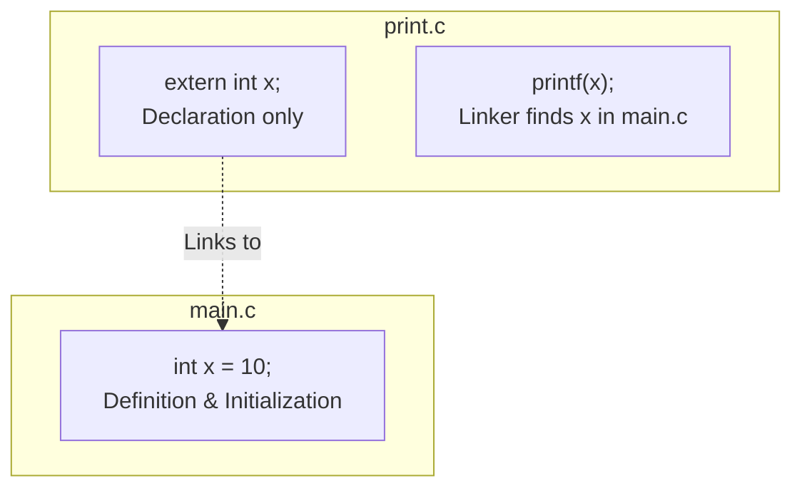
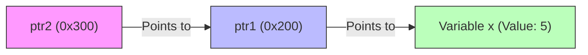
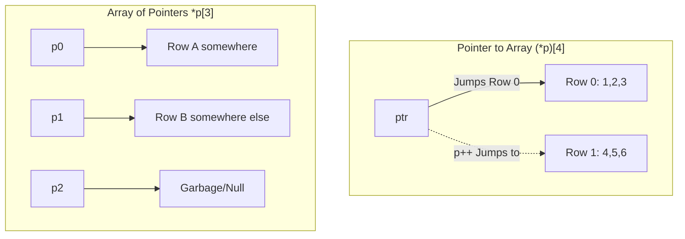

## [Day 7 - Part 1] Storage Classes, Unions & Advanced Types

بناءً على طلبك، هنفصص **Day 7 (الجزء الأول)** بالتفصيل الممل، وده سيشن تقيل جداً لأنه بيتعامل مع الـ Storage Classes والـ User Defined Types اللي بتفرق المبرمج العادي عن الـ Embedded Software Engineer.

---

## 1. 👁️ Scopes & The extern Keyword

قبل ما ندخل في العمق، لازم نفرق بين "مين شايف مين".

- **Block Scope:** أي حاجة جوه `{ }` (سواء فانكشن، if، for) بتموت بمجرد القوس ما يتقفل.
    
- **Global Variable:** "ملطش للكل". بيتشاف في الفايل كله.
    

### The Multi-File Dilemma

لو قسمت الكود لـ `main.c` و `print.c`:

- **المشكلة:** لو عرفت `int x = 10` في `main.c` وحاولت تستخدمه في `print.c`، الكومبايلر هيضرب (Undefined Reference). ليه؟ لأن الـ Global Scope افتراضياً هو **File Scope**.
    
- **الحل (extern):** لازم تروح لـ `print.c` وتقوله "يا عم الكومبايلر، فيه متغير اسمه `x` نوعه `int` موجود في مكان ما، متعملش واحد جديد، دور عليه".
    
    - `extern int x;` -> **Declaration Only** (متحجزوش مكان في الميموري، ده مجرد إخطار).
        

> [!danger] تحذير
> 
> ممنوع تعمل Initialization مع الـ extern (extern int x = 5 -> مصيبة/Compiler Error).

Code snippet



---

## 2. 🦎 The static Keyword (The Chameleon)

كلمة `static` في لغة C ليها 3 معاني مختلفة تماماً حسب مكانها. دي "الحرباء" بتاعة اللغة.

### A. Static Global / Static Function (Private Access)

- **المكان:** قبل Global Variable أو Function.
    
- **التأثير:** بيخلي المتغير/الفانكشن **Private** للفايل ده بس.
    
- **الهدف:** الـ Encapsulation. عشان محدش من بره يعمل `extern` ويشوف المتغير بتاعك ويبوظه. لو حاولت تعمل extern لمتغير static، اللينكر هيقولك "مش شايفه".
    

### B. Static Local (The Immortal Local)

- **المكان:** جوه الفانكشن (`static int count = 0;`).
    
- **التأثير:**
    
    - **Lifetime:** بيفضل عايش طول مدة البرنامج (بيتنقل من الـ **Stack** للـ **Data Segment**).
        
    - **Scope:** لسه Local (محدش يقدر يوصله غير الفانكشن دي).
        
- **Initialization:** بيحصل مرة واحدة فقط عند أول استدعاء. في المرات الجاية، بيفتكر قيمته القديمة.
    

**Code Reconstruction: Static Local Logic**

C

```c
void counter() {
    static int cnt = 0; // Initialized ONCE
    cnt++;
    printf("%d ", cnt);
}

int main() {
    counter(); // Output: 1
    counter(); // Output: 2 (Remembers old value)
    counter(); // Output: 3
    // printf("%d", cnt); // ERROR: Scope is still local
}
```

---

## 3. 🛡️ Header Guards (#ifndef)

لما المشروع يكبر، ممكن تعمل `#include "file.h"` مرتين بالغلط (مرة في main ومرة جوه file2.h). ده بيعمل **Redefinition Error**.

**الحل:** الـ Header Guards. باترن ثابت لازم تحفظه.

C

```c
#ifndef PRINT_H_  // لو الكلمة دي مش متعرفة
#define PRINT_H_  // عرفها، ونفذ اللي تحت

void printFunction();
struct Data { int x; };

#endif // نهاية الشرط
```

- **أول مرة:** `PRINT_H_` مش متعرفة -> يدخل يعرفها وينسخ الكود.
    
- **تاني مرة:** `PRINT_H_` متعرفة -> الـ Preprocessor يشيل الكود كله ويسيب مكانه فراغ.
    

---

## 4. ⚡ Advanced Storage Classes (register & volatile)

### A. register (Speed Request)

بتطلب من الكومبايلر يحط المتغير ده في **CPU Register** بدل الـ **RAM**.

- **الاستخدام:** لو عندك عداد Loop بيلف مليون مرة وعايز سرعة رهيبة.
    
- **تحذير:** ده مجرد "طلب". لو مفيش مكان في الريجسترات، الكومبايلر هيطنشه ويرميه في الرام.
    

### B. volatile (The Anti-Optimization)

دي أهم Keyword للـ Embedded Systems.

- **المشكلة:** الكومبايلر بيعمل Optimization. لو لقى كود زي:
    
    C
    
    ```c
    int x = 0;
    while(x == 0); // Infinite Loop?
    ```
    
    الكومبايلر هيقول: "محدش بيغير x جوه اللوب، يبقى اللوب دي لا نهائية، أنا مش هروح أقرأ x من الميموري كل شوية، أنا هعتبرها بـ 0 وأخلص".
    
- **السيناريو:** في الـ Embedded، المتغير `x` ممكن يتغير من بره (عن طريق **ISR** أو هاردوير).
    
- **الحل:** `volatile int x;` -> بتقول للكومبايلر: "يا محمد هنيدي (على رأي مينا)، ملكش دعوة! المتغير ده ممكن يتغير من ورا ظهرك، روح هاته من الميموري كل مرة غصب عنك".
    

---


## 5. 📛 typedef vs #define (The Type Safety Trap)

عشان نكتب كود Portable (يشتغل على أي ميكرو)، بنعرف أنواع زي `uint8` و `uint32`. نستخدم مين؟

- `#define`: مجرد Text Replacement (بحث واستبدال). غبي جداً.
    
- `typedef`: بتعمل اسم جديد لنوع داتا حقيقي. أذكى وآمن.
    

> [!danger] The Pointer Trap (سؤال امتحانات)
> 
> لو عايز تعرف 2 بوينترز في سطر واحد:
> 
> C
> 
> ```
> #define PTR_D char* // Stupid replacement
> typedef char* PTR_T;  // Smart type definition
> ```

> // Case 1: Using #define (The Trap)
> 
> PTR_D p1, p2;
> 
> // Preprocessor expands it to: char* p1, p2;
> 
> // Result: p1 is Pointer (char*), but p2 is just a CHAR! (Catastrophe)

> // Case 2: Using typedef (The Safe Way)
> 
> PTR_T p3, p4;
> 
> // Compiler treats PTR_T as a full data type.
> 
> // Result: p3 is Pointer, and p4 is Pointer. (Correct)

---

## 6. 📦 [[Unions]] (Shared Memory Magic)

الـ Union هو "علبة" بتشيل داتا أنواعها مختلفة، بس في نفس المكان في الميموري.

- **الحجم:** حجم الـ Union = حجم أكبر عنصر جواه (مش المجموع زي الـ Struct).
    
- **الاستخدام:** توفير الميموري، أو التعامل مع الداتا بأشكال مختلفة (Type Punning).
    

### Hack: Endianness Check using Union

بدل ما تستخدم Pointers عشان تعرف إنت Little Endian ولا Big Endian، استخدم Union.

C

```c
typedef union {
    uint32_t val;    // 4 Bytes (e.g., 0x00000001)
    uint8_t bytes[4]; // Array mapping the same 4 bytes
} EndianCheck;

EndianCheck u;
u.val = 1;

// If Little Endian: Memory is [01 00 00 00]
// u.bytes[0] will be 1.
if (u.bytes[0] == 1) printf("Little Endian");
```

---

## 7. 🤏 [[Bit Fields]] (Memory Squeezing)

لو عايز توفر في الميموري لأقصى درجة، وعايز متغير يشيل 3 بت بس (قيم من 0 لـ 7).

- **Syntax:** جوه الـ Struct.
    
    C
    
    ```c
    struct Flags {
        uint8_t enable : 1; // Takes 1 bit
        uint8_t mode   : 3; // Takes 3 bits
        // Total is still padded to closest Byte/Word alignment
    };
    ```
    
- **الفائدة:** التعامل مع الـ Hardware Registers اللي بتبقى متقسمة بتات.
    
- **العيب:** مقدرش أعمل `&variable` (Address Of) لـ Bit Field، لأن أقل عنوان في الميموري هو Byte كامل.
    

---

## 8. 🔢 [[Enum]] (Killing Magic Numbers)

بدل ما نكتب 0 و 1 و 2 وننسى دول بتوع إيه، بنستخدم `enum`.

- **الميزة:** بتدي أسماء للأرقام (`GPIO_INPUT`, `GPIO_OUTPUT`).
    
- **Auto-Increment:** لو بدأت بـ `JAN=1`، اللي بعده FEB بيبقى 2 أوتوماتيك.
    
- **Type Safety:** في C، الـ Enum هو `int` في الآخر، وممكن ياخد أي رقم (حتى لو مش في الليستة). لكنه بيخلي الكود مقروء (Readable).
    

The Config Function Pattern

بدل ما تبعت 0 أو 1 للفانكشن، ابعت الـ Enum.

C

```c
typedef enum { INPUT, OUTPUT } Direction;
void setPinDir(int pin, Direction dir) { ... }

// Call becomes readable:
setPinDir(5, OUTPUT); // Better than setPinDir(5, 1);
```

---

## 9. 🚀 Inline Functions vs Macros

عايز سرعة الـ Macros بس أمان الفانكشن؟

- **Macro Function:** `#define SUM(x,y) (x+y)`. 
- سريعة (Text replacement) بس مفهاش Type Checking وممكن تسبب بلاوي في الأولويات.
    
- **Inline Function:** `inline int sum(int x, int y)`.
    
    - بتقول للكومبايلر: "لو سمحت، خد كود الفانكشن ده وحطه مكان الاستدعاء (Copy-Paste) عشان نوفر الـ **Context Switching Overhead**".
        
    - في نفس الوقت، هي فانكشن حقيقية بـ Type Checking.
        

---

## [Day 7 - Part 2] Double Pointers, 2D Arrays & The Arithmetic Trap

الجزء ده هو "البعبع" الحقيقي للبوينترز. المهندس مينا قال: "لو دماغك قفلت هنا، أنا هعتزل التدريس". ركز جداً لأن ده اللي بيفرق بين الـ Senior والـ Junior.

---

## 1. 🔁 [[Pointer to Pointer]] (The Double Dereference)

- **التعريف:** هو متغير بيشيل عنوان متغير تاني، والمتغير التاني ده هو كمان بوينتر بيشاور على قيمة.
    
- **Syntax:** `int** ptr;`
    
- **The Visualization:**
    
    1. `x` (قيمة 5).
        
    2. `ptr1` (شايل عنوان `x`).
        
    3. `ptr2` (شايل عنوان `ptr1`).
        
- **Access:**
    
    - `*ptr2` -> يجيب `ptr1` (عنوان `x`).
        
    - `**ptr2` -> يجيب `x` (القيمة 5).
        

> [!quote] Mina's Metaphor
> 
> "عشان تجيب القيمة، لازم تغزه مرتين (Two Pokes/Dereferences). كل نجمة بتدخل ليفل أعمق".

Code snippet



---

## 2. 🪤 Pointer Arithmetic Traps (سؤال الانترفيو القاتل)

الترتيب (Precedence) بين `++` و `*` بيعمل كوارث. ركز في الفرق بين الحالات دي:

### Case A: `*ptr++` (The Deceiver)

- **الأولوية:** الـ Post-increment (`++`) أعلى من Dereference (`*`)، بس التنفيذ بيحصل بعدين.
    
- **السيناريو:**
    
    1. هات قيمة `ptr` القديمة واستخدمها للـ Dereference (`*ptr`).
        
    2. زود عنوان الـ `ptr` نفسه (ينط للنقطة اللي بعدها).
        
- **النتيجة:** بتجيب القيمة الحالية، والبوينتر بيتحرك خطوة لقدام.
    

### Case B: `(*ptr)++` (Value Change)

- **الأولوية:** الأقواس `()` أجبرته ينفذ الـ Dereference الأول.
    
- **السيناريو:**
    
    1. هات القيمة اللي جوه الصندوق (`*ptr`).
        
    2. زود القيمة دي بواحد.
        
- **النتيجة:** البوينتر ثابت في مكانه، والقيمة اللي في الميموري زادت.
    

### Case C: `++*ptr`

- **الأولوية:** `++` (Prefix) و `*` ليهم نفس الأولوية (Right-to-Left).
    
- **السيناريو:** هات القيمة، وزودها فوراً. (زي Case B بس Prefix).
    

**Code Reconstruction: The Quiz**

C

```c
int arr[] = {10, 20, 30};
int* p = arr;

printf("%d", *p++); // Prints 10, then p moves to &arr[1]
printf("%d", (*p)++); // Prints 20, then arr[1] becomes 21 (p stays at &arr[1])
```

---

## 3. 🕸️ The 2D Array Nightmare (Three Ways to Access)

إزاي نعمل بوينتر يشاور على 2D Array `arr[3][4]`؟ دي أصعب حتة في الكورس.

### Method 1: Flattening (The "Quarter Pounder" Pointer)

- استخدم بوينتر عادي `int* p = (int*)arr`.
    
- تعامل معاها كأنها 1D Array طويلة.
    
- `Index = row * COLS + col`.
    

### Method 2: [[Pointer to Array]] (`int (*p)[4]`)

- **Syntax:** `int (*p)[4];` (الأقواس مهمة جداً).
    
- **المعنى:** "يا كومبايلر، `p` ده بوينتر، لما أقوله `p++`، ينط صف كامل (3 * 4 bytes = 12 bytes)".
    
- **الاستخدام:** ده النوع الوحيد اللي ينفع يستقبل 2D Array في فانكشن `void func(int (*p)[4])`.
    
- **العيب:** لازم تثبت عدد العواميد (Fixed Columns).
    

### Method 3: [[Array of Pointers]] (`int* p[3]`)

- **Syntax:** `int* p[3];` (من غير أقواس على النجمة).
    
- **المعنى:** دي Array عادية، بس كل عنصر فيها عبارة عن بوينتر.
    
- **الاستخدام:** نعمل **Jagged Array** (صفوف بأطوال مختلفة). كل بوينتر يشاور على صف مستقل في الميموري.
    

Code snippet



---

## 4. 🚫 Array of Strings (The Read-Only Trap)

لما تعمل: `char* names[] = {"Mina", "Ali"};`

- **التحليل:** دي Array of Pointers.
    
- `names[0]` بيشاور على "Mina".
    
- "Mina" متخزنة في الـ **[[Read-Only Data]]** (`.rodata`).
    
- **الخطر:** لو حاولت تعمل `names[0][0] = 'N';` -> Crash (**Segmentation Fault**).
    

> [!note] Mina's Note
> 
> عشان تعدل فيها، لازم تعملها 2D Array عادية char names[2][10] (تتحجز في الـ Stack).

---

## 5. 🏗️ Intro to [[Dynamic Memory Allocation]] (The Heap)

دخلنا في "عدو الله والإنسان" (على رأي مينا): الـ **[[Heap Memory]]**.

- **الهدف:** حجز ميموري وقت التشغيل (Runtime) مش وقت الكومبايل (Compile time).
    
- **Functions:**
    
    - `malloc(size)`: بتحجز ميموري (فيها Garbage).
        
    - `calloc(n, size)`: بتحجز وتصفرها (Zero Initialization).
        
    - `realloc`: بتكبر مساحة محجوزة قبل كده.
        
    - `free`: (مهمة جداً) عشان ترجع الميموري وتمنع الـ **[[Memory Leak]]**.
        
- **Return Type:** بترجع `void*` (Generic Pointer) لازم تعمله Casting (أو تسيبه في C).
    

---
