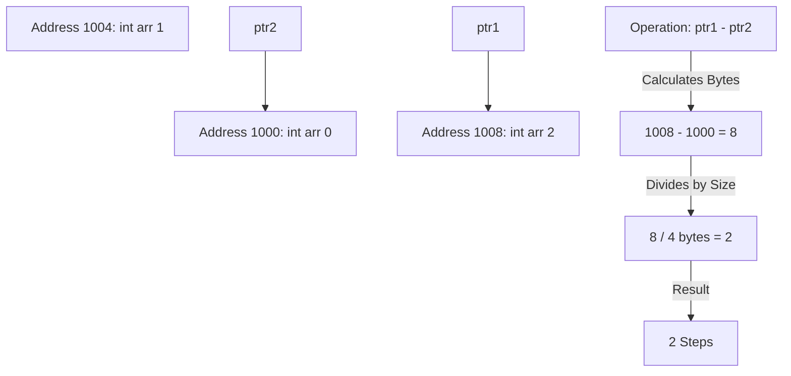
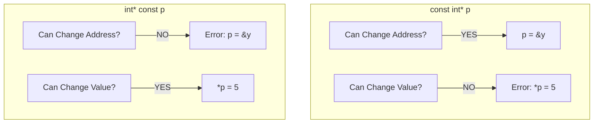

إليك تنسيق **Day 8 - Part 1** (Pointer Math, const Correctness & Void Pointers) بعد التنقيح وإزالة المصادر، جاهز للمذاكرة:

---

## [00:00 - 30:00] Pointer Math & The const Correctness Matrix

### 1. 🧮 Pointer Subtraction (The "Hop" Logic)

إحنا عارفين `ptr + 1`، لكن إيه اللي يحصل لو عملنا `ptr1 - ptr2`؟

- **The Logic:**
- الناتج مش عدد البايتات الفرق، الناتج هو عدد العناصر (Steps/Hops) اللي بينهم.
    
- **Equation:** `Result = (Address1 - Address2) / sizeof(Type)`.
    
    - لو الفرق 8 بايت والنوع `int` (4 بايت) -> النتيجة **2**.
        
- **Stack Behavior:** بما إن الـ **[[Stack Memory]]** بتنمو عكسياً (من العالي للواطي)، ترتيب تعريف المتغيرات `x` ثم `y` بيفرق في مين عنوانه أكبر. غالباً `ptr_x - ptr_y` هيديك سالب لو `y` اتعرفت بعد `x`.
    




---

### 2. 🛡️ The const Matrix (Read-Only vs. Locked Address)

دي أهم مهارة عشان تحمي كودك في الـ Embedded. إزاي تمنع الـ User (أو نفسك) من إنه يبوظ الداتا أو يغير عنوان البوينتر بالغلط؟

#### A. Pointer to Constant (`const int* p`)

- **Syntax:** `const` جت قبل النجمة.
    
- **Effect:** أنا بوينتر "بيتفرج بس". أقدر أشوف القيمة، بس مقدرش أغيرها.
    
    - `*p = 20;` -> **Compiler Error** (Read-Only).
        
    - `p = &y;` -> **Valid** (أقدر أشاور على حد تاني).
        
- **Use Case:** لما تبعت Array لـ Function وعايز تضمن إن الفانكشن دي "تقرأ" بس (Display Function).
    

#### B. Constant Pointer (`int* const p`)

- **Syntax:** `const` جت بعد النجمة.
    
- **Effect:** أنا بوينتر "مخلص" (Loyal). حلفة يمين ما أشاور على غيرك.
    
    - `p = &y;` -> **Compiler Error** (Address is locked).
        
    - `*p = 20;` -> **Valid** (أقدر أغير القيمة اللي جوه الصندوق).
        
- **Use Case:** الـ Hardware Registers اللي عنوانها ثابت (زي `PORTA`)، مش عايز حد يغير العنوان بالغلط.
    

#### C. Constant Pointer to Constant (`const int* const p`)

- **Syntax:** `const` قبل وبعد النجمة.
    
- **Effect:** "ممنوع اللمس والاقتراب". لا تغير العنوان ولا تغير القيمة.
    

> [!tip] Mina's Rule
> 
> "اقرأ التعريف من اليمين للشمال".
> 
> - `const int * p` -> Pointer to int that is constant.
>     
> - `int * const p` -> const pointer to int.
>     

Code snippet



---

## [30:00 - 62:00] The Void Pointer & Generic Programming

### 3. 🃏 [[Void Pointer]] (The Joker)

البوينتر العادي `int*` ليه "نوع" بيحدد هينط كام بايت. الـ `void*` هو بوينتر "بدون هوية".

- **Capability:** يقدر يشيل عنوان أي داتا تايب (int, float, struct).
    
- **Limitation 1 (Dereferencing):**
    
    - `void* ptr; *ptr;` -> **Error!** الكومبايلر مش عارف يغرف كام بايت (1 ولا 4 ولا 8؟).
        
    - **Fix:** لازم تعمل **[[Type Casting]]** الأول: `*(int*)ptr`.
        
- **Limitation 2 (Arithmetic):**
    
    - `ptr++` -> **Error** (Or Undefined Behavior). هينط قد إيه؟ هو ملوش Size.
        
    - _Note:_ بعض الكومبايلرز (زي GCC) بتعتبره `char*` (بينط 1 بايت) بس ده مش Standard.
        

---

### 4. 🧬 Generic Functions (Polymorphism in C)

إزاي نعمل دالة `print` واحدة تطبع أي نوع داتا (زي template في C++)؟ باستخدام `void*`.

**Code Reconstruction: The Generic Printer**


```c
// Define Types
#define INT_TYPE 1
#define CHAR_TYPE 2

// Generic Function receiving (void* data)
void printGeneric(void* data, int type) {
    if (type == INT_TYPE) {
        // Step 1: Cast to (int*)
        // Step 2: Dereference
        printf("%d", *(int*)data);
    }
    else if (type == CHAR_TYPE) {
        printf("%c", *(char*)data);
    }
}

int main() {
    int x = 10;
    char c = 'A';

    printGeneric(&x, INT_TYPE); // Pass int address
    printGeneric(&c, CHAR_TYPE); // Pass char address
}
```

> [!info] The "Universal" Concept
> 
> المهندس مينا استخدم الـ void* عشان يمهد لفكرة الـ [[Dynamic Memory Allocation]] (malloc) لأن malloc بترجع void* وأنت اللي بتحدد هتستخدم الميموري دي كـ إيه.

---

