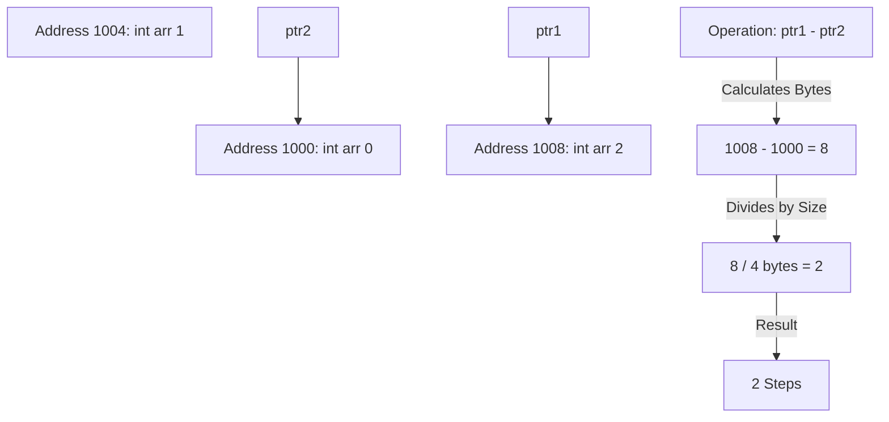
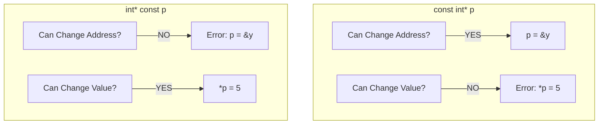
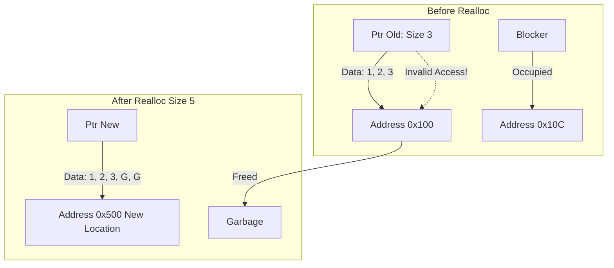

إليك تنسيق **Day 8 - Part 1** (Pointer Math, const Correctness & Void Pointers) بعد التنقيح وإزالة المصادر، جاهز للمذاكرة:

---

## [00:00 - 30:00] Pointer Math & The const Correctness Matrix

### 1. 🧮 Pointer Subtraction (The "Hop" Logic)

إحنا عارفين `ptr + 1`، لكن إيه اللي يحصل لو عملنا `ptr1 - ptr2`؟

- **The Logic:**
- الناتج مش عدد البايتات الفرق، الناتج هو عدد العناصر (Steps/Hops) اللي بينهم.
    
- **Equation:** `Result = (Address1 - Address2) / sizeof(Type)`.
    
    - لو الفرق 8 بايت والنوع `int` (4 بايت) -> النتيجة **2**.
        
- **Stack Behavior:** بما إن الـ **[[Stack Memory]]** بتنمو عكسياً (من العالي للواطي)، ترتيب تعريف المتغيرات `x` ثم `y` بيفرق في مين عنوانه أكبر. غالباً `ptr_x - ptr_y` هيديك سالب لو `y` اتعرفت بعد `x`.
    




---

### 2. 🛡️ The const Matrix (Read-Only vs. Locked Address)

دي أهم مهارة عشان تحمي كودك في الـ Embedded. إزاي تمنع الـ User (أو نفسك) من إنه يبوظ الداتا أو يغير عنوان البوينتر بالغلط؟

#### A. Pointer to Constant (`const int* p`)

- **Syntax:** `const` جت قبل النجمة.
    
- **Effect:** أنا بوينتر "بيتفرج بس". أقدر أشوف القيمة، بس مقدرش أغيرها.
    
    - `*p = 20;` -> **Compiler Error** (Read-Only).
        
    - `p = &y;` -> **Valid** (أقدر أشاور على حد تاني).
        
- **Use Case:** لما تبعت Array لـ Function وعايز تضمن إن الفانكشن دي "تقرأ" بس (Display Function).
    

#### B. Constant Pointer (`int* const p`)

- **Syntax:** `const` جت بعد النجمة.
    
- **Effect:** أنا بوينتر "مخلص" (Loyal). حلفة يمين ما أشاور على غيرك.
    
    - `p = &y;` -> **Compiler Error** (Address is locked).
        
    - `*p = 20;` -> **Valid** (أقدر أغير القيمة اللي جوه الصندوق).
        
- **Use Case:** الـ Hardware Registers اللي عنوانها ثابت (زي `PORTA`)، مش عايز حد يغير العنوان بالغلط.
    

#### C. Constant Pointer to Constant (`const int* const p`)

- **Syntax:** `const` قبل وبعد النجمة.
    
- **Effect:** "ممنوع اللمس والاقتراب". لا تغير العنوان ولا تغير القيمة.
    

> [!tip] Mina's Rule
> 
> "اقرأ التعريف من اليمين للشمال".
> 
> - `const int * p` -> Pointer to int that is constant.
>     
> - `int * const p` -> const pointer to int.
>     

Code snippet



---

## [30:00 - 62:00] The Void Pointer & Generic Programming

### 3. 🃏 [[Void Pointer]] (The Joker)

البوينتر العادي `int*` ليه "نوع" بيحدد هينط كام بايت. الـ `void*` هو بوينتر "بدون هوية".

- **Capability:** يقدر يشيل عنوان أي داتا تايب (int, float, struct).
    
- **Limitation 1 (Dereferencing):**
    
    - `void* ptr; *ptr;` -> **Error!** الكومبايلر مش عارف يغرف كام بايت (1 ولا 4 ولا 8؟).
        
    - **Fix:** لازم تعمل **[[Type Casting]]** الأول: `*(int*)ptr`.
        
- **Limitation 2 (Arithmetic):**
    
    - `ptr++` -> **Error** (Or Undefined Behavior). هينط قد إيه؟ هو ملوش Size.
        
    - _Note:_ بعض الكومبايلرز (زي GCC) بتعتبره `char*` (بينط 1 بايت) بس ده مش Standard.
        

---

### 4. 🧬 Generic Functions (Polymorphism in C)

إزاي نعمل دالة `print` واحدة تطبع أي نوع داتا (زي template في C++)؟ باستخدام `void*`.

**Code Reconstruction: The Generic Printer**


```c
// Define Types
#define INT_TYPE 1
#define CHAR_TYPE 2

// Generic Function receiving (void* data)
void printGeneric(void* data, int type) {
    if (type == INT_TYPE) {
        // Step 1: Cast to (int*)
        // Step 2: Dereference
        printf("%d", *(int*)data);
    }
    else if (type == CHAR_TYPE) {
        printf("%c", *(char*)data);
    }
}

int main() {
    int x = 10;
    char c = 'A';

    printGeneric(&x, INT_TYPE); // Pass int address
    printGeneric(&c, CHAR_TYPE); // Pass char address
}
```

> [!info] The "Universal" Concept
> 
> المهندس مينا استخدم الـ void* عشان يمهد لفكرة الـ [[Dynamic Memory Allocation]] (malloc) لأن malloc بترجع void* وأنت اللي بتحدد هتستخدم الميموري دي كـ إيه.

---
## [00:00 - 30:00] Stack vs. Heap & The Allocation Trinity

في الجزء ده، المهندس مينا بيقلب الطاولة. كنا عايشين في أمان الـ **Stack Memory** اللي بتنظف نفسها "أوتوماتيك" زي ما يكون عندك "ماما" بتروق وراك. دلوقتي دخلنا الـ **Heap Memory**.. أنت هنا "مغترب" ولازم تنظف وراك بنفسك.

### 1. The Allocation Trinity (malloc, calloc, realloc)

عشان تحجز مكان في الهيب، عندك 3 أسلحة:

1. `malloc(size)`: بتحجز بايتات وترجعلك عنوانها.
    
    - **العيب:** المكان ده جواه Garbage Value.
        
2. `calloc(count, size)`: بتحجز وتصفر (Zero Initialization).
    
    - **الميزة:** أبطأ سنة بس أمان (Clean Slate).
        
3. `realloc(ptr, new_size)`: لو المكان ديق عليك، بتكبره.
    
    - **السيناريو:** بتحاول تلاقي مكان جنبك توسع فيه. لو ملقيتش؟ هتاخد العفش (Copy Data) وتنقل لعنوان جديد أوسع، وتمسح القديم.
        

**Code Reconstruction: Allocation Logic**

C

```c
#include <stdlib.h>

void heap_demo() {
    // 1. Malloc: 3 Integers (Garbage inside)
    int* ptr = (int*) malloc(3 * sizeof(int));

    // 2. Calloc: 3 Integers (Zeroed out)
    int* ptr2 = (int*) calloc(3, sizeof(int));

    // 3. Realloc: Resize ptr to hold 5 ints
    // WARNING: ptr might change address!
    ptr = (int*) realloc(ptr, 5 * sizeof(int));

    // Critical: Check if allocation succeeded
    if (ptr == NULL) {
        // Handle Error (Heap Full)
    }
}
```

### 2. The realloc Trap

- **المشكلة:** لما تعمل `realloc`، الـ OS بيدور على مساحة متصلة.
    
- **الكارثة:** لو ملقاش مكان جنبك، هينقلك مكان تاني.
    
- **Result:** أي بوينتر تاني كان بيشاور على العنوان القديم بقى **Dangling Pointer**.
    




---

## [30:00 - 60:00] The Dark Side: Leaks & Fragmentation

هنا بندخل في الكوابيس الحقيقية للـ Dynamic Allocation.

### 1. 🧀 Memory Fragmentation (The Swiss Cheese Effect)

- **السيناريو:** عمال تحجز (`malloc`) وتفضي (`free`) بمساحات عشوائية.
    
- **النتيجة:** الهيب بقى عامل زي الجبنة الرومي (حتة مليانة وحتة فاضية).
    
- **المشكلة:** ممكن يكون عندك توتال مساحة فاضية 100 بايت، بس متقسمين 10 حتت كل حتة 10 بايت. لو طلبت `malloc(50)`.. هيفشل! لأنه محتاج 50 بايت "على بعض" (**Contiguous**).
    
- **الحل:** مفيش Garbage Collector في C يعمل Compaction (يضم الفراغات). الحل إنك متستخدمش Heap في الـ Embedded Systems الحرجة (MISRA C Rule).
    

### 2. 🚰 Memory Leak (The Silent Killer)

نسيت تعمل `free`؟ مبروك، الميموري دي ضاعت منك لحد ما تعمل Restart للجهاز.

**Scenario:**

C

```c
int* ptr = malloc(100);
ptr = &x; // CARASTROPHE!
```

أنت غيرت اتجاه البوينتر وخليته يشاور على `x`. طيب الـ 100 بايت اللي حجزتهم؟ محدش بقى عارف عنوانهم عشان يعملهم `free`. ده اسمه **Lost Reference**.

### 3. 🕵️ Valgrind (The Detective)

بما إن مفيش "ماما" تنظف وراك، بنستخدم أداة اسمها [[Valgrind]] (على Linux).

بترن الكود جواها، وهي بتقولك: "أنت حجزت 4 بايت في السطر 50 ونسيت تعملهم Free".

> [!tip] Mina's Advice
> 
> "دايماً اكتب free(ptr) في نفس اللحظة اللي بتكتب فيها malloc، وبعدين اكتب الكود اللي بينهم. ومتنساش تخلي البوينتر NULL بعد الـ Free عشان متعملش Use After Free."

---

## [60:00 - End] Dynamic 2D Arrays (The Matrix Trilogy)

أعقد جزء في المحاضرة. إزاي نعمل 2D Array في الهيب؟ عندنا 3 طرق.

### Method 1: The Single Pointer (Math Trick)

احجز بلوك واحد كبير، وتعامل معاه بمعادلة الضرب.

- `int* arr = malloc(rows * cols * sizeof(int));`
    
- **Access:** `arr[row * cols + col]`
    
- **الميزة:** أسرع وأسهل في الـ `free` (مرة واحدة).
    

### Method 2: Array of Pointers (Half Dynamic)

الصفوف ثابتة (Stack or Data)، بس الأعمدة ديناميك.

- `int* rows[5];` (Array of 5 pointers).
    
- لف عليهم واعمل `malloc` لكل صف.
    
- **الميزة:** ينفع تعمل **Jagged Array** (صفوف بأطوال مختلفة).
    

### Method 3: Pointer to Pointer (Fully Dynamic)

ده الـ Ultimate Dynamic 2D Array. كل حاجة في الهيب.

**Code Reconstruction: The int** Matrix**

C

```c
// Step 1: Allocate array of pointers (The backbone)
int** matrix = (int**) malloc(rows * sizeof(int*));

// Step 2: Allocate each row
for (int i = 0; i < rows; i++) {
    matrix[i] = (int*) malloc(cols * sizeof(int));
}

// Access like normal 2D array
matrix[1][2] = 50;

// Freeing (MUST be reverse order)
for (int i = 0; i < rows; i++) {
    free(matrix[i]); // Free rows first
}
free(matrix); // Free the backbone
```

> [!warning] The Jagged Array Trap
> 
> لو عملت صفوف بأطوال مختلفة (Jagged)، إزاي هتعرف طول كل صف وأنت بتلوب؟
> 
> - **الحل:** لازم تخزن الأطوال في Array تانية جانبيّة، أو تستخدم Sentinel Value (رقم مميز في آخر كل صف). من غير كده "أنت بتمسك الهواء بإيدك".
>     

---
