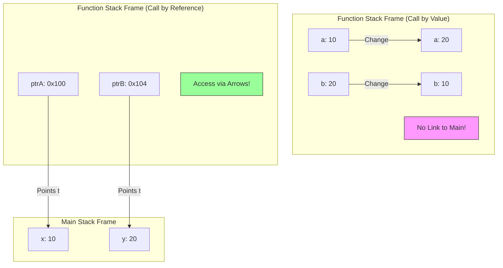
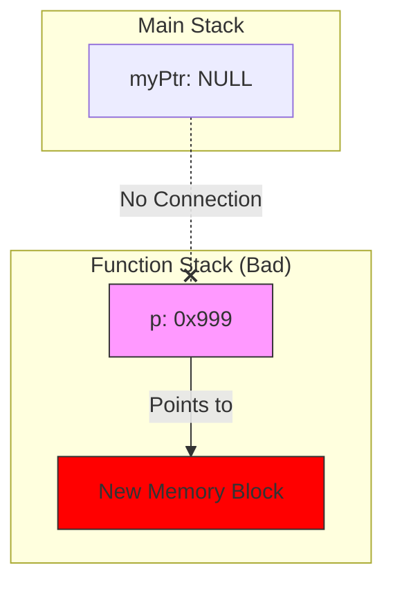
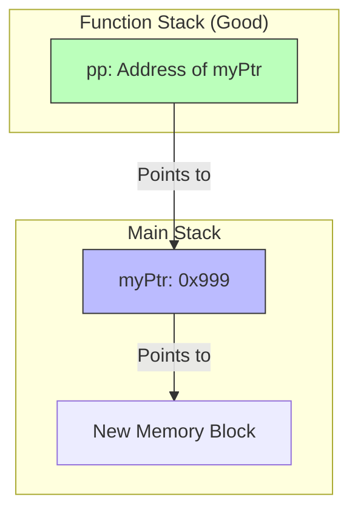

## Topic: Call by Value vs. Call by Reference

### 1. The Problem: Call by Value (نسخة طبق الأصل)

في الـ C/C++، الوضع الافتراضي لما تبعت متغير لفانكشن، إنك بتبعت **نسخة (Copy)** منه، مش هو شخصياً.

- **اللي بيحصل في الميموري:** الـ Function الجديدة بتعمل [[Stack Frame]] خاص بيها، وبتاخد نسخة من القيم تحطها عندها.
    
- **النتيجة:** أي تغيير بيحصل جوه الفانكشن، بيحصل في "النسخة"، والأصل (اللي في main) زي ما هو ما بيتحركش.
    

**المثال الشهير (The Failed Swap):**


```C++
void tryToSwap(int a, int b) {
    int temp = a;
    a = b;
    b = temp;
    // هنا a و b اتبدلوا فعلاً.. بس دي نسخ محلية (Local Copies) جوه الفانكشن دي بس
}

int main() {
    int x = 10, y = 20;
    tryToSwap(x, y);
    // x و y لسه زي ما هما (10 و 20)
    // الفانكشن اشتغلت على ورق تصوير ورمته، وملمستش المستند الأصلي
}
```

---

### 2. The Solution: Call by Reference (معاك مفتاح شقتي) 🔑

عشان الفانكشن تقدر تغير في المتغيرات الأصلية اللي في main، لازم نلغي فكرة النسخ.

بدل ما أبعتلك "صورة" من الفلوس، أنا هبعتلك "عنوان البنك" (Address).

- **المرسل (Main):** بيبعت العنوان باستخدام `&`.
    
- **المستقبل (Function):** بيستقبل العنوان في مؤشر `*`.
    
- **التنفيذ:** الفانكشن بتستخدم `*ptr` (Dereferencing) عشان تعدل في المكان الأصلي.
    

**كود الـ Swap الناجح (The Engineering Way):**


```c
// 1. المستقبل: بيطلب عناوين (Pointers) مش قيم
void realSwap(int* ptrA, int* ptrB) {
    // ptrA شايل عنوان x
    // ptrB شايل عنوان y
    
    int temp = *ptrA; // هات القيمة اللي جوه عنوان x وحطها في temp
    *ptrA = *ptrB;    // هات القيمة اللي جوه y وحطها جوه عنوان x
    *ptrB = temp;     // حط قيمة temp جوه عنوان y
}

int main() {
    int x = 10, y = 20;
    
    // 2. المرسل: بيبعت العناوين
    realSwap(&x, &y); 
    
    // x بقت 20، و y بقت 10 -> السحر حصل!
}
```

### 3. Visualizing the Stack (تحت الكبوت)

عشان تتخيل الفرق الرهيب في الميموري:




> [!TIP] Mina's Rule
> 
> - عايز الفانكشن **تقرأ بس**؟ ابعت **Value** (عشان الأمان).
>     
> - عايز الفانكشن **تغير وتعدل**؟ ابعت **Address** (عشان التحكم).
>     
> - البيانات حجمها كبير (زي صورة أو مصفوفة)؟ ابعت **Address** (عشان توفر وقت النسخ ومساحة الميموري).
>     

---

### 4. بونص C++ (The Reference Variable `&`) 🚀

بما إننا بنكتب C++، اللغة عملت حركة "شياكة" عشان تريحك من وجع دماغ النجمة `*` والعلامة `&`. حاجة اسمها **Reference**.

الـ Reference هو "دلع" للمتغير (Alias). هو مش مؤشر، هو اسم تاني لنفس المكان في الميموري.


```c
void cppSwap(int &a, int &b) { // لاحظ العلامة & هنا في التعريف
    // التعامل جوه كأنهم int عادي، بس هما مربوطين بالأصل
    int temp = a;
    a = b;
    b = temp;
}

int main() {
    int x = 10, y = 20;
    cppSwap(x, y); // ولا & ولا يحزنون، ابعت الاسم علطول
}
```

- **في الـ C (شغلنا الأساسي):** لازم Pointers.
    
- **في الـ C++ (الشغل الحديث):** بنفضل الـ References لأن شكل الكود أنضف، بس "تحت الكبوت" هي بتتحول لـ Pointers برضه!
    
---
حقك عليا يا هندسة، دي فعلاً أكتر حتة "بتعصر الدماغ" في الكورس، وعشان كدة لازم "نرسمها" عشان تتخيلها.

المشكلة كلها في جملة واحدة: "المؤشر هو كمان متغير (Variable)".

ولما بتبعت متغير لفانكشن، بيتبعت نسخة منه (Copy).

تعالى نتخيلها بتمثيلية صغيرة:

### المشهد الأول: السيناريو الغلط (النسخة المزيفة) ❌

تخيل إنك (الدالة `main`) معاك **ورقة فاضية** (المؤشر `ptr`) وعايز مهندس الديكور (الدالة `Allocation`) يكتبلك فيها عنوان شقتك الجديدة.

1. أنت ناديت المهندس واديتله **"صورة ضوئية"** من الورقة بتاعتك (`Call by Value`).
    
2. المهندس مسك "الصورة"، وكتب فيها عنوان الشقة الجديدة (`0x900`).
    
3. المهندس خلص شغله ومشي ورمى الصورة في الزبالة (الفانكشن خلصت).
    
4. أنت بصيت في **ورقتك الأصلية**.. لقيتها لسه فاضية (`NULL`)!
    

**ده اللي بيحصل في الكود ده:**

C++

```c
void badAllocation(int *p) { 
    // p هنا هي "الصورة الضوئية" (نسخة جديدة في الـ Stack)
    p = new int(50); 
    // الصورة بقت بتشاور على الميموري الجديدة.. والأصل ولا دريان
}

int main() {
    int *myPtr = NULL; // الورقة الأصلية
    badAllocation(myPtr); // بعت صورة منها
    // myPtr لسه بـ NULL -> والشقة الجديدة ضاعت (Memory Leak)
}
```

---

### المشهد الثاني: السيناريو الصح (أنا هقولك ورقتي فين) ✅

هنا إحنا هنستخدم **Double Pointer** (`**pp`).

1. أنت (الدالة `main`) معاك **الورقة الفاضية** (`ptr`).
    
2. أنت المرة دي مش هتديله الورقة.. أنت هتديله **"عنوان جيبك"** اللي فيه الورقة (`&ptr`).
    
3. المهندس (الدالة `goodAllocation`) بياخد العنوان ده ويسميه `pp`.
    
4. المهندس بيمد إيده في جيبك (`*pp`)، ويطلع ورقتك الأصلية، ويكتب فيها العنوان الجديد.
    
5. المهندس مشي.
    
6. أنت بتطلع الورقة من جيبك.. لقيت العنوان مكتوب فيها!
    

**ده اللي بيحصل هنا:**

C++

```c
void goodAllocation(int **pp) {
    // pp: عنوان جيبك (Pointer to Pointer)
    // *pp: الورقة اللي جوه جيبك (The Original Pointer)
    
    *pp = new int(50); 
    // أنا هنا بكتب على الورقة الأصلية مباشرة
}

int main() {
    int *myPtr = NULL;
    goodAllocation(&myPtr); // خد عنوان جيبي (عنوان المؤشر)
    // myPtr دلوقتي شايل عنوان الشقة الجديدة
}
```

---

### الرسمة اللي هتفك اللغز (The Memory Diagram) 🧠

تعالى نشوف الأسهم ماشية إزاي في الحالتين:

#### 1. الطريقة الفاشلة (قطع الاتصال)

Code snippet



_لاحظ إن `OriginalPTR` لسه بـ NULL وميعرفش حاجة عن `New Memory`._

#### 2. الطريقة الناجحة (الكوبري) 🌉

Code snippet



_لاحظ السهم اللي طالع من `pp` رايح لـ `myPtr`. الفانكشن استخدمت السهم ده عشان تغير قيمة `myPtr` وتخليه يشاور على الميموري الجديدة._

### الخلاصة (عشان تثبت):

- لو عايز تغير **القيمة** (`x`): ابعت عنوانها (`int *`).
    
- لو عايز تغير **العنوان** (`ptr`): ابعت عنوان العنوان (`int **`).
    

---


الموضوع اللي عليه الدور هو التطبيق العملي للـ Double Pointers اللي شرحناها:

Array of Pointers (مصفوفة المؤشرات).

ده التكنيك اللي بيخليك توفر ميموري في الـ Embedded Systems بشكل مرعب، واسمه الحركي **"Ragged Arrays"**.

---

### 1. المشكلة: إهدار المساحة في الـ 2D Arrays 📉

تخيل إنك عايز تخزن أسماء 3 طلاب في مصفوفة:

1. "Ali" (3 حروف)
    
2. "Mohamed" (7 حروف)
    
3. "Abdallah" (8 حروف)
    

لو استخدمت **2D Array تقليدية** `char names[3][10]`، أنت مضطر تحجز **أقصى مساحة ممكنة** لكل الأسماء (مثلاً 10 أماكن لكل اسم) عشان تكفي أطول واحد.

- صف "Ali" محجوز له 10 بايت، استخدمنا 4 بس (مع الـ null)، ورمينا 6 في الزبالة.
    
- ده اسمه **Internal Fragmentation** (إهدار داخلي).
    

---

### 2. الحل: Array of Pointers (على قد لحافك مد رجليك) 💡

بدل ما أحجز صناديق كبيرة، أنا هعمل مصفوفة صغيرة شايلة "عناوين" بس.

كل مؤشر يشاور على الاسم في مكان تاني، والاسم ياخد مساحته بالظبط، لا زيادة ولا نقص.

- `names[0]` بيشاور على "Ali" (واخد 4 بايت بس).
    
- `names[1]` بيشاور على "Mohamed" (واخد 8 بايت بس).
    

ده بنسميه **Ragged Array** (مصفوفة غير منتظمة)، لأن الصفوف مش قد بعضها، وده قمة التوفير.

---

### 3. الكود: الفرق بين الطريقتين

انسخ الكود ده وجربه، وركز في الفرق في الميموري:


```C++
#include <iostream>
using namespace std;

int main() {
    printf("\n--- 1. Traditional 2D Array (Wasted Space) ---\n");
    // حجزنا بلوك كامل مستطيل 3x10 = 30 بايت
    char flatMatrix[3][10] = {
        "Ali",
        "Mohamed",
        "Abdallah"
    };
    
    // لاحظ إن كل صف بيبدأ بعد اللي قبله بـ 10 بايت ثابتة، حتى لو الاسم قصير
    printf("Addr of Ali:      %p\n", flatMatrix[0]);
    printf("Addr of Mohamed:  %p (Diff: 10 bytes)\n", flatMatrix[1]);


    printf("\n--- 2. Array of Pointers (Smart Way) ---\n");
    // دي مصفوفة شايلة 3 مؤشرات بس (حجمها 3 * 8 = 24 بايت في نظام 64-bit)
    // الأسماء نفسها متخزنة في الـ Read-Only Data Section وكل واحد واخد مساحته بالظبط
    const char* ptrArray[3] = {
        "Ali",
        "Mohamed",
        "Abdallah"
    };

    printf("Addr of ptrArray[0] stores: %p (Points to Ali)\n", (void*)ptrArray[0]);
    printf("Addr of ptrArray[1] stores: %p (Points to Mohamed)\n", (void*)ptrArray[1]);
    
    // هنا الفرق مش ثابت، حسب طول الكلمة!
    
    return 0;
}
```

---

### 4. رسمة توضيحية (Jagged Structure) 🎨

الفرق في الميموري عامل كده:

**الطريقة القديمة (مصفوفة):**

Plaintext

```C++
[Ali....000] (10 bytes)
[Mohamed.00] (10 bytes)
[Abdallah.0] (10 bytes)
```

_بلوك واحد مصمت، فيه فراغات كتير._

**الطريقة الذكية (Array of Pointers):**

Plaintext

```C++
[ Ptr1 ] ----> "Ali"
[ Ptr2 ] ----> "Mohamed"
[ Ptr3 ] ----> "Abdallah"
```

_المصفوفة شايلة مفاتيح بس، والبيانات متطرفة في أماكن متفرقة، كل واحد واخد مقاسه._

---

### 5. سؤال إنترفيو خبيث جداً 🔥

س: إيه الفرق بين char *arr[] و char (*arr)[]؟

(الأقواس بتغير المعنى 180 درجة!)

1. `char *arr[5]`:
    
    - دي اللي شرحناها فوق. **Array of 5 Pointers**.
        
    - (الأولوية للأقواس المربعة `[]` قبل النجمة `*`).
        
2. `char (*arr)[5]`:
    
    - ده **Pointer to an Array**.
        
    - ده مؤشر واحد بس، بيشاور على مصفوفة كاملة حجمها 5 بايت.
        
    - (الأقواس المدورة `()` أجبرت الكومبايلر يعتبر `*arr` حتة واحدة).
        

> [!TIP] نصيحة
> 
> في الـ Embedded، بنستخدم النوع الأول char *arr[] كتير جداً عشان نعمل Lookup Tables أو قوائم نصوص (زي رسائل الـ LCD) عشان نوفر مساحة الـ RAM والـ Flash.

---

حقك عليا يا هندسة، ولا يهمك. الحتة دي بالذات (الأقواس والنجمة) بتعمل "ايرور" في دماغ ناس كتير حتى السينيورز، لأنها عاملة زي "الإعراب" في اللغة العربية.. مكان القوس بيغير المعنى تماماً.

تعالى نفككها حتة حتة بأسلوب "مين بيغلب مين".

---

### قاعدة الحرب: مين الأقوى؟ 💪

في لغة C، فيه خناقة دايمة بين الأقواس المربعة `[]` والنجمة `*`.

- القاعدة بتقول: **الأقواس `[]` أقوى من النجمة `*`**.
    
- يعني الكومبايلر بيبص على الاسم `arr`، ويشوف مين لازق فيه أقوى، ويربطه بيه الأول.
    

تعالى نطبق القاعدة دي على الحالتين:

---

### الحالة الأولى: `int *arr[5]`

(هنا مفيش أقواس مدورة تحمي النجمة).

1. **الخناقة:** الاسم `arr` جنبه `*` وجنبه `[5]`.
    
2. **الحكم:** الـ `[5]` أقوى، فهي اللي هتاخد الـ `arr`.
    
3. **الترجمة:**
    
    - يا كومبايلر، `arr` ده عبارة عن **Array** حجمها 5...
        
    - طب الـ Array دي شايلة إيه؟ (هنا نبص على النجمة).
        
    - شايلة **Pointers**.
        

النتيجة (Array of Pointers):

أنت عندك 5 صناديق (Array)، كل صندوق جواه "عنوان".

- `arr[0]` -> مؤشر بيشاور على مكان.
    
- `arr[1]` -> مؤشر بيشاور على مكان تاني.
    
- زي ما يكون عندك 5 موظفين، كل واحد معاه مفتاح لشقة مختلفة.
    

---

### الحالة الثانية: `int (*arr)[5]`

(هنا حطينا أقواس مدورة `()` حوالين النجمة والاسم).

1. **الخناقة:** الأقواس المدورة `()` دي زي "الحصن". هي أجبرت الكومبايلر يبص للي جواها الأول.
    
2. **الحكم:** الـ `*` ارتبطت بـ `arr` غصب عن الـ `[]`.
    
3. **الترجمة:**
    
    - يا كومبايلر، `arr` ده عبارة عن **Pointer** (واحد بس)...
        
    - طب المؤشر ده بيشاور على إيه؟ (هنا نبص بره القوس).
        
    - بيشاور على **Array كاملة** حجمها 5.
        

النتيجة (Pointer to an Array):

أنت عندك صندوق واحد بس (Pointer)، الصندوق ده شايل عنوان "بلوك كامل" مكون من 5 أرقام.

- زي ما يكون عندك مدير واحد (Pointer)، ماسك "دوسيه" (الملف كله) فيه 5 ورقات.
    

---

### بالمثال يتضح المقال (الفرق في الـ ++Step) 🔥

عشان تفهم الفرق بجد، شوف لما نقول للمؤشر "اتحرك خطوة" (`++`)، هينط قد إيه؟

C++

```c
#include <iostream>
using namespace std;

int main() {
    // 1. Array of Pointers (مصفوفة مؤشرات)
    int *arr1[5]; 
    // arr1 ده مصفوفة، كل عنصر فيها مؤشر (4 بايت أو 8 بايت)
    // لو قلت arr1 + 1 هينط لمكان المؤشر اللي بعده (هينط 8 بايت مثلاً)

    // 2. Pointer to Array (مؤشر لمصفوفة)
    int (*arr2)[5];
    // arr2 ده مؤشر لـ "بلوك" حجمه (5 * sizeof(int))
    // يعني البلوك حجمه 5 * 4 = 20 بايت
    
    printf("--- The Leap Test ---\n");
    printf("arr2 Address:       %p\n", (void*)arr2);
    printf("arr2 + 1 Address:   %p\n", (void*)(arr2 + 1));
    // الفرق هنا هيكون 20 بايت كاملة! (لأنه نط مصفوفة كاملة)
    
    return 0;
}
```

### الخلاصة (الزتونة):

1. `*arr[5]`: **دول 5 مؤشرات**. (بستخدمها عشان أعمل مصفوفة نصوص متغيرة الطول زي ما شرحنا في Ragged Array).
    
2. `(*arr)[5]`: **ده مؤشر يتيم** بيشاور على صف كامل. (بستخدمها لما أبعت 2D Array لفانكشن).
    

**إزاي تقرأها بسهولة؟**

- اقرأ من جوه لبره، واتبع الأقواس.
    
- لو فيه `()` حوالين النجمة -> يبقى ده **مؤشر واحد**.
    
- لو مفيش `()` -> يبقى دي **مصفوفة**.
    

---


لأن الـ new في C++ بتغير طريقة تفكيرنا شوية عن الـ malloc بتاعة الـ C، وبتخليك تشوف "النوع" (Type) بوضوح أكتر.

تعالى نربط "الخناقة" اللي فاتت (الأقواس vs النجمة) بكيفية حجز الميموري ديناميكياً باستخدام `new`.

---

### 1. الحالة الأولى: Dynamic Array of Pointers

الهدف: عايز أعمل مصفوفة صفوفها "مرنة" (Ragged Array)، وكل صف ممكن يكون ليه طول مختلف.

المكافئ لـ: int *arr[] بس المرة دي عدد الصفوف كمان مش معروف وقت الكومبايل.

هنا هنستخدم **Pointer to Pointer (`int**`)**.

**ليه `int**`؟**

- لأن `new` هترجعلي مصفوفة شايلة مؤشرات (`int*`).
    
- ومؤشر على مؤشر يعني `int**`.
    

**الكود والخطوات:**

C++

```c
#include <iostream>
using namespace std;

void case1_dynamic_pointers() {
    int rows = 3;
    
    // 1. احجز "العمود الفقري": مصفوفة شايلة مؤشرات (مش أرقام)
    int **matrix = new int*[rows]; 

    // 2. لف على كل مؤشر واحجز له الصف بتاعه (ممكن بأحجام مختلفة)
    for (int i = 0; i < rows; i++) {
        // مثلاً: الصف الأول 5، التاني 10، التالت 2
        matrix[i] = new int[i + 5]; 
    }

    // الاستخدام عادي جداً
    matrix[0][0] = 99;

    // 3. التنظيف (مهم جداً): لازم تمسح بالعكس
    for (int i = 0; i < rows; i++) {
        delete[] matrix[i]; // امسح الصفوف الأول
    }
    delete[] matrix; // وبعدين امسح العمود الفقري
}
```

- **شكل الميموري:** متبعثرة (Fragmented). كل صف في مكان لوحده.
    

---

### 2. الحالة الثانية: Dynamic Pointer to Array

الهدف: عايز أحجز بلوك ميموري كبير "حتة واحدة" (Contiguous)، بس أتعامل معاه كأنه 2D Array بعرض ثابت (مثلاً 5 أعمدة).

المكافئ لـ: int (*arr)[5].

هنا `new` هتحجز البلوك كله مرة واحدة.

**التركيبة العجيبة:**

C++

```c
void case2_pointer_to_array() {
    int rows = 3;
    // عدد الأعمدة لازم يكون ثابت ومعروف (Constant) عشان النوع يظبط
    const int cols = 5; 

    // 1. الحجز: سطر واحد بس!
    // الترجمة: احجزلي (3 * 5) مكان، ورجعلي مؤشر بيفهم إن "النطة" بـ 5
    int (*matrix)[cols] = new int[rows][cols];

    // الاستخدام
    matrix[1][2] = 77; // بيحسب العنوان: Base + (1*5 + 2)*4

    // 2. التنظيف: سطر واحد بس!
    delete[] matrix; // بيمسح البلوك كله مرة واحدة
}
```

- **شكل الميموري:** حتة واحدة مصمتة (بلوك واحد). أسرع في الكاش (Cache Friendly).
    

---

### مقارنة "تحت الكبوت" (عشان تثبت) ⚖️

|**وجه المقارنة**|**int **p (الحالة 1)**|**int (*p)[5] (الحالة 2)**|
|---|---|---|
|**عدد مرات الـ Allocation**|`rows + 1` (كتير)|مرة واحدة (1)|
|**شكل الميموري**|متفرفة (Scattered)|متصلة (Contiguous)|
|**الوصول للميموري**|قفزتين (Two Hops)|قفزة واحدة (حسابية)|
|**المرونة**|كل صف ممكن يكون بطول مختلف|لازم الأعمدة تكون ثابتة|
|**الاستخدام الأشهر**|نصوص، قوائم غير منتظمة|معالجة الصور (Matrices)|

---

### سؤال ليك يا هندسة 🧠

في الحالة التانية:

int (*matrix)[5] = new int[3][5];

لو حبيت أجيب عنوان الصف رقم 1، أكتب إيه؟

1. `matrix[1]`
    
2. `*(matrix + 1)`
    

الإجابة: الاتنين صح!

لأن matrix مؤشر لـ "Array size 5". لما تجمع عليه 1، بينط 5 أماكن (5 * sizeof(int)).

---
تمام يا هندسة، أنت كده عايز "الزتونة" بتاعة الـ **Ragged Array** باستخدام الـ `new` و الـ `Pointer to Pointer`.

المثال ده هيوضحلك إزاي بنبني مصفوفة "غير منتظمة" (صفوفها مش قد بعض)، وده قمة التوفير في الميموري، لأنك مش بتحجز ولا بايت زيادة.

---

### سيناريو المثال: "فصول المدرسة" 🏫

تخيل إننا بنعمل داتا بيز لمدرسة فيها 3 فصول، بس عدد الطلاب في كل فصل مختلف:

- **الفصل الأول:** فيه طالبين (2).
    
- **الفصل الثاني:** فيه 4 طلاب.
    
- **الفصل الثالث:** فيه 3 طلاب.
    

لو عملناها arr[3][4] هنضيع مساحة في الفصل الأول والثالث.

الحل: Ragged Array.

### كود البناء (خطوة بخطوة) 🏗️

انسخ الكود ده وركز في التعليقات عشان دي أهم من الكود نفسه:


```c
#include <iostream>
using namespace std;

int main() {
    // 1. تعريف الهيكل الأساسي (العمود الفقري)
    // int** : عشان ده مؤشر هيشاور على مؤشرات تانية
    int rows = 3;
    int **school = new int*[rows]; 
    // دلوقتي عندنا مصفوفة طولها 3، بس كل عنصر فيها عبارة عن (Garbage Pointer)

    // 2. حجز الصفوف (Allocation) بأحجام مختلفة
    // أحنا عارفين مقاس كل فصل، فبنحجز على قده بالظبط
    
    // الفصل الأول (مكانين)
    school[0] = new int[2]; 
    
    // الفصل الثاني (4 أماكن)
    school[1] = new int[4]; 
    
    // الفصل الثالث (3 أماكن)
    school[2] = new int[3];

    // شكل الميموري دلوقتي:
    // school[0] ----> [Student, Student]
    // school[1] ----> [Student, Student, Student, Student]
    // school[2] ----> [Student, Student, Student]

    // 3. إدخال البيانات (Data Entry)
    // التعامل معاها كأنها 2D Array عادية جداً
    
    // بيانات الفصل الأول
    school[0][0] = 10; school[0][1] = 20;

    // بيانات الفصل الثاني
    school[1][0] = 30; school[1][1] = 40; school[1][2] = 50; school[1][3] = 60;

    // بيانات الفصل الثالث
    school[2][0] = 70; school[2][1] = 80; school[2][2] = 90;

    // 4. العرض (Printing)
    // لازم أكون عارف حجم كل صف وأنا بطبع (عادة بنخزن الأحجام في مصفوفة تانية)
    int sizes[] = {2, 4, 3};

    cout << "--- School Database (Ragged Array) ---" << endl;
    for (int i = 0; i < rows; i++) {
        cout << "Class " << i + 1 << ": ";
        for (int j = 0; j < sizes[i]; j++) {
            cout << school[i][j] << " ";
        }
        cout << endl;
    }

    // 5. التنظيف (Deallocation) - أخطر مرحلة ☠️
    // لازم نمسح "من تحت لفوق" (الصفوف الأول، وبعدين العمود الفقري)
    
    for (int i = 0; i < rows; i++) {
        delete[] school[i]; // امسح الطلاب بتوع الفصل ده
    }
    
    delete[] school; // في الآخر امسح القائمة بتاعة الفصول نفسها
    // لو مسحت school الأول، هتضيع عناوين الفصول ويحصل Memory Leak

    return 0;
}
```

---

### تشريح الميموري (تحت الكبوت) 🧠

عشان تتخيل الـ `int **school` ده عامل إزاي:

1. school (The Double Pointer):
    
    ده متغير واحد بس في الـ Stack، قيمته عبارة عن عنوان "مصفوفة المؤشرات" في الـ Heap.
    
2. school[i] (The Array of Pointers):
    
    دي المصفوفة الرأسية اللي حجزناها أول مرة (new int*[3]).
    
    كل صندوق فيها (school[0], school[1]) مش شايل رقم، شايل عنوان صف.
    
3. school[i][j] (The Data):
    
    دي البيانات الفعلية (الطلاب) اللي محجوزة في أماكن متفرقة في الـ Heap.
    

---

### مثال تاني: Dynamic String Menu (لشغل الـ Embedded) 📟

ده مثال حقيقي بنستخدمه لما نكون عايزين نعرض رسايل على شاشة LCD وأطوال الرسايل مختلفة، وعايزين نوفر في الرامات.


```c
#include <iostream>
#include <cstring> // عشان strcpy
using namespace std;

int main() {
    int msgCount = 3;
    
    // مصفوفة مؤشرات للحروف (char**)
    char **lcdMsgs = new char*[msgCount];

    // الرسائل اللي عايزين نخزنها
    const char* tempMsgs[] = {"Error", "System Ready", "OK"};

    // اللوب السحري للحجز الديناميكي
    for(int i = 0; i < msgCount; i++) {
        // بنشوف طول الكلمة كام + 1 عشان الـ Null Terminator
        int len = strlen(tempMsgs[i]) + 1;
        
        // بنحجز مكان على قد الكلمة بالمللي!
        lcdMsgs[i] = new char[len];
        
        // بننسخ الكلمة في المكان المحجوز
        strcpy(lcdMsgs[i], tempMsgs[i]);
    }

    // العرض
    cout << "\n--- LCD Buffer ---" << endl;
    for(int i = 0; i < msgCount; i++) {
        cout << "Line " << i << ": " << lcdMsgs[i] << endl;
    }

    // التنظيف (واجب منزلي ليك: متنساش تمسح!)
    for(int i=0; i<msgCount; i++) delete[] lcdMsgs[i];
    delete[] lcdMsgs;

    return 0;
}
```

### الخلاصة:

الـ **Ragged Array** هي التطبيق العملي للـ **Double Pointer** (`Type **ptr`).

- **الميزة:** توفير رهيب للميموري (No Wasted Space).
    
- **العيوب:** إدارة الميموري صعبة (Allocation/Deallocation)، وتعتبر أبطأ سنة صغيرة في الوصول عشان بتعمل قفزتين (Double Dereference).
    

---
عينيا يا هندسة.. تعالى نفكك "عقدة" الـ **Function Pointers** ونشرحها من الصفر، لأن دي فعلاً هي اللي بتميز "المحترف" عن "المبتدئ" في لغة C.

الـ Function Pointer هو النقلة النوعية من التفكير في **البيانات** (Data) للتفكير في **السلوك** (Behavior).

---

### 1. الفكرة الفلسفية (The Concept) 🧠

إنت عارف إن المتغيرات (int x = 10) بتتخزن في الميموري (في الـ RAM)، وليها عنوان.

المفاجأة بقى: الفانكشن كمان بتتخزن في الميموري! (بس في منطقة الكود الـ .text section أو الـ Flash في الـ Embedded).

وبما إن الفانكشن ليها مكان، يبقى أكيد ليها عنوان (Address).

وبما إن ليها عنوان، يبقى أقدر أعمل مؤشر (Pointer) يشاور عليها.

إيه الفايدة؟

لما يكون معاك "عنوان" الكود، تقدر:

1. تبعته لفانكشن تانية (Callback).
    
2. تخزنه في مصفوفة (Array of Functions).
    
3. تغير الكود اللي هيتنفذ وأنت شغال (Runtime Binding).
    

---

### 2. السنتكس المرعب (Syntax Nightmare) 👻

أكبر مشكلة بتواجه الناس هي طريقة الكتابة.

القاعدة الذهبية: "اكتبها زي ما بتناديها".

عشان تعرف مؤشر لفانكشن بتاخد int وبترجع void:

1. اكتب شكل الفانكشن العادية: `void myFunc(int x)`
    
2. شيل الاسم وحط `(*ptr)`: `void (*ptr)(int)`
    

> [!DANGER] الفرق القاتل (الأقواس)
> 
> - `void *ptr(int)` ❌
> - دي فانكشن عادية اسمها `ptr`، **بترجع مؤشر** (`void*`).
>     
> - void (*ptr)(int) ✅ 
> - ده مؤشر اسمه ptr، بيشاور على فانكشن.
>     
>     (الأقواس حوالين النجمة هي اللي حولته لمؤشر).
>     

---

### 3. التطبيق العملي 1: الأساسيات (Hello World)

تعالى نشوف إزاي بنشاور على فانكشن ونناديها.


```c
#include <stdio.h>

void sayHello(int times) {
    for(int i=0; i<times; i++) printf("Hello Embedded!\n");
}

int main() {
    // 1. تعريف المؤشر
    // لازم يكون نفس "بصمة" الفانكشن (Signature): نفس الـ Return ونفس الـ Params
    void (*funcPtr)(int); 

    // 2. التوجيه (Assignment)
    // اسم الفانكشن لوحده هو عنوانها (زي اسم الـ Array بالظبط)
    funcPtr = sayHello; 
    // أو ممكن تكتب: funcPtr = &sayHello; (الاتنين صح)

    // 3. الاستدعاء (Calling)
    // الطريقة الصريحة (Dereference Code):
    (*funcPtr)(3); 
    
    // الطريقة المختصرة (C++ style):
    funcPtr(3); // الكومبايلر ذكي وبيفهم إنك بتنادي المؤشر

    return 0;
}
```

---

### 4. التطبيق العملي 2: القوة الحقيقية (Array of Function Pointers) 🚀

تخيل إنك بتعمل Menu في سيستم Embedded.

عندك 3 اختيارات: (1: Start, 2: Stop, 3: Reset).

**الطريقة التقليدية (Spaghetti Code):**


```c
if (choice == 1) start();
else if (choice == 2) stop();
else if (choice == 3) reset();
```

_(لو عندك 100 اختيار.. الكود هيبقى بطيء جداً وشكله وحش)._

طريقة المحترفين (Lookup Table):

بنعمل مصفوفة شايلة "عناوين" الدوال، وبننادي الدالة بـ Index بس! ($O(1)$ Time Complexity).


```c
#include <stdio.h>

void start() { printf("System Starting...\n"); }
void stop()  { printf("System Stopping...\n"); }
void reset() { printf("System Resetting...\n"); }

int main() {
    // 1. مصفوفة مؤشرات دوال
    // النوع: void (*)(void)
    void (*actions[])(void) = {
        start, // index 0
        stop,  // index 1
        reset  // index 2
    };

    int userChoice = 1; // تخيل اليوزر اختار رقم 1 (Stop)

    // 2. السطر السحري (بدل الـ if/else)
    // روح للمصفوفة، هات العنوان رقم 1، ونفذه
    actions[userChoice](); 

    return 0;
}
```

---

### 5. التطبيق العملي 3: الـ Callback (جوهر الـ Drivers) 🔌

ده المثال اللي بيشرح العلاقة بين مهندس الـ Hardware (اللي بيكتب Driver) ومهندس الـ Software (اللي بيكتب Application).

- **المشكلة:** كاتب الدرايفر عايز يقول: "لما الزرار يتداس، أنا هنفذ **أي حاجة** إنت عايزها".
    
- **الحل:** Function Pointer.
    


```c
#include <iostream>
using namespace std;

// --- المفروض ده ملف Driver.h ---
// بنستخدم typedef عشان نريح دماغنا من السنتكس المعقد
// معناها: أي حاجة نوعها EventCallback هي عبارة عن مؤشر لفانكشن void(void)
typedef void (*EventCallback)(void); 

// متغير جلوبال جوه الدرايفر شايل عنوان الفانكشن اللي هتتنفذ
EventCallback button_callback = NULL;

// دالة التسجيل: الأبليكيشن بيستخدمها عشان يسجل الفانكشن بتاعته
void Button_SetCallback(EventCallback cb) {
    button_callback = cb;
}

// دالة المحاكاة (ISR): دي اللي بتتنفذ لما الهاردوير يبعت إشارة
void Button_ISR() {
    cout << "[ISR] Hardware Interrupt Fired!" << endl;
    if (button_callback != NULL) {
        button_callback(); // نفذ كود الأبليكيشن
    }
}

// --- المفروض ده ملف main.c (Application) ---
void turnOnLed() {
    cout << "--> LED is ON (App Logic)" << endl;
}

void sendData() {
    cout << "--> Sending Wi-Fi Data (App Logic)" << endl;
}

int main() {
    // السيناريو 1: عايز لما الزرار يتداس الليد تنور
    Button_SetCallback(turnOnLed);
    
    // (محاكاة لضغط الزرار)
    Button_ISR(); 

    cout << "----------------" << endl;

    // السيناريو 2: غيرت رأيي، عايز أبعت داتا
    Button_SetCallback(sendData);
    
    // (محاكاة لضغط الزرار تاني)
    Button_ISR();

    return 0;
}
```

### 💡 ملحوظة مهمة جداً (typedef):

عشان ماتتجننش من الأقواس، دايماً استخدم `typedef` مع الـ Function Pointers.


```c
// الطريقة الصعبة
void (*ptr)(int, float);

// الطريقة السهلة
typedef void (*MyFuncType)(int, float); // عرفنا نوع جديد
MyFuncType ptr; // عملنا متغير من النوع ده
```

ها يا هندسة.. الـ Function Pointers كده فكت معاك ولا لسه فيها "كلاكييع"؟