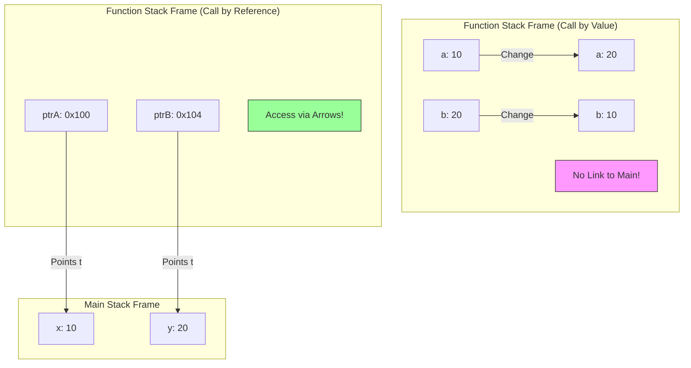
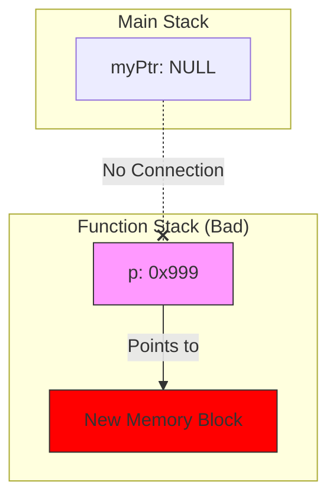
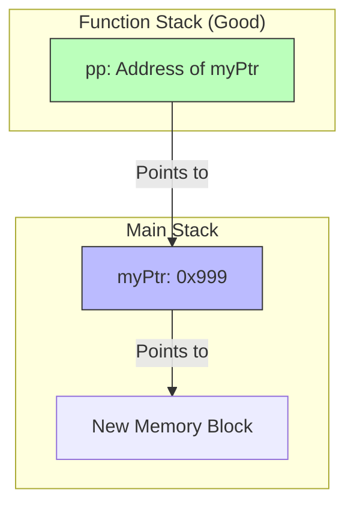

## Topic: Call by Value vs. Call by Reference

### 1. The Problem: Call by Value (نسخة طبق الأصل)

في الـ C/C++، الوضع الافتراضي لما تبعت متغير لفانكشن، إنك بتبعت **نسخة (Copy)** منه، مش هو شخصياً.

- **اللي بيحصل في الميموري:** الـ Function الجديدة بتعمل [[Stack Frame]] خاص بيها، وبتاخد نسخة من القيم تحطها عندها.
    
- **النتيجة:** أي تغيير بيحصل جوه الفانكشن، بيحصل في "النسخة"، والأصل (اللي في main) زي ما هو ما بيتحركش.
    

**المثال الشهير (The Failed Swap):**


```C++
void tryToSwap(int a, int b) {
    int temp = a;
    a = b;
    b = temp;
    // هنا a و b اتبدلوا فعلاً.. بس دي نسخ محلية (Local Copies) جوه الفانكشن دي بس
}

int main() {
    int x = 10, y = 20;
    tryToSwap(x, y);
    // x و y لسه زي ما هما (10 و 20)
    // الفانكشن اشتغلت على ورق تصوير ورمته، وملمستش المستند الأصلي
}
```

---

### 2. The Solution: Call by Reference (معاك مفتاح شقتي) 🔑

عشان الفانكشن تقدر تغير في المتغيرات الأصلية اللي في main، لازم نلغي فكرة النسخ.

بدل ما أبعتلك "صورة" من الفلوس، أنا هبعتلك "عنوان البنك" (Address).

- **المرسل (Main):** بيبعت العنوان باستخدام `&`.
    
- **المستقبل (Function):** بيستقبل العنوان في مؤشر `*`.
    
- **التنفيذ:** الفانكشن بتستخدم `*ptr` (Dereferencing) عشان تعدل في المكان الأصلي.
    

**كود الـ Swap الناجح (The Engineering Way):**


```c
// 1. المستقبل: بيطلب عناوين (Pointers) مش قيم
void realSwap(int* ptrA, int* ptrB) {
    // ptrA شايل عنوان x
    // ptrB شايل عنوان y
    
    int temp = *ptrA; // هات القيمة اللي جوه عنوان x وحطها في temp
    *ptrA = *ptrB;    // هات القيمة اللي جوه y وحطها جوه عنوان x
    *ptrB = temp;     // حط قيمة temp جوه عنوان y
}

int main() {
    int x = 10, y = 20;
    
    // 2. المرسل: بيبعت العناوين
    realSwap(&x, &y); 
    
    // x بقت 20، و y بقت 10 -> السحر حصل!
}
```

### 3. Visualizing the Stack (تحت الكبوت)

عشان تتخيل الفرق الرهيب في الميموري:




> [!TIP] Mina's Rule
> 
> - عايز الفانكشن **تقرأ بس**؟ ابعت **Value** (عشان الأمان).
>     
> - عايز الفانكشن **تغير وتعدل**؟ ابعت **Address** (عشان التحكم).
>     
> - البيانات حجمها كبير (زي صورة أو مصفوفة)؟ ابعت **Address** (عشان توفر وقت النسخ ومساحة الميموري).
>     

---

### 4. بونص C++ (The Reference Variable `&`) 🚀

بما إننا بنكتب C++، اللغة عملت حركة "شياكة" عشان تريحك من وجع دماغ النجمة `*` والعلامة `&`. حاجة اسمها **Reference**.

الـ Reference هو "دلع" للمتغير (Alias). هو مش مؤشر، هو اسم تاني لنفس المكان في الميموري.


```c
void cppSwap(int &a, int &b) { // لاحظ العلامة & هنا في التعريف
    // التعامل جوه كأنهم int عادي، بس هما مربوطين بالأصل
    int temp = a;
    a = b;
    b = temp;
}

int main() {
    int x = 10, y = 20;
    cppSwap(x, y); // ولا & ولا يحزنون، ابعت الاسم علطول
}
```

- **في الـ C (شغلنا الأساسي):** لازم Pointers.
    
- **في الـ C++ (الشغل الحديث):** بنفضل الـ References لأن شكل الكود أنضف، بس "تحت الكبوت" هي بتتحول لـ Pointers برضه!
    
---
حقك عليا يا هندسة، دي فعلاً أكتر حتة "بتعصر الدماغ" في الكورس، وعشان كدة لازم "نرسمها" عشان تتخيلها.

المشكلة كلها في جملة واحدة: "المؤشر هو كمان متغير (Variable)".

ولما بتبعت متغير لفانكشن، بيتبعت نسخة منه (Copy).

تعالى نتخيلها بتمثيلية صغيرة:

### المشهد الأول: السيناريو الغلط (النسخة المزيفة) ❌

تخيل إنك (الدالة `main`) معاك **ورقة فاضية** (المؤشر `ptr`) وعايز مهندس الديكور (الدالة `Allocation`) يكتبلك فيها عنوان شقتك الجديدة.

1. أنت ناديت المهندس واديتله **"صورة ضوئية"** من الورقة بتاعتك (`Call by Value`).
    
2. المهندس مسك "الصورة"، وكتب فيها عنوان الشقة الجديدة (`0x900`).
    
3. المهندس خلص شغله ومشي ورمى الصورة في الزبالة (الفانكشن خلصت).
    
4. أنت بصيت في **ورقتك الأصلية**.. لقيتها لسه فاضية (`NULL`)!
    

**ده اللي بيحصل في الكود ده:**

C++

```c
void badAllocation(int *p) { 
    // p هنا هي "الصورة الضوئية" (نسخة جديدة في الـ Stack)
    p = new int(50); 
    // الصورة بقت بتشاور على الميموري الجديدة.. والأصل ولا دريان
}

int main() {
    int *myPtr = NULL; // الورقة الأصلية
    badAllocation(myPtr); // بعت صورة منها
    // myPtr لسه بـ NULL -> والشقة الجديدة ضاعت (Memory Leak)
}
```

---

### المشهد الثاني: السيناريو الصح (أنا هقولك ورقتي فين) ✅

هنا إحنا هنستخدم **Double Pointer** (`**pp`).

1. أنت (الدالة `main`) معاك **الورقة الفاضية** (`ptr`).
    
2. أنت المرة دي مش هتديله الورقة.. أنت هتديله **"عنوان جيبك"** اللي فيه الورقة (`&ptr`).
    
3. المهندس (الدالة `goodAllocation`) بياخد العنوان ده ويسميه `pp`.
    
4. المهندس بيمد إيده في جيبك (`*pp`)، ويطلع ورقتك الأصلية، ويكتب فيها العنوان الجديد.
    
5. المهندس مشي.
    
6. أنت بتطلع الورقة من جيبك.. لقيت العنوان مكتوب فيها!
    

**ده اللي بيحصل هنا:**

C++

```c
void goodAllocation(int **pp) {
    // pp: عنوان جيبك (Pointer to Pointer)
    // *pp: الورقة اللي جوه جيبك (The Original Pointer)
    
    *pp = new int(50); 
    // أنا هنا بكتب على الورقة الأصلية مباشرة
}

int main() {
    int *myPtr = NULL;
    goodAllocation(&myPtr); // خد عنوان جيبي (عنوان المؤشر)
    // myPtr دلوقتي شايل عنوان الشقة الجديدة
}
```

---

### الرسمة اللي هتفك اللغز (The Memory Diagram) 🧠

تعالى نشوف الأسهم ماشية إزاي في الحالتين:

#### 1. الطريقة الفاشلة (قطع الاتصال)

Code snippet



_لاحظ إن `OriginalPTR` لسه بـ NULL وميعرفش حاجة عن `New Memory`._

#### 2. الطريقة الناجحة (الكوبري) 🌉

Code snippet



_لاحظ السهم اللي طالع من `pp` رايح لـ `myPtr`. الفانكشن استخدمت السهم ده عشان تغير قيمة `myPtr` وتخليه يشاور على الميموري الجديدة._

### الخلاصة (عشان تثبت):

- لو عايز تغير **القيمة** (`x`): ابعت عنوانها (`int *`).
    
- لو عايز تغير **العنوان** (`ptr`): ابعت عنوان العنوان (`int **`).
    

---


الموضوع اللي عليه الدور هو التطبيق العملي للـ Double Pointers اللي شرحناها:

Array of Pointers (مصفوفة المؤشرات).

ده التكنيك اللي بيخليك توفر ميموري في الـ Embedded Systems بشكل مرعب، واسمه الحركي **"Ragged Arrays"**.

---

### 1. المشكلة: إهدار المساحة في الـ 2D Arrays 📉

تخيل إنك عايز تخزن أسماء 3 طلاب في مصفوفة:

1. "Ali" (3 حروف)
    
2. "Mohamed" (7 حروف)
    
3. "Abdallah" (8 حروف)
    

لو استخدمت **2D Array تقليدية** `char names[3][10]`، أنت مضطر تحجز **أقصى مساحة ممكنة** لكل الأسماء (مثلاً 10 أماكن لكل اسم) عشان تكفي أطول واحد.

- صف "Ali" محجوز له 10 بايت، استخدمنا 4 بس (مع الـ null)، ورمينا 6 في الزبالة.
    
- ده اسمه **Internal Fragmentation** (إهدار داخلي).
    

---

### 2. الحل: Array of Pointers (على قد لحافك مد رجليك) 💡

بدل ما أحجز صناديق كبيرة، أنا هعمل مصفوفة صغيرة شايلة "عناوين" بس.

كل مؤشر يشاور على الاسم في مكان تاني، والاسم ياخد مساحته بالظبط، لا زيادة ولا نقص.

- `names[0]` بيشاور على "Ali" (واخد 4 بايت بس).
    
- `names[1]` بيشاور على "Mohamed" (واخد 8 بايت بس).
    

ده بنسميه **Ragged Array** (مصفوفة غير منتظمة)، لأن الصفوف مش قد بعضها، وده قمة التوفير.

---

### 3. الكود: الفرق بين الطريقتين

انسخ الكود ده وجربه، وركز في الفرق في الميموري:


```C++
#include <iostream>
using namespace std;

int main() {
    printf("\n--- 1. Traditional 2D Array (Wasted Space) ---\n");
    // حجزنا بلوك كامل مستطيل 3x10 = 30 بايت
    char flatMatrix[3][10] = {
        "Ali",
        "Mohamed",
        "Abdallah"
    };
    
    // لاحظ إن كل صف بيبدأ بعد اللي قبله بـ 10 بايت ثابتة، حتى لو الاسم قصير
    printf("Addr of Ali:      %p\n", flatMatrix[0]);
    printf("Addr of Mohamed:  %p (Diff: 10 bytes)\n", flatMatrix[1]);


    printf("\n--- 2. Array of Pointers (Smart Way) ---\n");
    // دي مصفوفة شايلة 3 مؤشرات بس (حجمها 3 * 8 = 24 بايت في نظام 64-bit)
    // الأسماء نفسها متخزنة في الـ Read-Only Data Section وكل واحد واخد مساحته بالظبط
    const char* ptrArray[3] = {
        "Ali",
        "Mohamed",
        "Abdallah"
    };

    printf("Addr of ptrArray[0] stores: %p (Points to Ali)\n", (void*)ptrArray[0]);
    printf("Addr of ptrArray[1] stores: %p (Points to Mohamed)\n", (void*)ptrArray[1]);
    
    // هنا الفرق مش ثابت، حسب طول الكلمة!
    
    return 0;
}
```

---

### 4. رسمة توضيحية (Jagged Structure) 🎨

الفرق في الميموري عامل كده:

**الطريقة القديمة (مصفوفة):**

Plaintext

```C++
[Ali....000] (10 bytes)
[Mohamed.00] (10 bytes)
[Abdallah.0] (10 bytes)
```

_بلوك واحد مصمت، فيه فراغات كتير._

**الطريقة الذكية (Array of Pointers):**

Plaintext

```C++
[ Ptr1 ] ----> "Ali"
[ Ptr2 ] ----> "Mohamed"
[ Ptr3 ] ----> "Abdallah"
```

_المصفوفة شايلة مفاتيح بس، والبيانات متطرفة في أماكن متفرقة، كل واحد واخد مقاسه._

---

### 5. سؤال إنترفيو خبيث جداً 🔥

س: إيه الفرق بين char *arr[] و char (*arr)[]؟

(الأقواس بتغير المعنى 180 درجة!)

1. `char *arr[5]`:
    
    - دي اللي شرحناها فوق. **Array of 5 Pointers**.
        
    - (الأولوية للأقواس المربعة `[]` قبل النجمة `*`).
        
2. `char (*arr)[5]`:
    
    - ده **Pointer to an Array**.
        
    - ده مؤشر واحد بس، بيشاور على مصفوفة كاملة حجمها 5 بايت.
        
    - (الأقواس المدورة `()` أجبرت الكومبايلر يعتبر `*arr` حتة واحدة).
        

> [!TIP] نصيحة
> 
> في الـ Embedded، بنستخدم النوع الأول char *arr[] كتير جداً عشان نعمل Lookup Tables أو قوائم نصوص (زي رسائل الـ LCD) عشان نوفر مساحة الـ RAM والـ Flash.

---

حقك عليا يا هندسة، ولا يهمك. الحتة دي بالذات (الأقواس والنجمة) بتعمل "ايرور" في دماغ ناس كتير حتى السينيورز، لأنها عاملة زي "الإعراب" في اللغة العربية.. مكان القوس بيغير المعنى تماماً.

تعالى نفككها حتة حتة بأسلوب "مين بيغلب مين".

---

### قاعدة الحرب: مين الأقوى؟ 💪

في لغة C، فيه خناقة دايمة بين الأقواس المربعة `[]` والنجمة `*`.

- القاعدة بتقول: **الأقواس `[]` أقوى من النجمة `*`**.
    
- يعني الكومبايلر بيبص على الاسم `arr`، ويشوف مين لازق فيه أقوى، ويربطه بيه الأول.
    

تعالى نطبق القاعدة دي على الحالتين:

---

### الحالة الأولى: `int *arr[5]`

(هنا مفيش أقواس مدورة تحمي النجمة).

1. **الخناقة:** الاسم `arr` جنبه `*` وجنبه `[5]`.
    
2. **الحكم:** الـ `[5]` أقوى، فهي اللي هتاخد الـ `arr`.
    
3. **الترجمة:**
    
    - يا كومبايلر، `arr` ده عبارة عن **Array** حجمها 5...
        
    - طب الـ Array دي شايلة إيه؟ (هنا نبص على النجمة).
        
    - شايلة **Pointers**.
        

النتيجة (Array of Pointers):

أنت عندك 5 صناديق (Array)، كل صندوق جواه "عنوان".

- `arr[0]` -> مؤشر بيشاور على مكان.
    
- `arr[1]` -> مؤشر بيشاور على مكان تاني.
    
- زي ما يكون عندك 5 موظفين، كل واحد معاه مفتاح لشقة مختلفة.
    

---

### الحالة الثانية: `int (*arr)[5]`

(هنا حطينا أقواس مدورة `()` حوالين النجمة والاسم).

1. **الخناقة:** الأقواس المدورة `()` دي زي "الحصن". هي أجبرت الكومبايلر يبص للي جواها الأول.
    
2. **الحكم:** الـ `*` ارتبطت بـ `arr` غصب عن الـ `[]`.
    
3. **الترجمة:**
    
    - يا كومبايلر، `arr` ده عبارة عن **Pointer** (واحد بس)...
        
    - طب المؤشر ده بيشاور على إيه؟ (هنا نبص بره القوس).
        
    - بيشاور على **Array كاملة** حجمها 5.
        

النتيجة (Pointer to an Array):

أنت عندك صندوق واحد بس (Pointer)، الصندوق ده شايل عنوان "بلوك كامل" مكون من 5 أرقام.

- زي ما يكون عندك مدير واحد (Pointer)، ماسك "دوسيه" (الملف كله) فيه 5 ورقات.
    

---

### بالمثال يتضح المقال (الفرق في الـ ++Step) 🔥

عشان تفهم الفرق بجد، شوف لما نقول للمؤشر "اتحرك خطوة" (`++`)، هينط قد إيه؟

C++

```c
#include <iostream>
using namespace std;

int main() {
    // 1. Array of Pointers (مصفوفة مؤشرات)
    int *arr1[5]; 
    // arr1 ده مصفوفة، كل عنصر فيها مؤشر (4 بايت أو 8 بايت)
    // لو قلت arr1 + 1 هينط لمكان المؤشر اللي بعده (هينط 8 بايت مثلاً)

    // 2. Pointer to Array (مؤشر لمصفوفة)
    int (*arr2)[5];
    // arr2 ده مؤشر لـ "بلوك" حجمه (5 * sizeof(int))
    // يعني البلوك حجمه 5 * 4 = 20 بايت
    
    printf("--- The Leap Test ---\n");
    printf("arr2 Address:       %p\n", (void*)arr2);
    printf("arr2 + 1 Address:   %p\n", (void*)(arr2 + 1));
    // الفرق هنا هيكون 20 بايت كاملة! (لأنه نط مصفوفة كاملة)
    
    return 0;
}
```

### الخلاصة (الزتونة):

1. `*arr[5]`: **دول 5 مؤشرات**. (بستخدمها عشان أعمل مصفوفة نصوص متغيرة الطول زي ما شرحنا في Ragged Array).
    
2. `(*arr)[5]`: **ده مؤشر يتيم** بيشاور على صف كامل. (بستخدمها لما أبعت 2D Array لفانكشن).
    

**إزاي تقرأها بسهولة؟**

- اقرأ من جوه لبره، واتبع الأقواس.
    
- لو فيه `()` حوالين النجمة -> يبقى ده **مؤشر واحد**.
    
- لو مفيش `()` -> يبقى دي **مصفوفة**.
    

---


لأن الـ new في C++ بتغير طريقة تفكيرنا شوية عن الـ malloc بتاعة الـ C، وبتخليك تشوف "النوع" (Type) بوضوح أكتر.

تعالى نربط "الخناقة" اللي فاتت (الأقواس vs النجمة) بكيفية حجز الميموري ديناميكياً باستخدام `new`.

---

### 1. الحالة الأولى: Dynamic Array of Pointers

الهدف: عايز أعمل مصفوفة صفوفها "مرنة" (Ragged Array)، وكل صف ممكن يكون ليه طول مختلف.

المكافئ لـ: int *arr[] بس المرة دي عدد الصفوف كمان مش معروف وقت الكومبايل.

هنا هنستخدم **Pointer to Pointer (`int**`)**.

**ليه `int**`؟**

- لأن `new` هترجعلي مصفوفة شايلة مؤشرات (`int*`).
    
- ومؤشر على مؤشر يعني `int**`.
    

**الكود والخطوات:**

C++

```c
#include <iostream>
using namespace std;

void case1_dynamic_pointers() {
    int rows = 3;
    
    // 1. احجز "العمود الفقري": مصفوفة شايلة مؤشرات (مش أرقام)
    int **matrix = new int*[rows]; 

    // 2. لف على كل مؤشر واحجز له الصف بتاعه (ممكن بأحجام مختلفة)
    for (int i = 0; i < rows; i++) {
        // مثلاً: الصف الأول 5، التاني 10، التالت 2
        matrix[i] = new int[i + 5]; 
    }

    // الاستخدام عادي جداً
    matrix[0][0] = 99;

    // 3. التنظيف (مهم جداً): لازم تمسح بالعكس
    for (int i = 0; i < rows; i++) {
        delete[] matrix[i]; // امسح الصفوف الأول
    }
    delete[] matrix; // وبعدين امسح العمود الفقري
}
```

- **شكل الميموري:** متبعثرة (Fragmented). كل صف في مكان لوحده.
    

---

### 2. الحالة الثانية: Dynamic Pointer to Array

الهدف: عايز أحجز بلوك ميموري كبير "حتة واحدة" (Contiguous)، بس أتعامل معاه كأنه 2D Array بعرض ثابت (مثلاً 5 أعمدة).

المكافئ لـ: int (*arr)[5].

هنا `new` هتحجز البلوك كله مرة واحدة.

**التركيبة العجيبة:**

C++

```c
void case2_pointer_to_array() {
    int rows = 3;
    // عدد الأعمدة لازم يكون ثابت ومعروف (Constant) عشان النوع يظبط
    const int cols = 5; 

    // 1. الحجز: سطر واحد بس!
    // الترجمة: احجزلي (3 * 5) مكان، ورجعلي مؤشر بيفهم إن "النطة" بـ 5
    int (*matrix)[cols] = new int[rows][cols];

    // الاستخدام
    matrix[1][2] = 77; // بيحسب العنوان: Base + (1*5 + 2)*4

    // 2. التنظيف: سطر واحد بس!
    delete[] matrix; // بيمسح البلوك كله مرة واحدة
}
```

- **شكل الميموري:** حتة واحدة مصمتة (بلوك واحد). أسرع في الكاش (Cache Friendly).
    

---

### مقارنة "تحت الكبوت" (عشان تثبت) ⚖️

|**وجه المقارنة**|**int **p (الحالة 1)**|**int (*p)[5] (الحالة 2)**|
|---|---|---|
|**عدد مرات الـ Allocation**|`rows + 1` (كتير)|مرة واحدة (1)|
|**شكل الميموري**|متفرفة (Scattered)|متصلة (Contiguous)|
|**الوصول للميموري**|قفزتين (Two Hops)|قفزة واحدة (حسابية)|
|**المرونة**|كل صف ممكن يكون بطول مختلف|لازم الأعمدة تكون ثابتة|
|**الاستخدام الأشهر**|نصوص، قوائم غير منتظمة|معالجة الصور (Matrices)|

---

### سؤال ليك يا هندسة 🧠

في الحالة التانية:

int (*matrix)[5] = new int[3][5];

لو حبيت أجيب عنوان الصف رقم 1، أكتب إيه؟

1. `matrix[1]`
    
2. `*(matrix + 1)`
    

الإجابة: الاتنين صح!

لأن matrix مؤشر لـ "Array size 5". لما تجمع عليه 1، بينط 5 أماكن (5 * sizeof(int)).

وضحت الربطة ولا لسه معقدة؟