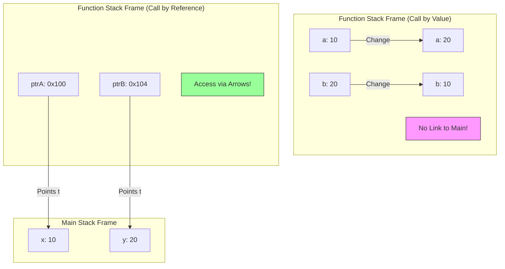
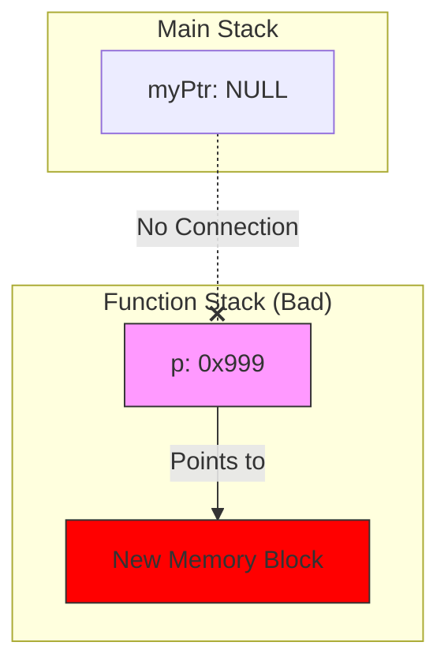
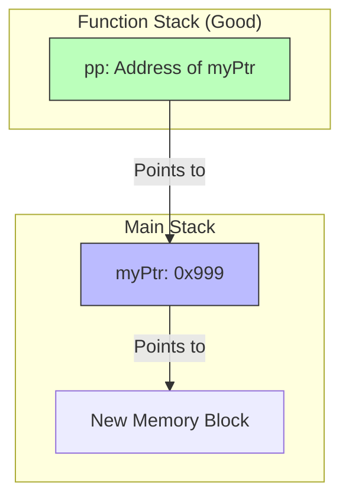

## Topic: Call by Value vs. Call by Reference

### 1. The Problem: Call by Value (نسخة طبق الأصل)

في الـ C/C++، الوضع الافتراضي لما تبعت متغير لفانكشن، إنك بتبعت **نسخة (Copy)** منه، مش هو شخصياً.

- **اللي بيحصل في الميموري:** الـ Function الجديدة بتعمل [[Stack Frame]] خاص بيها، وبتاخد نسخة من القيم تحطها عندها.
    
- **النتيجة:** أي تغيير بيحصل جوه الفانكشن، بيحصل في "النسخة"، والأصل (اللي في main) زي ما هو ما بيتحركش.
    

**المثال الشهير (The Failed Swap):**


```C++
void tryToSwap(int a, int b) {
    int temp = a;
    a = b;
    b = temp;
    // هنا a و b اتبدلوا فعلاً.. بس دي نسخ محلية (Local Copies) جوه الفانكشن دي بس
}

int main() {
    int x = 10, y = 20;
    tryToSwap(x, y);
    // x و y لسه زي ما هما (10 و 20)
    // الفانكشن اشتغلت على ورق تصوير ورمته، وملمستش المستند الأصلي
}
```

---

### 2. The Solution: Call by Reference (معاك مفتاح شقتي) 🔑

عشان الفانكشن تقدر تغير في المتغيرات الأصلية اللي في main، لازم نلغي فكرة النسخ.

بدل ما أبعتلك "صورة" من الفلوس، أنا هبعتلك "عنوان البنك" (Address).

- **المرسل (Main):** بيبعت العنوان باستخدام `&`.
    
- **المستقبل (Function):** بيستقبل العنوان في مؤشر `*`.
    
- **التنفيذ:** الفانكشن بتستخدم `*ptr` (Dereferencing) عشان تعدل في المكان الأصلي.
    

**كود الـ Swap الناجح (The Engineering Way):**


```c
// 1. المستقبل: بيطلب عناوين (Pointers) مش قيم
void realSwap(int* ptrA, int* ptrB) {
    // ptrA شايل عنوان x
    // ptrB شايل عنوان y
    
    int temp = *ptrA; // هات القيمة اللي جوه عنوان x وحطها في temp
    *ptrA = *ptrB;    // هات القيمة اللي جوه y وحطها جوه عنوان x
    *ptrB = temp;     // حط قيمة temp جوه عنوان y
}

int main() {
    int x = 10, y = 20;
    
    // 2. المرسل: بيبعت العناوين
    realSwap(&x, &y); 
    
    // x بقت 20، و y بقت 10 -> السحر حصل!
}
```

### 3. Visualizing the Stack (تحت الكبوت)

عشان تتخيل الفرق الرهيب في الميموري:




> [!TIP] Mina's Rule
> 
> - عايز الفانكشن **تقرأ بس**؟ ابعت **Value** (عشان الأمان).
>     
> - عايز الفانكشن **تغير وتعدل**؟ ابعت **Address** (عشان التحكم).
>     
> - البيانات حجمها كبير (زي صورة أو مصفوفة)؟ ابعت **Address** (عشان توفر وقت النسخ ومساحة الميموري).
>     

---

### 4. بونص C++ (The Reference Variable `&`) 🚀

بما إننا بنكتب C++، اللغة عملت حركة "شياكة" عشان تريحك من وجع دماغ النجمة `*` والعلامة `&`. حاجة اسمها **Reference**.

الـ Reference هو "دلع" للمتغير (Alias). هو مش مؤشر، هو اسم تاني لنفس المكان في الميموري.


```c
void cppSwap(int &a, int &b) { // لاحظ العلامة & هنا في التعريف
    // التعامل جوه كأنهم int عادي، بس هما مربوطين بالأصل
    int temp = a;
    a = b;
    b = temp;
}

int main() {
    int x = 10, y = 20;
    cppSwap(x, y); // ولا & ولا يحزنون، ابعت الاسم علطول
}
```

- **في الـ C (شغلنا الأساسي):** لازم Pointers.
    
- **في الـ C++ (الشغل الحديث):** بنفضل الـ References لأن شكل الكود أنضف، بس "تحت الكبوت" هي بتتحول لـ Pointers برضه!
    
---
حقك عليا يا هندسة، دي فعلاً أكتر حتة "بتعصر الدماغ" في الكورس، وعشان كدة لازم "نرسمها" عشان تتخيلها.

المشكلة كلها في جملة واحدة: "المؤشر هو كمان متغير (Variable)".

ولما بتبعت متغير لفانكشن، بيتبعت نسخة منه (Copy).

تعالى نتخيلها بتمثيلية صغيرة:

### المشهد الأول: السيناريو الغلط (النسخة المزيفة) ❌

تخيل إنك (الدالة `main`) معاك **ورقة فاضية** (المؤشر `ptr`) وعايز مهندس الديكور (الدالة `Allocation`) يكتبلك فيها عنوان شقتك الجديدة.

1. أنت ناديت المهندس واديتله **"صورة ضوئية"** من الورقة بتاعتك (`Call by Value`).
    
2. المهندس مسك "الصورة"، وكتب فيها عنوان الشقة الجديدة (`0x900`).
    
3. المهندس خلص شغله ومشي ورمى الصورة في الزبالة (الفانكشن خلصت).
    
4. أنت بصيت في **ورقتك الأصلية**.. لقيتها لسه فاضية (`NULL`)!
    

**ده اللي بيحصل في الكود ده:**

C++

```c
void badAllocation(int *p) { 
    // p هنا هي "الصورة الضوئية" (نسخة جديدة في الـ Stack)
    p = new int(50); 
    // الصورة بقت بتشاور على الميموري الجديدة.. والأصل ولا دريان
}

int main() {
    int *myPtr = NULL; // الورقة الأصلية
    badAllocation(myPtr); // بعت صورة منها
    // myPtr لسه بـ NULL -> والشقة الجديدة ضاعت (Memory Leak)
}
```

---

### المشهد الثاني: السيناريو الصح (أنا هقولك ورقتي فين) ✅

هنا إحنا هنستخدم **Double Pointer** (`**pp`).

1. أنت (الدالة `main`) معاك **الورقة الفاضية** (`ptr`).
    
2. أنت المرة دي مش هتديله الورقة.. أنت هتديله **"عنوان جيبك"** اللي فيه الورقة (`&ptr`).
    
3. المهندس (الدالة `goodAllocation`) بياخد العنوان ده ويسميه `pp`.
    
4. المهندس بيمد إيده في جيبك (`*pp`)، ويطلع ورقتك الأصلية، ويكتب فيها العنوان الجديد.
    
5. المهندس مشي.
    
6. أنت بتطلع الورقة من جيبك.. لقيت العنوان مكتوب فيها!
    

**ده اللي بيحصل هنا:**

C++

```c
void goodAllocation(int **pp) {
    // pp: عنوان جيبك (Pointer to Pointer)
    // *pp: الورقة اللي جوه جيبك (The Original Pointer)
    
    *pp = new int(50); 
    // أنا هنا بكتب على الورقة الأصلية مباشرة
}

int main() {
    int *myPtr = NULL;
    goodAllocation(&myPtr); // خد عنوان جيبي (عنوان المؤشر)
    // myPtr دلوقتي شايل عنوان الشقة الجديدة
}
```

---

### الرسمة اللي هتفك اللغز (The Memory Diagram) 🧠

تعالى نشوف الأسهم ماشية إزاي في الحالتين:

#### 1. الطريقة الفاشلة (قطع الاتصال)

Code snippet



_لاحظ إن `OriginalPTR` لسه بـ NULL وميعرفش حاجة عن `New Memory`._

#### 2. الطريقة الناجحة (الكوبري) 🌉

Code snippet



_لاحظ السهم اللي طالع من `pp` رايح لـ `myPtr`. الفانكشن استخدمت السهم ده عشان تغير قيمة `myPtr` وتخليه يشاور على الميموري الجديدة._

### الخلاصة (عشان تثبت):

- لو عايز تغير **القيمة** (`x`): ابعت عنوانها (`int *`).
    
- لو عايز تغير **العنوان** (`ptr`): ابعت عنوان العنوان (`int **`).
    

ها يا هندسة.. الصورة وضحت شوية ولا لسه فيها "غبار"؟
